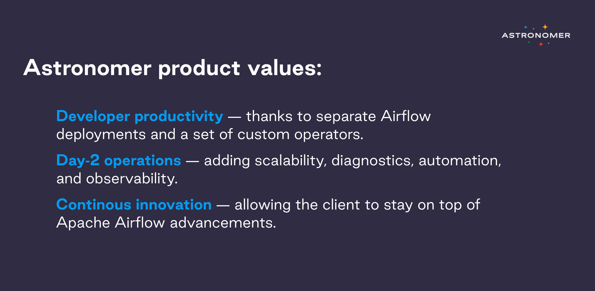
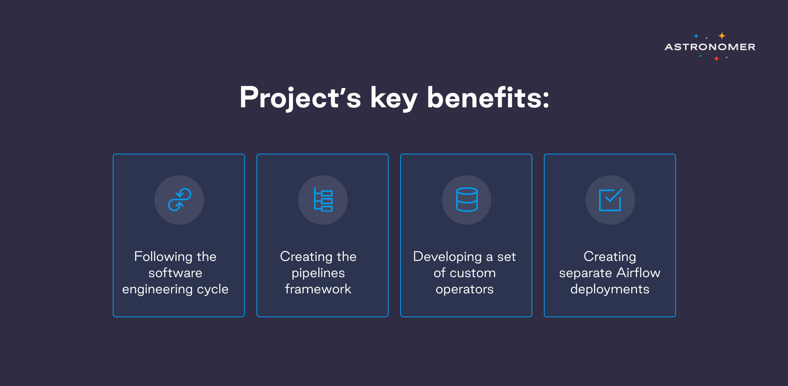

<iframe src="https://fast.wistia.net/embed/iframe/auno45aggr" title="CREDfinal Video" allow="autoplay; fullscreen" allowtransparency="true" frameborder="0" scrolling="no" class="wistia_embed" name="wistia_embed" allowfullscreen msallowfullscreen width="100%" height="450"></iframe>

CRED is an exclusive community for India’s most trustworthy and creditworthy individuals, where the members are rewarded for good financial behavior. CRED was born out of a need to bring back the focus on trust, the idea being to create a community centered around this virtue. A community that constantly strives to become more virtuous in this regard till they finally scale their behavior to create a utopia where being trustworthy is the norm and not the exception. To build a community like this requires a community of its own; a community special in its own way, working towards making this vision come true. 

CRED as an institution has a high reputation of providing a wide variety of product offerings from lifestyle to personal finances to its members. The strong ethos of upholding and meeting such requirements is imperative for business to effectively scale the demanding needs. 

## The challenge

The foundational setup used by [CRED](https://cred.club/)’s data and analytics team was based on an open source project [Apache Nifi](https://www.astronomer.io/blog/apache-nifi-vs-airflow)—a platform that can collect and act on data in real time. As the increasing need to keep this foundation pitch-perfect continued to become prevalent, the Data and Analytics team faced some operational hazards and the vast majority of those involved quality checks and lack of ownership of data pipelines. To overcome this barrier, CRED needed a robust solution that could be easily scaled and had rich feature sets.

Looking at the evolving technology landscape, CRED decided to strike out Apache Airflow by developing a local environment using the [Astronomer CLI](https://www.astronomer.io/cli-quickstart). CRED and Astronomer developers collaborated for a demonstration of proof of concept by setting up an Astronomer cluster on AWS cloud. Data Engineering Lead Gautam Doulani and Data Architect Omesh Patil who recently joined CRED, had immense hands-on experience of using Apache Airflow. This enabled both team members to consistently focus on tool’s development and seek additional assistance from the Astronomer team.

> “I’ve worked with Airflow forever and so I love everything about it. As it’s built on Python, there’s literally no limit to what you can do.” - Gautam Doulani, Data Engineering Lead at CRED

## The solution

Embarking on the Astronomer for a real long-term solution, Gautam and Omesh had to ensure whether some of the key features, such as: email integration, slack integration, CI/CD integration, unit tests, role-based access control, were natively supported by Astronomer. This checklist was instantly assured by the Astronomer team.

**With Astronomer CRED was able to:**

1. Follow the software engineering cycle with code checking, peer reviews, CI/CD and therefore minimize the number of errors in production.
2. Create a pipeline framework — which allows them to create generic pipelines that can be used and built many times without affecting the rest.
3. Develop a set of custom operators—thanks to which CRED developers don’t have to keep reinventing the same components. “Astronomer Registry of existing custom hooks and operators helped us a lot with this task,” says Omesh Patil, “It’s a great initiative, available to everyone.”
4. Separate Airflow deployments for each team—which helped the separation of concern. Developers can deal with their environments, perform tests, updates etc., and if something goes wrong, only a few DAGs are affected. “It minimizes the risk, “says Omesh, “I have never seen that feature in Airflow before.”

“Before Airflow, our pipelines were split, some things were done on Cron, some on NiFi, some on other tools. We wanted to bring it all together,” says Omesh, Data Architect, CRED.

With NiFi, CRED developers had to make a copy of all the pipelines and use it for their specific use cases. If they wanted to change something, for example, upgrade to a newer Airflow version, they needed to update both copies.

Airflow greatly improved developer productivity, as developers are able to write code once and use it in multiple places. It also allowed the teams to be more flexible, as it’s Python-based. 

Additionally, in the spirit of continuous innovation, Astronomer team added an option to deploy DAGs using NFS Volume in version 0.25, answering the client’s needs.

> “After 6-7 months with Apache Airflow, we’ve built more than ninety DAGs. The tool made the experience so much easier.”

## The road ahead

> “With Astronomer, you don’t have to compromise. If it involves Airflow, they can do it.”

Now that the data engineering team is using Airflow with no issues, the goal is for the rest of the organization to adopt it too. “We don’t want Airflow to be a tool used only by data engineers”, says Gautam. According to him and his team, Astronomer is a perfect solution for any company that needs and uses data, as it offers: 

* Easy upgrading
* Separation of deployments
* Continuous innovation 

If you’re looking to start or improve your Apache Airflow experience—[get in touch with Astronomer experts!](https://www.astronomer.io/get-astronomer)