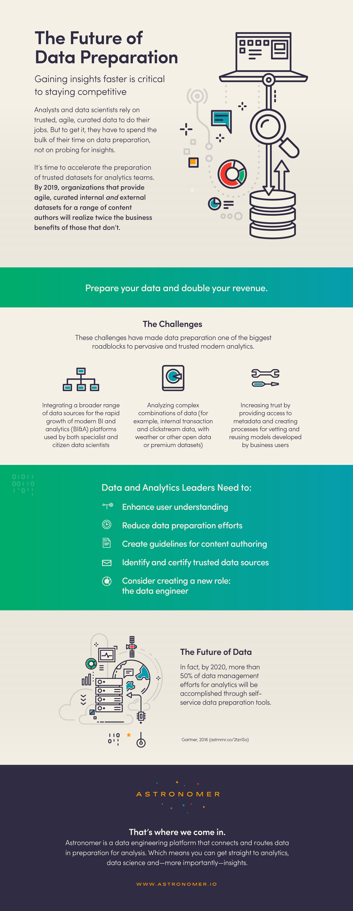

_\*If you like this infographic, [download a PDF](http://resources.astronomer.io/infographics-and-visuals/how-to-get-to-insights-faster-an-infographic) and share it with the world! Every bit of it is based on Gartner's [Market Guide for Self-Service Data Preparation](https://www.gartner.com/doc/3418832/market-guide-selfservice-data-preparation).&nbsp;_

