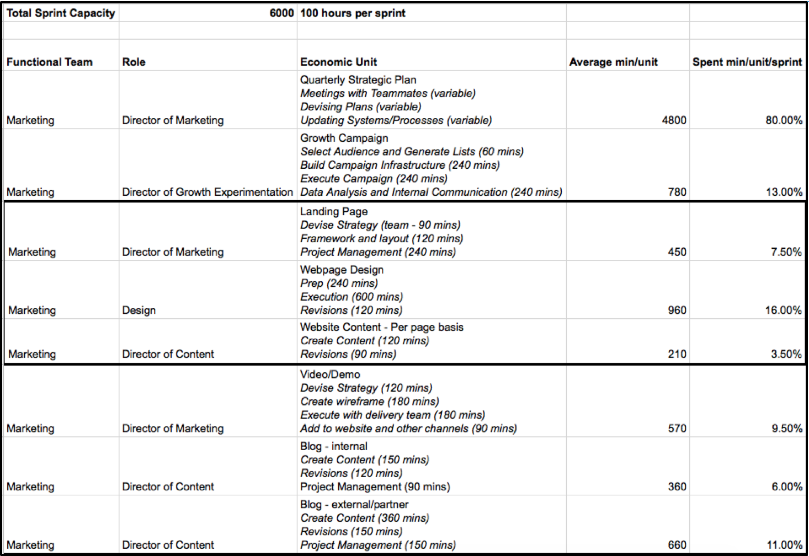
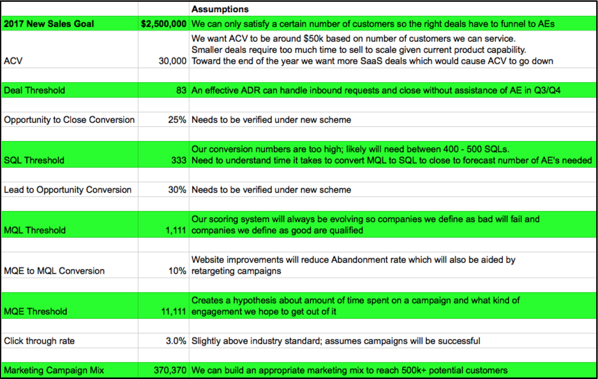

Remember Allen Iverson’s, “We talking ‘bout practice” rant? Iverson, irate at the gall of a reporter to question how his in-game performance may have resulted from lackluster effort in practice, sounded off, the jarring undercurrent asking, “Who cares about preparation so long as you execute when it counts?”

  
 [videoEmbed](https://giphy.com/embed/j8A3qOFyrCOUE)

&nbsp;

Reflecting on the central themes I wanted to cover in this blog (you can read parts&nbsp;[one](https://www.astronomer.io/blog/how-to-scale-your-growth-process-in-8-weeks) and [two](https://www.astronomer.io/blog/how-to-scale-your-growth-process-in-8-weeks-part-2) here to catch up), I thought of Iverson. And how practice actually _drives_ execution.

In four weeks, we went from wanting to quantify a growth process to creating an inventory of data to having an initial framework and strategy to test some hypotheses. But as we began Step 3 (start running campaigns to populate the system with data, add infrastructure to systems as needed, test framework for automation) two weeks ago, I realized a LOT about preparation. And how important it is when kicking off a process for the first time.

So, strap in. Here’s the behind-the-scenes peek at what we did leading up to this third installment of The Beacon Project (ie. a model that would quantify our growth process to shed light on—and attract—best-fit customer profiles).&nbsp;

_\*By the way, when it comes to anything referring to money/budget, exact numbers in supporting spreadsheets have been changed.&nbsp;_

### Everything Is Not As It Seems

In blog two, [I outlined our initial unit economic framework](https://www.astronomer.io/blog/how-to-scale-your-growth-process-in-8-weeks-part-2) but noted it was a work in progress. As I began to put more campaigns into the system the first week of May, I realized several things that needed to be improved right away. Quantifying growth requires preparing, tweaking, adapting. The way I look at it, you practice so that you know HOW to execute. Here’s what I realized needed to be changed right away:

#### 1. Sprint Timelines and Roles&nbsp;

As I began entering all Q2 strategic campaigns from Head of Marketing, I hadn’t considered well enough how one campaign could include multiple people doing work across multiple sprints.

For example, our Director of Content was included heavily in two strategic campaigns: website re-build and explainer video. Knowing these activities were planned to stretch through June was helpful. As a result, I switched our two-week sprint into monthly sprints, which were easier to manage.

_Tactical Capacity Menu **before** :_

__

_Tactical Capacity Menu **after** :__&nbsp;[Click to view full details in Google Spreadsheet](https://docs.google.com/spreadsheets/d/1DhrV5qcmAea6Gpo_CnpiNt3BLsICZxZlHZwVVUkemoQ/edit#gid=0).&nbsp;_

__

This format also made it easier to update our primary Growth Scorecard so anything that changes in this unit economics menu is reflected there. More on that later, though. For now, another big change:

#### 2. Measurement of Tactical vs. Strategic Campaigns

Our Director of Content’s inclusion in many campaigns also changed how I view measurement of tactical vs. strategic campaigns. What’s the difference? Because we’re so focused on execution, right now it made sense to define each as follows:

- **Tactical campaigns are associated with one or two specific KPIs in the sales/marketing mix.**

  - _Example_: Ad Retargeting campaign will generate x Marketing Qualified Leads (MQLs)
- **Strategic campaigns are being undertaken to improve conversion percentages.**

  - _Example_: Website reconfiguration to include content that can be positioned and “scored” based on how people interact with it

Strategic campaigns are a challenge to track because it’s difficult to say exactly which strategy caused an uptick in conversion. For now, because we are making quite a few assumptions in our marketing and sales mix, we have a standard improvement rate for conversions at 10% MoM. I already know that number will involve; now I’m ready to update it as needed.

#### 3. Marketing/Sales Mix and Monthly Forecast

Based on the aforementioned operational improvements and need for more granularity in our unit economic story, Co-founder and COO Tim Brunk wanted a revised pro forma for our Marketing/Sales Mix with two specific asks:

1. What are the unit economics of each campaign type - in other words, if we put $1 into a ad retargeting campaign, what do we expect to get out of it?
2. Based on current assumptions and improvements in our activities, how will we expect this mix to shake out over the next 12 months?

The result was a more robust forecast.

_Marketing/Sales Mix **before** :_

__

_Marketing/Sales Mix **after** :&nbsp;__[Click to view full details in Google Spreadsheet](https://docs.google.com/spreadsheets/d/1DhrV5qcmAea6Gpo_CnpiNt3BLsICZxZlHZwVVUkemoQ/edit#gid=403764247) including new Marketing/Sales unit economics (all numbers have been changed)._

__

To make the “after” model work, I had to add one final “unit economics” menu to marketing tactics based on underlying assumptions for activities we choose to pay for (like ad retargeting).

Ultimately, the details on this sheet reinforce the relationship between paid marketing activities, strategic marketing activities and sales-based activities (aka hustle). It is a pro forma, so the information in here is meant to provide guardrails for our team to choose the right mix of activities given time, money and human constraints. Changes to assumptions of conversions and/or unit economics changes everything on this page, and therefore, our live Growth Scorecard in the Beacon. Which brings me to my final change…

#### 4. “Normalized” Growth Scorecard (based on monetary and human capital costs)

Similar to the first time around, it was time to bring all our unit and campaign details together into a “production” environment. Once the framework is proven, we will use Astronomer to bring together all the systems that contain this information. For right now, it’s another tab in a Google Spreadsheet that contains formulas and links to our standardized units in other sheets.

_Scorecard framework **before** ([click for full details](https://docs.google.com/spreadsheets/d/1hKq2b29u7ahFrkWqjIHFEYhMb9JBxlp0sAO4PVahSwY/edit#gid=0)):_

__

_Scorecard framework **after** ([click for full details](https://docs.google.com/spreadsheets/d/1DhrV5qcmAea6Gpo_CnpiNt3BLsICZxZlHZwVVUkemoQ/edit#gid=1095173760)):_

__

I changed the format of the page slightly for ease of viewing as we look across multiple sprints. The most important “before and after” differences are in the blue and green highlighted cells.

Blue cells are what we _expected_ to happen based on the tactical and strategic campaigns the growth team has committed to undertaking (the details that show up at the bottom of the page, all of which have formulas calculated based on unit costs from other sheets). Green cells are what actually happened so we can compare what went well and what didn’t.

For example, in May, our Director of Sales and an Account Executive attended the [MarTech](https://martechconf.com/) conference in San Francisco. We had budgeted the cost around $5,000 and 68.5 combined hours (4,110 minutes) to generate 10 SQLs. During the trip, we also added an ad retargeting effort which was meant to generate brand awareness and real time MQLs.

Once the trip was completed, we recalibrated. The team generated 18 SQLs and 102 Marketing Qualified Engagements (MQEs) over two days. Based on KPI expectations and costs, the campaign was 31% better than expected.&nbsp;What does that tell us? Shine the Beacon toward more conferences and trade shows to generate SQL without fighting through conversions. &nbsp;

But that’s just one example. To truly execute, we need to go through this exercise repeatedly to validate all of our assumptions. Good news though: with the operational framework updated and in place, that’s what we took care of the following week.

### Getting Focused and Kicking Off

All the work I just described was preparation for us to begin executing broad-based, integrated marketing and sales campaigns. That started the week of May 15 with a push into “Account-based Marketing.”

If you’ve never heard of it, Account-based Marketing (ABM) has been an evolving strategy in the B2B SaaS field since the early 2000s (before that for many). Its recent renaissance occurred because of new systems that enable accounts to be targeted as if they are their own market.

ABM is not persona-based targeting but instead based on larger macro and micro trends, after which individual targets can be identified as part of a larger network of communication.

#### Key Tenets of Astronomer’s ABM Strategy

- Be measured and intentional when targeting ABM candidates.
- Customized content/messaging critical to long-term campaign success; focus on entire business.
- Sales cycle does not end with close; it is ongoing which makes implementation and customer success critical to the long-term success of the strategy.
- Touchpoints come from multiple channels based on where they spend time or seek information about solutions.
- Internal systems need to be detailed and integrated so actors within accounts are known and targeted intentionally (Do they get all Astronomer communications or just those that are targeted to their account? It depends on who, when and what.)
- Inside information through trusted relationship development is beneficial to ABM success once the first contract has been closed.

#### **Structure**

To effectively execute an ABM strategy, resources will need to be allocated across several roles in conjunction with Astronomer’s broader marketing and sales mix.

As such, two roles have been identified as being a bridge between the outbound efforts of the marketing team, the closing efforts of the Account Executives and the ongoing relationship development of the Customer Success team.

- **Account Development Representative (ADR)** - Externally-focused role that executes day to day ABM processes and other manual, persona-based outbound efforts on behalf of sales.

- **Account Qualification Representative (AQR) -** Internally-focused role that qualifies MQEs into MQLs and passes off SQLs to AEs.

In our version of ABM, ADRs run a series of “plays” that are part of a broader campaign. Initially, we will keep our number of plays tight to ensure we get _great_ at executing fundamentals. Over time, as we get more creative with individual accounts, we will add plays we have seen work consistently.

_\*[Astronomer’s full menu of ABM plays](https://docs.google.com/spreadsheets/d/1x3fM1d0BlkoY1g4Ge7fKa2azHQ8Inz4D0Cp66xg6QN0/edit#gid=0)_

The key to ABM is realizing which companies have _demonstrated_ they can be greater than $1m lifetime value (LTV). We have suspicions about which companies and industries _might_ fit this criteria, but we won’t know until we actually start engaging.

This is why practice matters! Because we’re constantly testing what works, we have to be flexible enough to call quick audibles and move nimbly.

#### Next Steps: ABM Campaign and Play Execution

So now we’re back in real time. The final post in this blog series will focus on our results and continual adaptations, which comprise Step 4 and 5, respectively: (4) cross-reference the data sets like crazy; focus marketing and sales according to what’s working (manual exercises at first) and (5) iterate the model accordingly and build proven models into automated systems

Our initial ABM targets come from a mix of the following:

- Cincinnati-based ABM Targets
- Industry-specific ABM Candidates 
- Location-specific ABM Candidates

We will begin executing ten Cincinnati-based campaigns as well as location-based campaigns targeting Insurance companies in Columbus and Chicago and Series A and beyond startups in San Francisco and New York. We're itching to get rolling!

_Think our “practice” was worth it? To find out how our preparation translates into execution, make sure to read the last installment of The Beacon Project blog series two weeks from now.&nbsp;_

