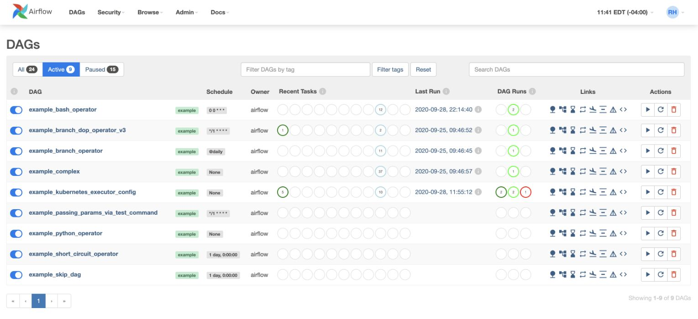
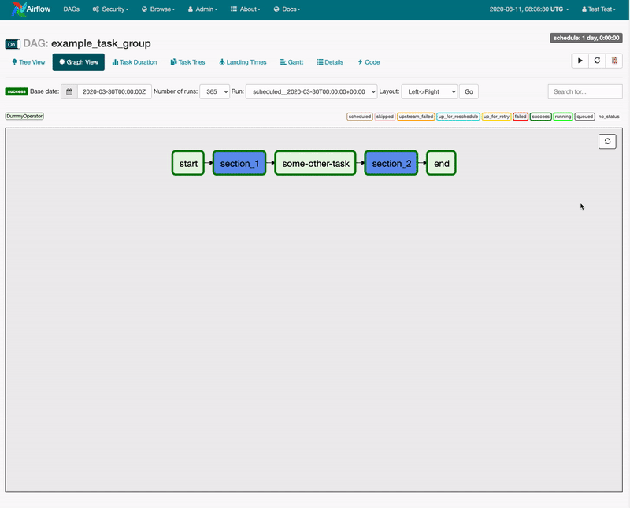
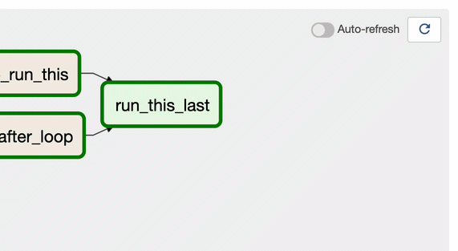

Apache Airflow was created by Airbnb’s Maxime Beauchemin as an open-source project in late 2014. It was brought into the Apache Software Foundation’s Incubator Program in March 2016 and saw growing success in the wake of Maxime’s well-known [“The Rise of the Data Engineer”](https://medium.com/free-code-camp/the-rise-of-the-data-engineer-91be18f1e603) blog post. By January of 2019, Airflow was [announced as a Top-Level Apache Project](https://blogs.apache.org/foundation/entry/the-apache-software-foundation-announces44) by the Foundation and is now concretely considered the industry’s leading workflow orchestration solution.

Airflow’s strength as a tool for dataflow automation has grown for a few reasons:

**1. Proven core functionality for data pipelining.**
Airflow competitively delivers in scheduling, scalable task execution and UI-based task management and monitoring.

**2. An extensible framework.**
Airflow was designed to make data integration between systems easy. Today it supports over 55 providers, including AWS, GCP, Microsoft Azure, Salesforce, Slack and Snowflake. Its ability to meet the needs of simple and complex use cases alike make it both easy to adopt and scale.

**3. A large, vibrant community.**
Airflow boasts thousands of users and over 1,600 contributors who regularly submit features, plugins, content and bug fixes to ensure continuous momentum and improvement. In 2020, Airflow reached 10,000 commits and 18,000 GitHub stars.

As Apache Airflow grows in adoption, there’s no question that a major release to expand on the project’s core strengths was long overdue. As users and members of the community, we at Astronomer are delighted to announce that Airflow 2.0 was released on December 17th, 2020, and is generally available today.

Over the last year, various organizations and leaders within the Airflow Community have been in close collaboration refining the scope of Airflow 2.0 and actively working towards enhancing existing functionality and introducing changes to make Airflow faster, more reliable and more performant at scale.

In celebration of the highly anticipated release, we’ve put together an overview of major Airflow 2.0 features below. We’ll publish a series of followup posts over the next few weeks that dive deeper into some of those changes.

## Major Features in Airflow 2.0

Airflow 2.0 includes hundreds of features and bug fixes both large and small. Many of the significant improvements were influenced and inspired by feedback from [Airflow's 2019 Community Survey](https://airflow.apache.org/blog/airflow-survey/), which garnered over 300 responses.

### A New Scheduler: Low-Latency + High-Availability

The Airflow Scheduler as a core component has been key to the growth and success of the project following its creation in 2014. As Airflow matures and the number of users running hundreds of thousands of tasks grows, however, we at Astronomer saw great opportunity in driving a dedicated effort to improve upon Scheduler functionality and push Airflow to a new level of scalability.

In fact, "Scheduler Performance" was the most asked for improvement in the Community Survey. Airflow users have found that while the Celery and Kubernetes Executors allow for task execution at scale, the Scheduler often limits the speed at which tasks are scheduled and *queued* for execution. While effects vary across use cases, it's not unusual for users to grapple with induced downtime and a long recovery in the case of a failure and experience high latency between short-running tasks.

It is for that reason that we’re beyond ecstatic to introduce a new, refactored Scheduler with the Airflow 2.0 release. The most impactful Airflow 2.0 change in this area is support for running multiple schedulers concurrently in an active/active model. Coupled with DAG Serialization, Airflow’s refactored Scheduler is now highly available, significantly faster and infinitely scalable. Here's a quick overview of new functionality:

**1. Horizontal Scalability.**
If task load on 1 Scheduler increases, a user can now launch additional "replicas" of the Scheduler to increase the throughput of their Airflow Deployment.

**2. Lowered Task Latency.**
In Airflow 2.0, even a single scheduler has proven to schedule tasks at much faster speeds with the same level of CPU and Memory.

**3. Zero Recovery Time.**
Users running 2+ Schedulers will see zero downtime and no recovery time in the case of a failure.

**4. Easier Maintenance.**
The Airflow 2.0 model allows users to make changes to individual schedulers without impacting the rest and inducing downtime.

The Scheduler's now-zero recovery time and readiness for scale eliminates it as a single point of failure within Apache Airflow. Given the significance of this change, our team recently published ["The Airflow 2.0 Scheduler"](https://www.astronomer.io/blog/airflow-2-scheduler), a blog post that dives deeper into the story behind Scheduler improvements alongside an architecture overview and benchmark metrics.

For more information on how to run more than 1 Scheduler concurrently, refer to [official documentation on the Airflow Scheduler](https://airflow.apache.org/docs/apache-airflow/stable/scheduler.html?highlight=multiple%20schedulers#running-more-than-one-scheduler).

### Full REST API

Data engineers have been using Airflow’s “Experimental API” for years, most often for [triggering DAG runs programmatically](https://www.astronomer.io/docs/cloud/stable/customize-airflow/airflow_api/). With that said, the API has historically remained narrow in scope and lacked critical elements of functionality, including a robust authorization and permissions framework.

Airflow 2.0 introduces a new, comprehensive REST API that sets a strong foundation for a new Airflow UI and CLI in the future. Additionally, the new API:

* Makes for easy access by third-parties
* Is based on the [Swagger/OpenAPI Spec](https://swagger.io/specification/)
* Implements CRUD (Create, Update, Delete) operations on *all* Airflow resources and
* Includes authorization capabilities (parallel to those of the Airflow UI)

These capabilities enable a variety of use cases and create new opportunities for automation. For example, users now have the ability to programmatically set Connections and Variables, show import errors, create Pools, and monitor the status of the Metadata Database and Scheduler.

For more information, reference [Airflow's REST API documentation](https://airflow.apache.org/docs/apache-airflow/stable/stable-rest-api-ref.html).

### Smart Sensors

In the context of dependency management in Airflow, it’s been common for data engineers to design data pipelines that employ *[Sensors](https://www.astronomer.io/guides/what-is-a-sensor/)*. Sensors are a special kind of Airflow Operator whose purpose is to wait on a particular trigger, such as a file landing at an expected location or an external task completing successfully. Although Sensors are idle for most of their execution time, they nonetheless hold a “worker slot” that can cost significant CPU and memory.

The “Smart Sensor” introduced in Airflow 2.0 is an “early access” (subject to change) foundational feature that:

* Executes as a single, “long running task”
* Checks the status of a batch of Sensor tasks
* Stores sensor status information in Airflow’s Metadata DB

This feature was proposed and contributed by Airbnb based on their experience running an impressively large Airflow Deployment with tens of thousands of DAGs. For them, Smart Sensors reduced the number of occupied worker slots by over 50% for concurrent loads in peak traffic.

To learn more, refer to [Airflow documentation on Smart Sensors](https://airflow.apache.org/docs/apache-airflow/stable/smart-sensor.html).

### TaskFlow API

While Airflow has historically shined in scheduling and running idempotent tasks, it has historically lacked a simple way to pass information *between* tasks. Let's say you are writing a DAG to train some set of Machine Learning models. A first set of tasks in that DAG generates an identifier for each model and a second set of tasks outputs the results generated by each of those models. In this scenario, what's the best way to pass output from those first set of tasks to the latter?

Historically, [XComs](https://airflow.apache.org/docs/apache-airflow/stable/concepts.html?highlight=xcoms#xcoms) have been the standard way to pass information between tasks and would be the most appropriate method to tackle the use case above. As most users know, however, XComs are often cumbersome to use and require redundant boilerplate code to set return variables at the end of a task and retrieve them in downstream tasks.

With Airflow 2.0, we're excited to introduce the TaskFlow API and Task Decorator to address this challenge. The TaskFlow API  implemented in 2.0 makes DAGs significantly easier to write by abstracting the task and dependency management layer from users. Here's a breakdown of incoming functionality:

**1. A framework that automatically creates PythonOperator tasks from Python functions and handles variable passing.**
Now, variables such as Python Dictionaries can simply be passed between tasks as return and input variables for cleaner and more efficient code.

**2. Task dependencies are abstracted and inferred as a result of the Python function invocation.**
This again makes for much cleaner and more simple DAG writing for all users.

**3. Support for Custom XCom Backends.**
Airflow 2.0 includes support for a new [`xcom_backend` parameter](https://airflow.apache.org/docs/stable/concepts.html?highlight=xcom#custom-xcom-backend) that will allow users to pass even more objects between tasks. Out-of-the-box support for S3, HDFS and other tools is coming soon.

It's worth noting that the underlying mechanism here is still XCom and data is still stored in Airflow’s Metadata Database, but the XCom operation itself is hidden inside the PythonOperator and is completely abstracted from the DAG developer. Now, Airflow users can pass information and manage dependencies between tasks in a standardized Pythonic manner for cleaner and more efficient code.

To learn more, refer to [Airflow documentation on the TaskFlow API](https://airflow.apache.org/docs/apache-airflow/stable/concepts.html#taskflow-api) and the [accompanying tutorial](https://airflow.apache.org/docs/apache-airflow/stable/tutorial_taskflow_api.html).

### Task Groups

[Airflow SubDAGs](https://airflow.apache.org/docs/stable/concepts.html?highlight=subdag#subdags) have long been limited in their ability to provide users with an easy way to manage a large number of tasks. The lack of parallelism coupled with confusion around the fact that SubDAG tasks can only be executed by the Sequential Executor, regardless of which Executor is employed for all other tasks, made for a challenging and unreliable user experience.

Airflow 2.0 introduces Task Groups as a UI construct that doesn’t affect task execution behaviour but fulfills the primary purpose of SubDAGs. Task Groups give a DAG author the management benefits of “grouping” a logical set of tasks with one another without having to look at or process those tasks any differently.

While Airflow 2.0 will continue to support the SubDAG Operator, Task Groups are intended to replace it in the long-term.

### Independent Providers

One of Airflow’s signature strengths is its sizable collection of community-built Operators, Hooks, and Sensors - all of which enable users to integrate with external systems like AWS, GCP, Microsoft Azure, Snowflake, Slack and many more.

Providers have historically been bundled into the core Airflow distribution and versioned alongside every Apache Airflow release. As of Airflow 2.0, they are now split into its own [airflow/providers](https://github.com/apache/airflow/tree/master/airflow/providers) directory such that they can be released and versioned independently from the core Apache Airflow distribution. Cloud service release schedules often don’t align with the Airflow release schedule and either result in incompatibility errors or prohibit users from being able to run the latest versions of certain providers. The separation in Airflow 2.0 allows the most up-to-date versions of Provider packages to be made generally available and removes their dependency on core Airflow releases.

It’s worth noting that some operators, including the Bash and Python Operators, remain in the core distribution given their widespread usage.

To learn more, refer to [Airflow documentation on Provider Packages](https://airflow.apache.org/docs/apache-airflow-providers/index.html).

### Simplified Kubernetes Executor

Airflow 2.0 includes a re-architecture of the [Kubernetes Executor](https://airflow.apache.org/docs/stable/executor/kubernetes.html) and [KubernetesPodOperator](https://kubernetes.io/blog/2018/06/28/airflow-on-kubernetes-part-1-a-different-kind-of-operator/), both of which allow users to dynamically launch tasks as individual Kubernetes Pods to optimize overall resource consumption.\
Given the known complexity users previously had to overcome to successfully leverage the Executor and Operator, we drove a concerted effort towards simplification that ultimately involved removing over 3,000 lines of code. The changes incorporated in Airflow 2.0 make the Executor and Operator easier to understand, faster to execute and offers far more flexibility in configuration.

Data Engineers will now have access to the full Kubernetes API to create a yaml ‘pod_template_file’ instead of being restricted to a partial set of configurations through parameters defined in the airflow.cfg file. We’ve also replaced the `executor_config` dictionary with the `pod_override` parameter, which takes a Kubernetes V1Pod object for a clear 1:1 override setting.

For more information, we encourage you to follow documentation on the new [pod_template file](https://airflow.apache.org/docs/apache-airflow/stable/executor/kubernetes.html?highlight=pod_override#pod-template-file) and [pod_override](https://airflow.apache.org/docs/apache-airflow/stable/executor/kubernetes.html?highlight=pod_override#pod-override) functionality.

### UI/UX Improvements

Perhaps one of the most welcomed sets of changes brought by Airflow 2.0 will be the visual refresh of the Airflow UI.

In an effort to give users a more sophisticated and intuitive front-end experience, we’ve made over 30 UX improvements over the past few months, including a new “auto-refresh” toggle in the “Graph” view that enables users to follow task execution in real-time without having to manually refresh the page ([commit](https://github.com/apache/airflow/pull/11534)).

Other highlights include:

* A refreshed set of icons, colors, typography and top-level navigation ([commit](https://github.com/apache/airflow/pull/11195))
* Improved accessibility and legibility throughout ([commit](https://github.com/apache/airflow/pull/11579), [commit](https://github.com/apache/airflow/pull/11690))
* Separation of actions + links in DAG navigation ([commit](https://github.com/apache/airflow/pull/9894))
* A button to reset the DAGs view (home) after performing a search ([commit](https://github.com/apache/airflow/pull/11583))
* Refactored loading of DAGs view (e.g. remove “spinning wheels) ([commit](https://github.com/apache/airflow/commit/6c3f4357f5c0a95d4a6772fdc45dce0acaf3ba7f))

Many more Airflow UI changes are expected beyond Airflow 2.0, but we’re certainly excited to have gotten a head start.

To learn more, refer to [Airflow documentation on the Airflow UI](https://airflow.apache.org/docs/apache-airflow/stable/ui.html).

## Apache Airflow 1.10 vs. Apache Airflow 2.0

Apache Airflow 2.0 doesn’t only bring some amazing new features—the data architecture layer changes to! Let’s have a look at how it compares to Airflow 1.10.

A common workflow for processing files is dropping them into an S3 bucket and performing a 3-step process for each file (before they’re being inserted into a data warehouse and used by data analysts). In this case, the pipeline has to run every 30 minutes and occasionally can be triggered on an ad-hoc basis (through an API).

**Even though it’s very common, there’s a lot of places it can go wrong on Airflow 1.10. Here’s why:**

* You’d need to use a Subdag to make the UI clean when you're showing the process. However, Subdags can be hard to manage. 
* You may want to trigger it on an ad-hoc basis from the API, but the API isn't officially supported in Airflow 1.10. 
* If you use community-supported operators for your DAGs you'd have to upgrade your entire Airflow environment because they are tightly coupled on 1.10.  
* Scheduling on Airflow 1.10 can cause SLA delays when you try to run on a massive scale.
* Airflow 1.10 has the web server parse DAGs, meaning it will need more resources as you add more workloads. 
* Whatever bits of data you'd want to pass back and forth through an XCOM, the Airflow 1.10 XCOMs are pretty limited in their scope. They have to be stored within the Airflow database and can’t be externalized.

As you can see, as great as Airflow 1.10 is, it has some limitations.

**Luckily, all that's different in Airflow 2.0:**

* You can use [TaskGroups that give you a clean UI but don’t make you lose performance as you do with Subdags.](https://www.astronomer.io/guides/task-groups)
* The API is fully supported with more endpoints than ever, so you can trigger it on an ad-hoc basis. 
* The community operators that you're using can be versioned independently of Airflow (if you just want to make a slight change to your community operator you can upgrade it without upgrading all of Airflow). 
* As a data infrastructure engineer or a DevOps engineer, you don't have to upgrade Airflow frequently because your data engineers can upgrade the providers, the hooks, and operators on their own.
* The scheduler is 20 times better on Airflow 2.0 and you can add more than one. As your number of files or the frequency in which you want to run your DAG increases, the scheduler can keep up with that. 
* The UI is stateless because all your DAGs in Airflow 2.0 are serialized in the database so that you don't have to spend resources cracking up your web server.  
* Lastly, you can use external storage like S3 for your XCOMs so that if you want to pass large amounts of data back and forth you can do that with a clean developer experience without maintaining extra overhead. Plus, the data is backed up in S3, which is infinitely scalable.

To sum up, everything from writing and maintaining those workloads, to making sure that your jobs are on when they're supposed to without delay and that your data is actually there when you need it—Airflow 2.0 makes each step easier. 

## Get Started with Airflow 2.0

The upgrade path to Airflow 2.0 will largely depend on your Airflow project and the version of Airflow you're currently running. As expected with major releases, Airflow 2.0 has breaking changes and requires both code and configuration-level adjustments for your DAGs to be compatible.

Astronomer's [open-source CLI](https://github.com/astronomer/astro-cli) is the best way to test Airflow 2.0 on your local machine as you prepare to migrate. For guidelines, refer to [Get Started with Airflow 2.0](https://www.astronomer.io/guides/get-started-airflow-2).

For detailed instructions on the upgrade process, refer to [Upgrading to Airflow 2.0+](https://airflow.apache.org/docs/apache-airflow/stable/upgrading-to-2.html) from the Apache Airflow Project and [Upgrade to Airflow 2.0 on Astronomer](https://www.astronomer.io/docs/cloud/stable/customize-airflow/upgrade-to-airflow-2) if you're running on our platform.

## Get Involved

We’re thrilled to finally be sharing Airflow 2.0 with the community. The scope of the features outlined above sets an incredibly exciting foundation on top of which developers all over the world will undoubtedly build.

If you're interested in getting involved with the wider community, we encourage you to sign up for the [Dev Mailing List](https://airflow.apache.org/community/) or join the [Apache Airflow Community in Slack](https://apache-airflow-slack.herokuapp.com/). For real-time announcements and updates, follow [Astronomer](https://twitter.com/astronomerio) and [ApacheAirflow](https://twitter.com/ApacheAirflow) on Twitter.

Finally, please join us in sincerely thanking the many Airflow contributors who worked tirelessly to reach this milestone. In no particular order, a huge thank you goes out to: [Ash Berlin-Taylor](https://github.com/ashb), [Kaxil Naik](https://github.com/kaxil), [Jarek Potiuk](https://github.com/potiuk), [Daniel Imberman](https://github.com/dimberman), [Tomek Urbaszek](https://github.com/turbaszek), [Kamil Breguła](https://github.com/mik-laj), [Gerard Casas Saez](https://github.com/casassg), [Kevin Yang](https://github.com/KevinYang21), [James Timmins](https://github.com/jhtimmins), [Yingbo Wang](https://github.com/YingboWang), [Qian Yu](https://github.com/yuqian90), [Ryan Hamilton](https://github.com/ryanahamilton) and the hundreds of others for their time and effort into making Airflow what it is today.

We're excited for what's next.