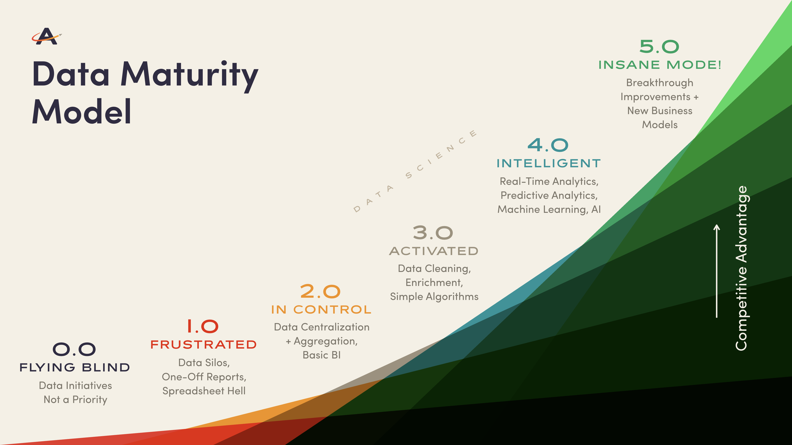

Traditional astronomers know that you can look up at the sky with a naked eye and appreciate the stars. But you can look with a telescope and understand them and what they mean. Even among telescopes, though, [vast differences exist](https://www.amazingtelescopes.com/types-of-telescopes-compared/) for astronomers across a spectrum of&nbsp;beginners to amateurs to professionals.

Same thing with data. Most companies now collect data and use it in varying ways, whether that’s downloading CSV reports and manually combining them with other data sets or hiring a Chief Data Officer and team of data scientists. We like to think of that as a company’s data maturity across a spectrum, from “flying blind” to “insanity mode.”

### Understanding Where You Rank

The first step to advancing your rank in the world of data is knowing where to start. Consider the model and ask yourself, truly, where you stand. If you need some help with understanding where you and your organization ranks, we’ve put together a [60-second data maturity self-assessment](https://smartforms.wyzerr.com/#/surveys/249/28id90mYZ44WHeAHZYqXLj).&nbsp;

Basically, are you...

- Flying Blind? Data simply hasn't been a priority.&nbsp;What better time than now?
- Frustrated?&nbsp;Dealing with siloed data, one-off reports and spreadsheets? Half the battle is knowing. You’re beginning to understand where your data is and you’re seeing how it could possibly be pieced to together to tell a clearer picture.
- In control?&nbsp;Basic data aggregation and BI are underway. You’re just beginning to set the framework for putting your data to work for your organization.
- Activated? You've&nbsp;got automated data transforms, enrichment and simple algorithms going and you're beginning to see how data can drive business insights.&nbsp;
- Intelligent?&nbsp;Real-time and predictive analytics, machine learning and AI are all in place and you’re relying on this data to make better decisions.&nbsp;
- Insane? (In the best way!) You've got an obvious competitive advantage. We'd love to do a webinar together. [Interested?&nbsp;](https://www.astronomer.io/contact)

The problem is, the longer an organization stays on the infancy side of the spectrum, the wider the gap between them and their competition. In other words, if you're not moving up the data maturity model, as time passes, the areas that need&nbsp;improvement just get worse. In fact, you may&nbsp;actually begin&nbsp;sliding backwards down the scale as once-amateur practices become more elementary. The good news is, it's not too late to get started!

### An Organization Divided

A quick word of caution: What often happens when an organization grows without data maturity baked into their DNA is that each part of the company lands on a different place along the spectrum. So while one part of the company may look like this:

… it doesn’t accurately represent the whole company. Which makes it easy for stewards of the organization (central management) to focus on the peaks and ignore the valleys where a lot of people live. So they might genuinely see something like this:

This disparity actually forces people to continue to fend for themselves. Many people want to put their data to use and move up the sophistication scale, but suddenly find there is no internal support for this.

### Bridging the Data Gap

When a data initiative isn't central enough to be covered by management and/or IT, that’s where Astronomer comes in. Our goal is to raise an&nbsp;organization's maturity level by providing a way for data-ambitious people to get their initiatives off the ground. But whether or not you use Astronomer to do this, here are some ways to get some easy wins on the road to data maturity.

#### Learn more about your options.

Take the aforementioned data maturity self-assessment, even if you want to find or engineer your own solution. Identify&nbsp;your current weaknesses and explore more mature data uses like analytics tools, algorithms or predictive analytics. (Shameless plug: We have&nbsp;a webinar about maximizing the data in all your tools for more robust customer analytics this Thursday at 1pm EST.&nbsp;[Register here](https://www.astronomer.io/webinar3-23-17?utm_campaign=Q1-2017-WebinarSeries-Ruberg&utm_source=hs_email&utm_medium=email&utm_content=46260858&_hsenc=p2ANqtz--qJto29jSfqD_KR8tMXb_6VUZzKFq3ORRE12iPcIUlzZHXoFDL5-CrYBohZ8yYpD-RCYEi81H0DFtOIHHpbxJqW1Xw9A&_hsmi=46260858)!)

#### Access more data.

You’ve probably heard about the surge in data proliferation. [According to IDC](https://www.emc.com/leadership/digital-universe/2014iview/executive-summary.htm), the 4.4 trillion gigabytes generated in 2014 is projected to reach 44 trillion gigabytes by 2020. [Deloitte](https://www2.deloitte.com/us/en/pages/deloitte-analytics/articles/analytics-trends.html) has declared this to be an “everywhere analytics” world, and data’s ubiquity is only is increasing. That said, some of the data we need is incredibly hard to reach. Whether it’s difficult by inherent property, human interaction or process, it’s not impossible to get. [Check out this post](https://www.astronomer.io/blog/why-is-my-data-playing-hard-to-get) about how to figure out&nbsp;the “game” your data is playing. Once you do, it can’t hide anymore!

#### Control your data.

In recent years, more than 3500 tools have emerged in the marketing space, which means a lot of raw data is accessible, but it’s pretty siloed. By connecting it all in a centralized warehouse or sending it to one dashboard, you can start to visualize all the data as one body. This means any insights you glean are based on comprehensive data, and therefore, a lot more accurate.

#### Choose a solution.

We would be remiss not to acknowledge that we have [a growing library of pre-built solutions](https://www.astronomer.io/solutions), ready to serve as push-button&nbsp;data infrastructure offering&nbsp;your organization immediate value. Of course, if you’ve got dev support, you can check out the code in GitHub and build the solution yourself (all of our [integrations](https://www.astronomer.io/integrations) are open source). If you want to know more, we’d love to talk to you.

