One of the core modules is our clickstream module. It empowers marketers and product mangers to know their target audience and how they're interacting with a site or app.

Under the hood, a huge part of our clickstream module is powered by Apache Airflow. Analytics.js events get sent to S3 and loaded into Redshift by dynamically generated DAGs.

Our Airflow Clickstream powers our Redshift loader DAGS for clickstream events.

Recently, we pushed a pretty big update to our Airflow Clickstream. You'll see some screenshots of our engineering Slack channel through deployment night.

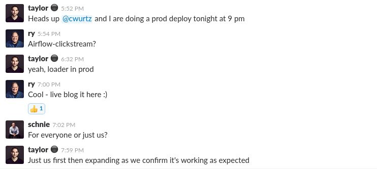

### First, some intros:

@kicksopenminds  - our resident Pythonista

@CJ - Astronomer's dev team's free safety

CEO @rywalker, noted lover of live blogs.

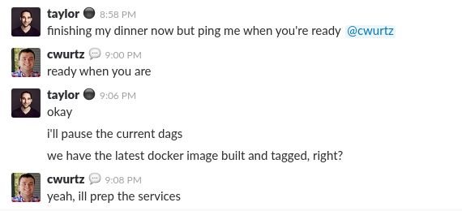

#### People forget they called him "Mr. Punctual" in high school.

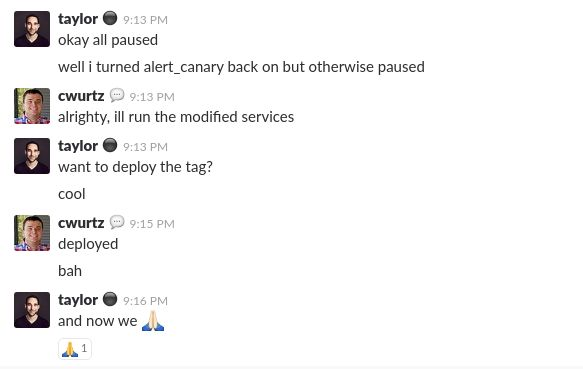

We rolled out the new DAG version to our own Astronomer DAGs first for our website, then for our app.

Bah followed by a prayer emoji...oh boy.

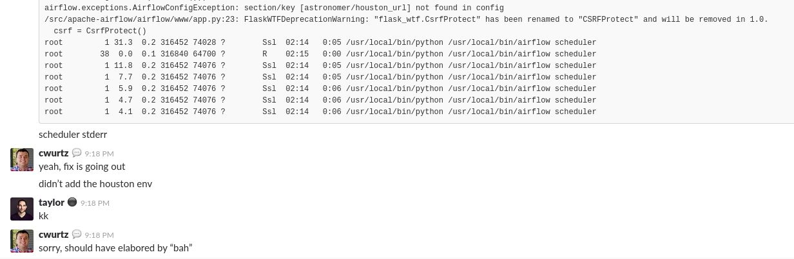

##### First obstacle (and amibigious bah) averted!

Houston is our GraphQL API - it acts as ground control between all the different services that run our platform.
You can read more about why we chose to write it in GraphQL [here](https://www.astronomer.io/blog/3-reasons-why-astronomer-is-betting-on-graphql/).

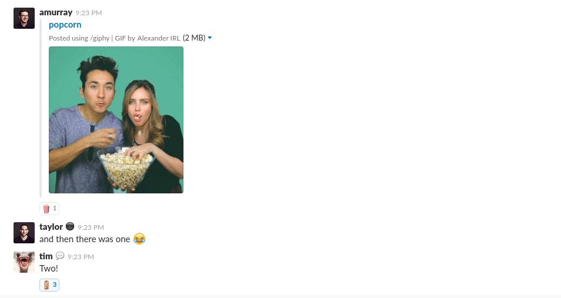

Now the spectators start arriving!

#### 20 minutes in, something is still off

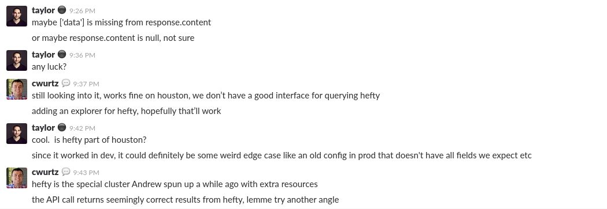

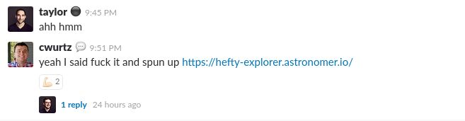

Another API explorer never hurt anyone.

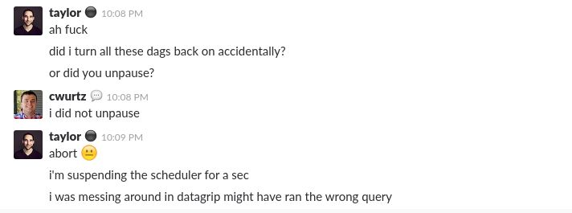

### Airflow logs everything to a database, so remember to check your SQL!

Most common phrase in the Astronomer Slack- "wtf Airflow?"

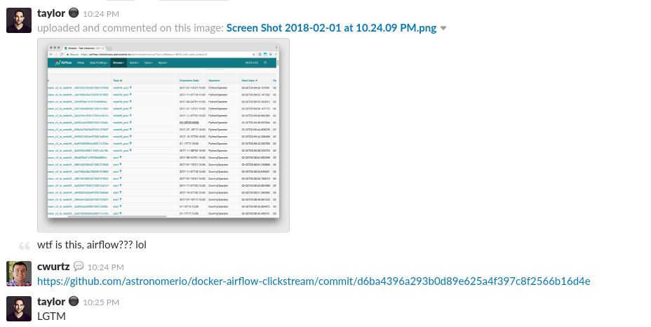

#### But it's all good because we love Airflow anyways, but it certainly has its quirks...

10:40 - morale was high.

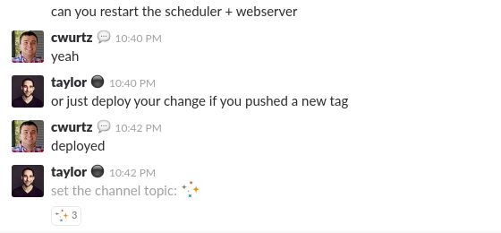

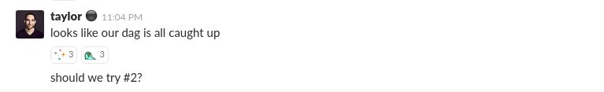

Those are our internal DAGs that control how we handle reporting and inbound marketing.

Over the next half hour, some of our other DAGs caught up successfully as we re-enabled them.

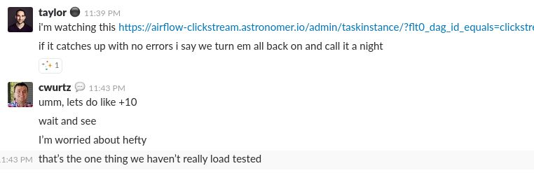

### Fun Fact: They also called CJ "Mr Cynical" in high school.

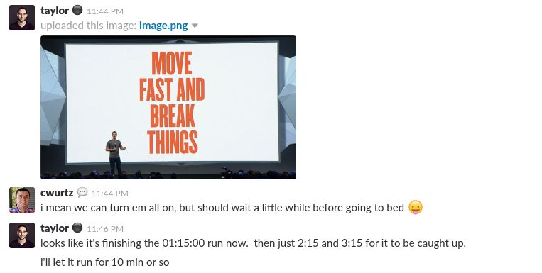

### Startups, man.

5 minutes later...

A wild @andscooper appears!

Executive confirmation always helps.

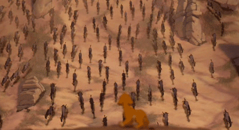

After some investigation, we figured out the issue.
As the scheduler was catching up, it was hitting Houston with a higher than expected request volume.

#### We were DDoSsing ourselves.

### Added some caching magic (added server-side caching on the GraphQL API endpoint), bumped the docker tag, and tried again.

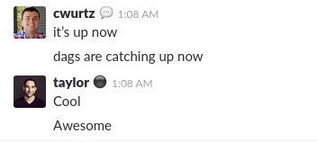

Some last touch-ups...

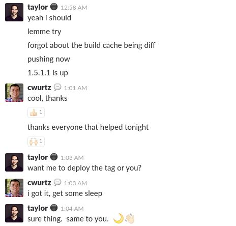

Andddddd we're through the finish line. What a rollercoaster of emotions that was!