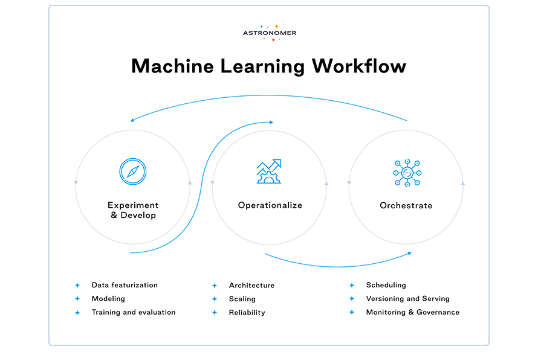

Production machine learning (ML) pipelines are built to serve ML models that enrich the product and/or user journey to a business’ end users. Machine learning orchestration (MLO) helps implement and manage such pipelines as smoothly running workflows from start to finish, affecting not only real users but also the business bottom line. 

To set the stage for MLO, let’s first walk through the steps of a typical ML pipeline. ML pipelines comprise task-based components that work together to deliver the overall value proposition.

1. Data featurization - We begin with retrieving raw data from a database (or an API) and perform a set of transformations on them to create features for our ML model. For a production pipeline, it’s best practice to implement feature stores, which help with reproducibility and avoid repeated featurization of the same data. 
2. ML model training - We train our ML model on the featurized data. In many cases, the model needs to be retrained with a regular cadence. For example, an ML model may need to be retrained once a day, incorporating the most recently generated data, to be relevant to the product the following day. In this case, we retrieve and featurize new data, join them with the relevant previously featurized data from the feature store, and retrain the model on the combined data daily.
3. Model evaluation - After training, we evaluate the performance of the trained model instance in order to decide if the new model is ready to be served in production. For a model which we train daily to serve the following day, we need to ensure a newly trained instance performs better or at least as well as the established model. The same process holds for models which evolve through transfer learning.
4. Model saving - Once the new model instance is validated, we want to save it in an adequate location and in the appropriate format for it to be picked up and served to users (for example by a microservice). 
5. Model monitoring - Now that the model is saved and being served, we must monitor it in production. The continuous monitoring of model attributes, including but not limited to performance, enables us to observe and track how a model in production changes over time. In addition to alerting us of any degradation, monitoring helps us identify changes in the underlying data, which could signal the need for updates to our pipeline. 

Because the steps above are ordered and each depends on its predecessor, the flow of data between them is central to ML architecture and [ML production workflow](https://www.astronomer.io/use-cases/machine-learning/)s. The sending and receiving endpoints of components must agree on what, when, and how data will be transferred. In order for our ML pipeline to work well in production, its components must be orchestrated—the dependencies and data flow between them must be coordinated reliably, regularly, and observably. This practice is known as machine learning orchestration.

Let’s dive deeper!

## Machine Learning Orchestration in Business

Workflow orchestration in the data and machine learning space today has decidedly increased the productivity of data teams across industries at companies large and small. Templatization and a one-stop-shop orchestration platform such as Apache Airflow remove overhead, streamline cross-functional handoffs, and help businesses scale effortlessly. 

[Wise](https://www.astronomer.io/blog/apache-airflow-wise), for example, utilizes many well-known ML frameworks and libraries such Tensorflow, PyTorch, XGBoost, H2O, and scikit-learn. When it comes to workflow orchestration, ML engineers at Wise use Apache Airflow for retraining their models in Amazon [SageMaker](https://www.astronomer.io/guides/airflow-sagemaker).

The BBC, on the other hand, uses Airflow to create templates of workflows, which make delivering new variants of machine learning models easy for the data teams. The [data orchestration](https://www.astronomer.io/blog/what-is-data-orchestration) platform helps them achieve a standardized approach to workflow development and reuse code for different use cases. 

One huge pain point experienced by businesses that leverage machine learning in production is [the cold start problem](https://medium.com/@ODSC/overcoming-the-cold-start-problem-how-to-make-new-tasks-tractable-b43ab79bf512). The need for deploying a new ML model instance can be triggered by many events including the launching of a new product, the discovery of a new use case, or onboarding of a new client. When first booted up, ML pipelines perform poorly relative to when they have reached a steady state. With an orchestrator, especially one that supports a high degree of modularity like Airflow, it’s easier to avoid cold-starting a model. One can simply reuse relevant assets and artifacts from a pipeline already in production which is solving a similar problem. 

## Production Machine Learning: Operationalization and Orchestration

*The continuous nature of machine learning workflows.*

Production machine learning relies on both the operationalization and orchestration of pipelines (check the diagram above). While we focus on orchestration in this article, let’s take a high-level look at considerations when operationalizing an ML model.

### Machine learning operationalization and system design

Let’s say we have just built a use-case-driven, performant ML application that hasn’t been pushed to production yet. To get it to production, we need to answer the following questions:

1. Architecture & data flow - What does the pipeline look like: what are the steps, how do they relate to each other, how does the data flow, what are the transaction agreements and schema? How does the ML pipeline fit into other production services/systems? How does the training environment compare to the environment in which the model will be deployed?
2. Scaling & scalability - Will our model still work well when we go from thousands of  data records to hundreds of thousands? 
3. Availability & uptime - How available is the service to the end-user: how often does it fail, drop requests, or need downtime (e.g. when new updates are released)? 
4. Security considerations - What can go wrong with the ML model in the production environment? What vulnerabilities does the ML service or platform introduce to the overall architecture?

### Machine Learning Orchestration

Now that we have designed the system in which our ML pipeline is going to live and operationalized our model, we’re ready to deploy it so our users can benefit from it!

Machine learning pipelines are dynamic and ever-learning, therefore healthy orchestration of the workflow is fundamental to their success. This is where the fun begins, and where you can really leverage powerful orchestration solutions like Airflow. 

Here are eight components to orchestrating a machine learning model in production:

1. Scheduling

Typically, we want to run our pipeline with some regular cadence. After all, if our ML model doesn’t learn and update frequently, it will become stale and increasingly bad at addressing the problem it’s designed to solve. We may even want different parts of our pipeline to run on out-of-step schedules. A great orchestration framework enables us to schedule different parts of the pipeline individually, while still defining dependencies holistically.

2. Syncing 

With upstream/downstream dependencies set, we need to make sure that the components of the pipeline talk to each other properly. Specifying the schema for data flow between components—i.e. telling an upstream task what to send and the downstream task what to expect—is only half of it. It’s also important to indicate when and how the component is supposed to receive data. For example, does a component need to wait until it receives some data, as in a sensor? Is the transaction scheduled or trigger-based?

3. CI/CD and testing 

While integration, testing, and deployment of data and ML pipelines look different than CI/CD and testing in software engineering, they are nonetheless an essential part of a successful productionized ML workflow. Frequent data quality checks make the model dependable. Proper exception and error handling ensure the deployed pipeline and its corresponding service is highly available. 

Moreover, with production data science and machine learning workflows, one expects the business to thrive on—not in spite of—constant experimentation and updates. Our model in production shouldn’t stagnate; rather it should always be at its best possible iteration. Supporting experimentation on our production workflows allows us as data scientists to keep moving the business forward by testing new hypotheses. As we experiment with the data and ML model, or simply train a model on new data, we must constantly test the pipeline to make sure it continues to function well, both on its own and with the overall system or platform. 

Along with the pipeline, tests must also be orchestrated and automated as part of the workflow. 

4. Saving & versioning 

In order for our model to be ready to be served in production, it needs to be saved and versioned in an efficient way. This includes creating a feature store and a model store and turning our featurized data and model into storage efficient formats (for example binary). Our storage must be adequately sized and scalable for the business use case we’re solving. We should also coordinate lineage from the code version to the data and model versions. This helps us associate our model performance and business value-add at a specific moment in time to the state of the code at that time, an essential step to understanding the evolution of our ML service’s business impact, especially when we’re updating it regularly.  

5. Retention and cleanup schedule

Our feature store and model store would keep growing indefinitely if we don’t perform maintenance on them. A retention and cleanup strategy, especially one that is orchestrated at the same time as the pipeline, will help free up space and ensure that the most relevant assets always have a place to inhabit. 

6. Monitoring

In addition to helping prevent models from deteriorating and stagnating, monitoring of the pipeline also helps us understand our data, our users, and the evolving landscape of our business. For example, suppose the launch of a new feature skews our user activity-based metric, causing our ML model predicting user behavior to no longer work as expected. We notice this change reflected in the behavior of one of the model KPIs we’re tracking and recognize the need for pipeline redesigning. Monitoring is therefore a crucial MLO step to ensure the success of ML in production. In particular, we want to orchestrate monitoring of:

* Data drift - All machine learning applications are built on a foundation of assumptions and hypotheses about the core data which are subsequently validated. For example, our ML model may rely on the normality of a certain feature in the data. In the event that the feature distribution is not in fact normal, the predictions made by the ML model may become invalid. The job is not done once, validating that the feature is normal at the time of initially building the model. Rather, we must constantly validate this assumption on the data, including the most recent additions. Thus, this [check on the data](https://www.youtube.com/watch?v=6ib2gH4A0rI) becomes part of the pipeline. Data validation and governance as a component of ML pipeline orchestration not only guards against the garbage-in-garbage-out problem but also allows us to identify when the underlying data evolves and necessitates introspection of the business assumptions and model architecture. 
* Concept drift - Concept drift can be thought of as aggregate data drift - i.e. rather than monitoring the drift of individual features in data, we are interested in monitoring how the overall representation of the data evolves. It comes in especially handy in certain domains like Natural Language Processing (NLP), where the business use case may depend on understanding the topics of discourse amongst groups of users. Because these conversations are live and unscripted, the fundamental concepts in the discourse are likely to evolve over time. Again, the ML model addressing the business use case is likely to rely on assumptions about the concept—so when the concept drifts, we must be able to identify, adapt to and change with it.
* Model performance - Of course, we want to monitor how well our ML model performs at its core function - modeling trends in the data by learning from them. Individual ML pipelines’ performance metrics will be guided by their specific requirements and can range from accuracy and average precision to net revenue functions that associate model predictions directly to their effect on business revenue. 

An ML model with a stellar performance during its proof-of-concept phase isn’t guaranteed to continue delivering such performance in perpetuity. We need to pay keen attention to and be prepared to react to drops in the model’s performance. Because of the nascency of machine learning operations (MLOps) as a discipline, surprisingly few production pipelines have the correct model monitoring apparatus in place. As the field is coming to realize, however, the relatively small lift of building good monitoring infrastructure ultimately provides immense value. With a powerful orchestration platform like Airflow, the infrastructure is practically already present—all that remains is to orchestrate monitoring as part of the workflow.

7. System health and reliability tracking

In addition to tracking model performance and health, we want to observe how the ML system and/or service performs reliably delivering the proposed value to users. While adjacent to the ML model pipeline itself, ensuring high uptime and efficient functioning of the system is fundamental to good production engineering. The strength of Airflow or a similar platform is that one doesn’t have to switch contexts to go from checking the health of the data and machine learning portion of an ML-based application to the overall system and service health. It can all be done within Airflow. Machine learning applications do not and cannot live in isolation from their business value proposition. They are part of the product, and increasingly the entirety of the product. Therefore, meeting service level agreements and objectives is part of the pipeline’s charter and best when treated as part of the ML workflow. 

8. Governance and Observability

So far we’ve set up how the ML pipeline works, but not how to know or what to do when it doesn’t. MLO includes implementing the strategies and protocols for smooth workflow and robust operation. It also incorporates creating views into the going-ons of our pipeline as well as the necessary tools to intervene and govern the workflow.

* Challenger vs champion strategy - What happens when the model in production starts to underperform? Robust machine learning pipelines employ a governance strategy called challenger vs champion. Here, we choose the model most suitable for solving the problem, perhaps the model architecture that outperforms others during initial proof-of-concept according to relevant metrics,—the champion—and upgrade it to production. However, we also operationalize the contenders—the challengers—so that any one of them can replace the champion model if needed. Operationalizing isn’t enough, however, because unless trained on the latest data and adequately validated, the challengers will not be ready to replace the champion in production and presume its efficacy. Therefore, we need to treat the challenger models exactly as the champion model, orchestrating all the steps we’ve discussed above and keeping them completely in sync with the production pipeline. All the models are part of the same orchestrated workflow and can be interchanged without compromising pipeline quality.
* Checkpoints & fallback protocol - As our ML pipeline runs in production, we need to set up protocols around reactions to unexpected or undesirable incidents. Fallback protocols, which are particularly important, rely on checkpointing the featurized data and trained model instances. Thankfully, we have implemented feature and model stores that help increase the robustness of our pipeline. But we also need to orchestrate the protocols as part of the workflow. Suppose our newly trained model today performs worse than yesterday’s model against a curated truth data set. Our pipeline must be fully equipped to follow the protocol to fall back to yesterday’s model version without any intervention. 
* Dashboarding and alerting - Most end-to-end ML pipelines include observability. Monitoring is incomplete without displaying the trends or surfacing alerts when appropriate so we can intervene. This can be set up as a dashboard or simply an email alert, both of which can be straightforwardly implemented in Airflow.
* Model interpretability metric extraction - To build ethical and conscientious ML pipelines, we need to keep ourselves and our models accountable. We should extract metrics and attributes from our pipeline that help explain why a model makes the predictions it does—another process that can be orchestrated as part of the workflow.
* Governance and approval workflows - Even with sophisticated protocols and extensive edge-case testing, a human-enabled governance and approval strategy is often required for machine learning applications. Once again, alerting becomes extremely important as does implementing appropriate access controls and setting up different working environments.

Thus, to go from building a machine learning model to having it work for us in production, we need to operationalize its pipeline and orchestrate its workflow. The different components such as scheduling, syncing, testing, versioning, and monitoring must all be orchestrated together to create a smoothly functioning and reliable workflow. Additionally, we can orchestrate the required maintenance and governance in order to ensure the pipeline’s sustainability.

## Airflow and Machine Learning Orchestration

The leading tool for orchestration in the data and machine learning space is Apache Airflow, the go-to platform for programmatically authoring, scheduling, and monitoring data pipelines. We’ve just seen how Airflow can be leveraged for all additional aspects of ML workflow orchestration as well. Here are some of Airflow’s strengths that make it particularly effective at its job:

* Dependable scheduling -  Airflow enables us to reliably schedule different parts of the pipeline, together or separately. It also offers flexibility to switch between real-time, batch, and on-demand processing of data, adding versatility and reusability to our workflows.
* Complete dependency and flow support - Each task’s relationship to the rest can be set and the transactions between them precisely defined—whether it be explicit data transfer using XComs or implicit transfer through the [TaskFlow API](https://airflow.apache.org/docs/apache-airflow/stable/tutorial_taskflow_api.html), decision-based [bifurcations](https://www.astronomer.io/guides/airflow-branch-operator) of the flow-path, or modularization of [groups of tasks](https://www.astronomer.io/guides/task-groups). Downstream tasks can wait for upstream tasks to execute properly, with retries and custom error handling, ensuring that a task runs only when appropriate and not earlier. Moreover, the DAG graph view allows us to see these relationships mapped out and update to changes as we make them.
* Python-native - Most data science practitioners are familiar with Python, and with Airflow, one can remain within the Python ecosystem for the entirety of their project. Additionally, this means that Airflow is as extensible as the Python community wants it to be. 
* Easy integrations - It’s easy to set up and programmatically modify [connections](https://www.astronomer.io/guides/connections) in Airflow to integrate with the rest of one’s stack. Moreover, Airflow allows us to leverage different connections for different components of the workflow based on specific tradeoffs such as latency, availability, and compute needs.
* Containerization - Containerization is core to Airflow’s executor, so we don’t have to implement containerization separately. Specifically, the ability to isolate task dependencies, resource handling, and code execution environments all come baked into our Airflow deployment. The [KubernetesExecutor](https://www.astronomer.io/docs/cloud/stable/customize-airflow/kubernetes-executor) dynamically delegates work and resource pods on a per-task basis and even allows us to configure and modify these pods.
* Custom scalable XComs backend - If we want to allow larger data artifacts to be transferred between tasks, we can scale up XComs with cloud services such as GCS and S3.

Particularly for machine learning orchestration, two other attributes stand out:

* Modularity enabling approval controls - Airflow makes it particularly easy to implement governance protocols, including hot swapping ML models in production. As long as the endpoints of our components communicate well, what happens inside the task does not disrupt the DAG. Therefore, we can painlessly swipe out one model for another, for example, if we discover the need.
* End-to-end workflow orchestration - Most MLOps tools only focus on the ML part of the orchestration, which is on one end. Airflow allows us to remain within the same framework for orchestrating the entire orchestration, including the data preparation piece. 

Finally, thanks to the vibrant and dedicated OSS community and the team at Astronomer, there are even more features to look forward to!

Coming soon on Astronomer and Airflow:

* Improved CI/CD Tooling
* Support for GPU computing
* File sensors and deferrable operators
* SQL and pandas-native data flow
* Dynamic task mapping

[Best of luck orchestrating your machine learning pipelines with Airflow and reach out to us with any questions!](https://www.astronomer.io/get-astronomer/)