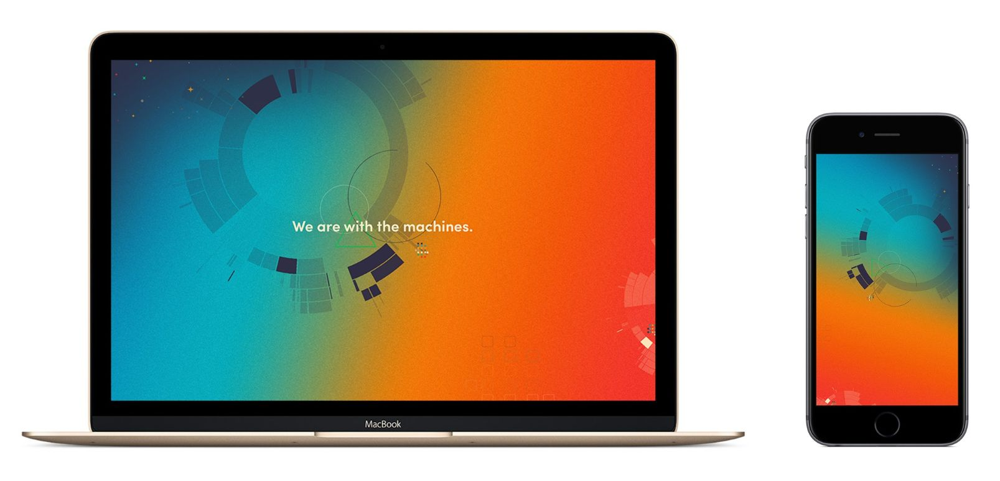

 **TL;DR: By packaging our platform and our people into our product, we’re building a company that has high customer satisfaction, fast growth, capital efficiency and a self-service platform that’s growing stronger every day.**

## Setting the Stage

In the cloud data integration space, there are many incumbents and upstarts, including SnapLogic, Mulesoft, XPlenty, Segment, mParticle, Treasure Data, Fivetran and Alooma.

We noticed that most of our competitors are self-service-oriented, which isn’t surprising. Founders are highly influenced by venture capitalists seeking&nbsp;to scale products, not people.

Once we started talking to customers, however, we quickly realized that many of them simply didn’t know where to start. They all had big dreams about becoming data-driven, but they needed advice from another human.

So we asked ourselves, what if we were more than&nbsp;self-service? What if we built a company that provides a more complete solution from day one, so we can control the activation process while continuing to&nbsp;build the platform that’s in our mind’s eye?

Our pursuit of this objective led us to the Machine + Human Hybrid SaaS Model.

## The Machine + Human Hybrid SaaS Model

**Overview**

Wrap our platform with a human delivery team that not only builds custom integrations, but also acts as a data champion for customers. Our customers get the higher touch and feel of professional services with the speed and predictability of SaaS.

**Benefits**

- Our [platform](https://www.astronomer.io/blog/why-we-built-our-data-platform-on-aws-and-why-we-rebuilt-it-with-open-source) is put to the test with real customers, which pushes us to develop new features in real time.
- We’re able to acquire customers who are less technical, because we can provide the bridge between their needs and our platform.
- We can achieve high customer satisfaction and retention rates, because we’re offering highly&nbsp;dedicated service.&nbsp;
- Customer revenue offsets some venture-raised capital.
- Eventually, we’ll have an opportunity to launch a much stronger self-service platform.

**Team Structure**

- **Growth Team (Marketing and Sales)**: Their objective is to #BreakDelivery.
- **Delivery Team (Customer Success and Product Development)**: Their objective is to onboard and retain customers, and stay one step ahead of sales demand.

**Growth Team**

The process is simple: find companies with a data problem we can solve, and then agree on an amount of monthly recurring revenue to work on the problem for them. Target the initial problem first, but plan to later&nbsp;explore&nbsp;other problems that we can solve for them, too. Once the deal is finalized, the delivery team can begin.

Some key decisions we made when building this team:

- We brought on a sales person very early. They started with customer validation calls, then shifted to sales as the product became ready.
- We adopted [Hubspot](https://www.hubspot.com/), which provides all-in-one CRM, CMS, and marketing tools.
- We established a weekly blog rhythm, rotating blog writing duties amongst the team.
- We hired a part-time social media manager to prime the pump with interesting content.

**Delivery Team**

Within the delivery team, we combine all aspects of customer success, account management, onboarding, product development and platform operations into one group. The team is organized into smaller teams that we call “pods.”

The pods work to solve the problem at hand in agile sprints (we use [JIRA](https://www.atlassian.com/software/jira) for project management). Work can include anything from new integrations to changes to the core platform to setting up customer-requested data pipelines.

**How does the model compare with professional services and self-service SaaS?**

In past lives, many of us on the team have been involved in various high-growth professional services businesses and self-service SaaS companies. What we’re finding is that the Machine + Human Hybrid shares some characteristics with both models, and has distinct advantages.

One side effect of the Machine + Human Hybrid Model is that we “begin with the end in mind” by doing enterprise deals right from the beginning. This forces us to sell to higher-level people rather than directly to our eventual end users, but with the advantage of learning about how the market views our product category and which features will be valued.

While most successful self-service SaaS businesses usually give in to the revenue opportunities of moving upstream into “contact us for pricing” enterprise plans, we are choosing to make that our starting point.

**Model economics**

Although enterprise is the “end” we “begin” with, we are open to signing smaller contracts initially, which means there is huge opportunity for contract expansion. We expect ~20% contract expansion within the first 3-6 months. (So far, this has proven true for us.)

Additionally, as long as (1) realistic expectations were set by sales and (2) the delivery team is performing, there should be near-zero churn.

At $1.5M ARR—our early milestone to break even with current funding—here’s how the math works...

**ARR**

- Initial Contracts $1.4M
- Contract Expansion $280K
- Churn $140K
- _Net Churn -$140K (net negative churn)_
- **Net ARR**  **$1.54M**
- **MRR**  **$128K**

**Monthly Costs**

- Growth 31K (25%)
- Delivery 56K (45%)
- Administrative 19K (15%)

**Recurring Profit**  **22K** (15%)

## So, is this different than self-service SaaS + customer success?

The definition of customer success, according to Wikipedia:

> **_Customer Success_** _is the function at a company responsible for managing the technical and business relationships between a vendor and its customers with the intent of: (1) maximizing the value that customers generate from the solutions they acquired from the vendor by making them as profitable and productive as possible, and (2) maximizing the value the vendor can in turn derive from the customers resulting in sustainable corporate profits and growth._

In other words, people matter to people.

Customer success isn’t a bolt-on feature at Astronomer. It’s baked in as a core responsibility of our delivery team, and we invest significant time and energy into getting to know our customers and their needs.

## Our Experience with the Model

We took a risk by adopting this Machine + Human Hybrid SaaS Model, and it’s working out very well for us. Since January 2016, we’ve grown from $3.5K to $35K MRR with 35% month-over-month growth and near zero churn (i.e. happy customers).

Justin Jackson recently wrote an essay “[SaaS is Ripe for Disruption](https://medium.com/swlh/saas-is-ripe-for-disruption-56429324a0ed)” that inspired this post. We agree with him that there are opportunities to do SaaS differently. And if our&nbsp;past eight months are any indication, we think adding a personal touch could be exactly what SaaS needs.

Download&nbsp;Wallpaper: [Desktop](../assets/wallpaper2560x1600g.jpg) or [Mobile](../assets/wallpaper1080x1920b.jpg)

