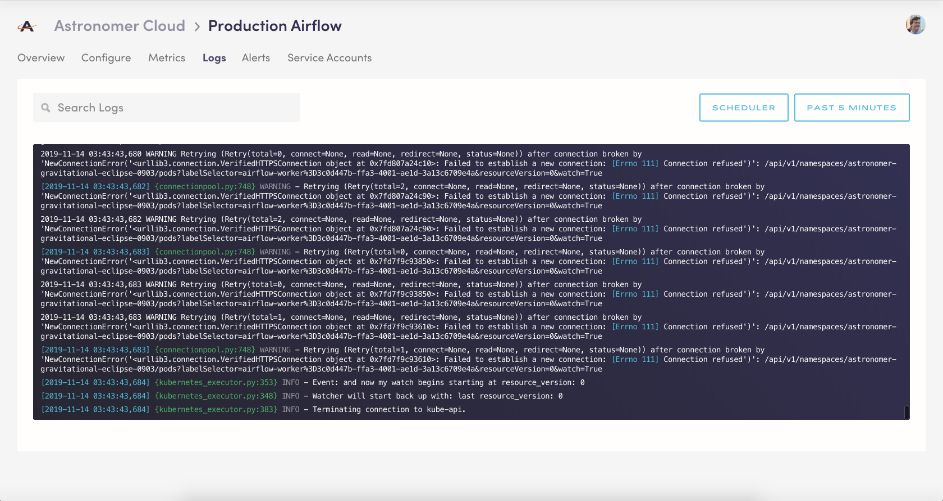
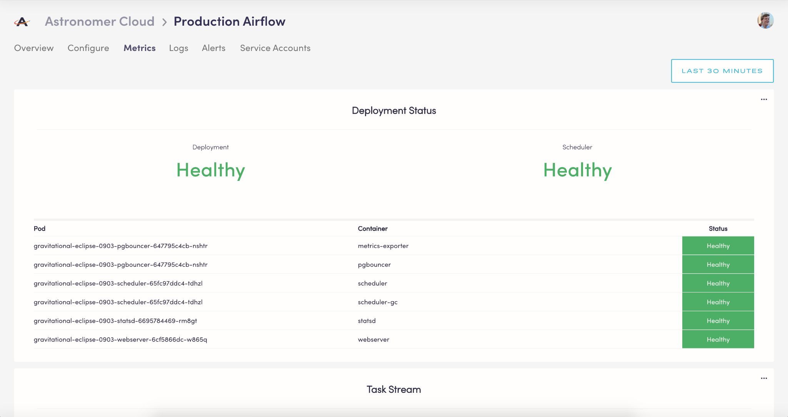
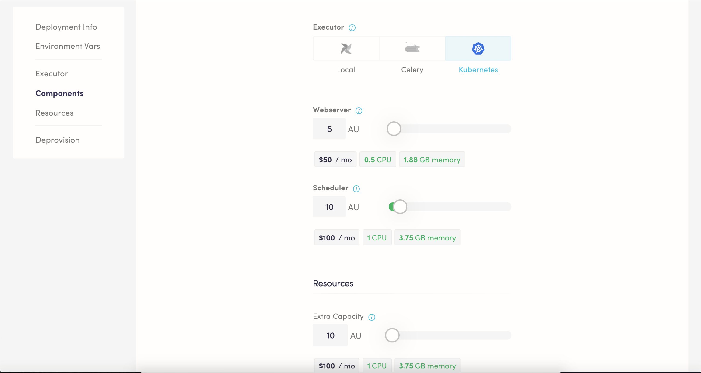
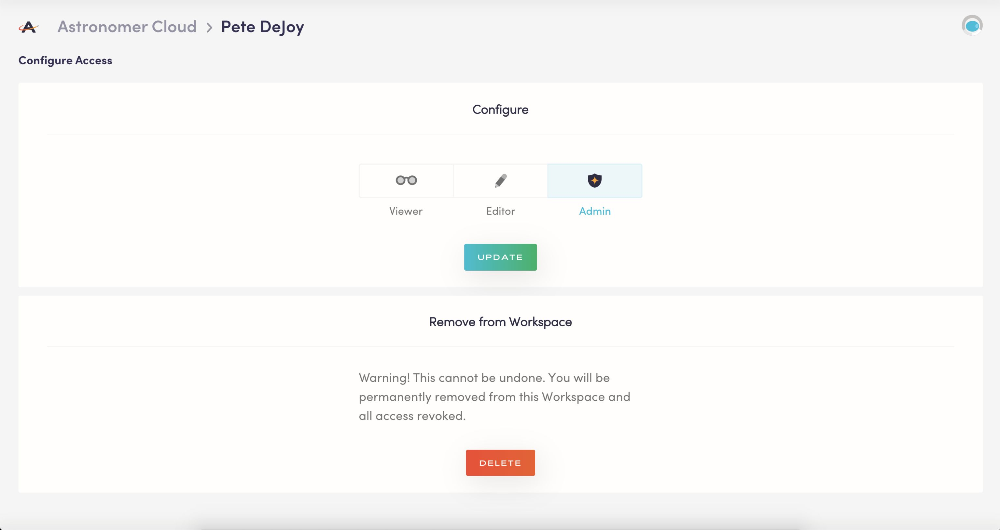

Born in 2018, Astronomer Cloud remains the easiest way to run Apache Airflow.

After 12+ months of strong growth in both usage and support from customers, prospects and Airflow community members alike, it became clear that our single, multi-tenant GKE Cluster that hosted Astronomer Cloud needed an infrastructural makeover.

Optimizing for both maturity and scale, our team has spent the past few months upgrading our backend to create a more reliable and robust managed Airflow offering.

Today, we're excited to announce that the next generation Astronomer Cloud platform is ready.

Designed to set the foundation for multi-cloud and multi-region support, "New" Astronomer Cloud boasts our latest features and a strong backbone built to handle a regular and consistent stream of soon-to-come product releases.

## What's Included

"New" Astronomer Cloud brings our existing customer base to our latest product version, Astronomer v0.10.3. Our latest and greatest includes a slew of features that we're excited to expose to both our current users and those exploring our offering.

### Run Airflow v1.10.5

"New" Astronomer Cloud is built to run and fully support the latest version of Airflow, v1.10.5. By upgrading, users gain access to the features and bug fixes most recently released by the core Airflow project.

For more info, reference [Airflow’s v1.10.5 Changelog](https://github.com/apache/airflow/blob/master/UPDATING.md).

### Real-Time Log Streaming in the Astronomer UI

With Astronomer Cloud, we've re-architected our Airflow + Astronomer logging stack for added observability and usability. For the first time as an Astronomer Cloud customer, you can search and filter your Scheduler, Webserver, and Worker logs from the Astronomer UI. Leverage these logs for informed, real-time troubleshooting and gain deeper exposure into Airflow’s internal processes.

Check out our [logging doc](https://www.astronomer.io/docs/deployment-level-logs/) for a closer look at our new view.

### Metrics Interface

Your deployment on Astronomer Cloud now comes with a dedicated Metrics tab for a birds-eye view of your deployment’s resource usage, the overall health of its components, and a real-time stream of task failures and successes.

### Support for the KubernetesExecutor

In a significant step towards making serverless Airflow a reality, we’ve added support for the KubernetesExecutor, the most resource-efficient way to run Airflow yet. The Executor eliminates the possibility of interruption to running tasks during a deploy, allows for task-level resource configuration, and is built for ultimate scale.

When you use the KubernetesExecutor on Astronomer, you'll be billed dynamically according to true CPU and Memory usage.

### Role-Based Access Control at the Workspace Level

Astronomer Cloud is now fully integrated with Airflow’s native RBAC functionality. You can now assign users one of three granularity mapped roles and control the level of access they have to your deployments and Workspace-level settings. You can also apply these RBAC policies to Service Accounts at the Workspace level.

For a detailed breakdown of roles, refer to our docs [here](https://www.astronomer.io/docs/rbac/).

### 3x Resource Maximums for Airflow Components

You can now increase the resources allocated to your Deployment’s Airflow components on Astronomer to a maximum of 100AU each, a significant bump from our legacy 30AU cap. teams that run heavier jobs, Astronomer

### Faster Deploys

Our newly built infrastructure is optimized to deliver faster and smoother deployments to Astronomer Cloud across the board. Applicable to Local, Celery, and Kubernetes Executors.

### Updated Astro CLI

To enhance the Astro CLI’s functionality, we’ve refactored commands for more intuitive troubleshooting, added a feature for real-time log streaming, and added support for authentication via Service Accounts.

### In-App Billing

In an effort to improve the administrative experience for our users, Workspace Admins can now manage their billing information directly in the Astronomer UI.

## Getting Started

### Existing Customers

We’re just as excited as you are about this release. For instructions on how to upgrade, refer to our [Cloud Migration Guide](https://www.astronomer.io/docs/cloud-migration/).

### New to Astronomer?

The best way to get to know our platform is by [starting a trial](https://www.astronomer.io/trial/).

Otherwise, feel free to check out our [updated docs](https://www.astronomer.io/docs/), [post on our community forum](https://forum.astronomer.io/), or reach out to [Astronomer Support](https://support.astronomer.io/) with any and all feedback or questions.

That’s what we’re here for. Onwards and upwards!
