A very common initiative these days is data warehouse centralization across an organization. [DWaaS](https://searchdatamanagement.techtarget.com/definition/data-warehouse-as-a-service-DWaaS) (data warehouse as a service) has become commoditized to the point that organizations of every size can begin setting up a reporting infrastructure starting at only a couple hundred dollars a month. This is really exciting and, when copying data from other structured databases, a relatively simple process.

Like anything, though, there are a number of ways to centralize data—and every solution has tradeoffs. Even between SQL databases ([relational structures](https://en.wikipedia.org/wiki/SQL)), subtle differences exist and some data types supported in one will require data to be converted from another. But generally, the conceptual relationship of rows and columns carries over to any structured database. It gets trickier, however, when we want to translate [document-oriented](https://en.wikipedia.org/wiki/Document-oriented_database) (e.g. MongoDB) or [object-oriented](https://en.wikipedia.org/wiki/Object_database) structures (e.g. REST APIs) into the 2-dimensional SQL space.

The good news about working in non-SQL space is that storing data in [JSON](https://www.json.org/) (JavaScript Object Notation) allows for a flexible schema to be built over time with a comparable (or higher) performance to that of a structured DB. Yet the ubiquity of SQL knowledge in data teams means that NoSQL databases (and by extension JSON) have yet to really supplant SQL as the default format for basic querying and reporting. There are use cases where NoSQL makes sense for more difficult problems at a much larger scale, but that’s a blog post for another time.

All that to say, knowing the options for storing data will help you make the right decisions for your company when you’re ready to take this step. There are the three aspects to take into consideration when designing a data warehouse—an OLAP (online analytical processing) database—and three forms your data can take to appeal to these aspects.&nbsp;&nbsp;

**NOTE: When using a hosted database or warehouse that stores your data across a cluster, there are additional setup considerations (dense compute vs. storage; indexing; sort/dist keys) that will affect query performance. This guide does not go into them and instead focuses on the factors directly related to importing and normalizing.**

**(https://giphy.com/gifs/hair-character-skate-l0HlW11zuA8Kwuq1a)**

### Three Considerations: Storage, Speed, Ease of use&nbsp;

Storage, speed and ease-of-use each factor heavily into your database choice. The first two are pretty straightforward. Broadly, you want to make sure that your database is avoiding record duplication and that whatever records relate to each other are organized together to make your queries as efficient as possible. These considerations are somewhat at odds (as we’ll soon see) and efforts to reduce either storage size or query latency usually result in sacrifices in the other.&nbsp;

The third consideration (ease-of-use), however, is more subjective. Good analysts are going to care a lot about how their queries are performing but on agile analytics teams, they should also care about how quickly they can navigate the data structures and create various views. If you don’t normalize your data at all, any nested data will just be put into the table nested (and become essentially unusable), but if you normalize too much, you might end up forcing your analyst to work between a taxing quantity of tables. It’s important to remember that analysts rarely generate a dashboard and never touch it again. They (should!) iterate on their analysis quickly, always taking their questions a level deeper, and this requires a delicate balance when choosing how to store the data in the first place.

](https://giphy.com/gifs/hair-character-skate-l0HlW11zuA8Kwuq1a)

### Three Forms of Normalized Data

In balancing the above considerations, a method of how to think about structuring data efficiently emerged in the early 1970s by Edgar Codd, then a researcher at IBM. Although IBM initially wasn’t terribly interested in data storage efficiency (they made their money off of charging for that same storage), IBM’s customers were. But knowing exactly how to put it into practice (and when to stop) turns out to be harder than you might expect.

Take the JSON example below:

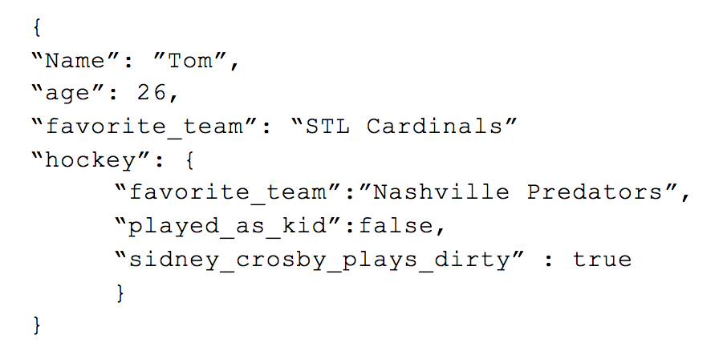This can easily be converted to a structured format as follows:

The values that were nested within the value of “hockey” have been moved up to the top level with the prefix “hockey\_” added to them to ensure they are unique. Had we not included the “hockey\_” to each value, we would have had a conflict between the two “favorite\_team” values as one already exists at the top level. This process is called “flattening” -- whereas there used to be a complex structure, now they are all on the same row. &nbsp;This creates a greater uniformity between records and easier traversing for analysts.

But what if we had something like this?

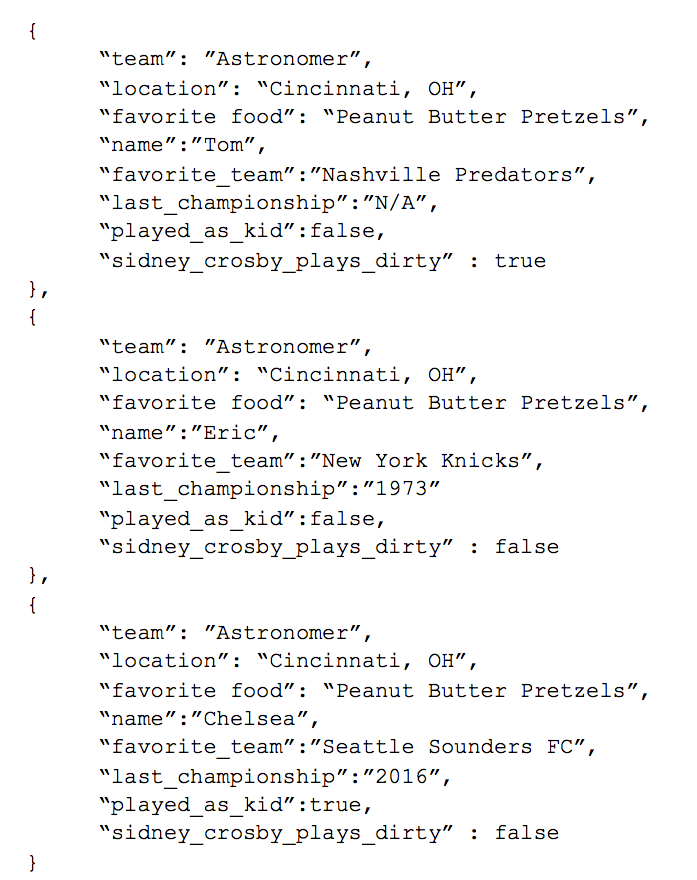&nbsp;This is a much harder example to flatten because we’ve introduced “Sports” that has an array of corresponding values, each with the same sub-fields. If we were to flatten this JSON object, the result would look something like this:

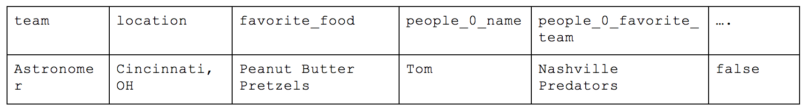

This isn’t great. For every person we add to this list, a corresponding number of columns for each field get created. Instead of a “names” column, we would get people\_0\_name, people\_1\_name, people\_3\_name. This makes even basic analysis impossible because you need to complete rebuild the table through convoluted queries to build the table you actually want where each column is the comprehensive source of truth for a given metric or trait.

An alternative would be to associate the top level information to each person like the following.

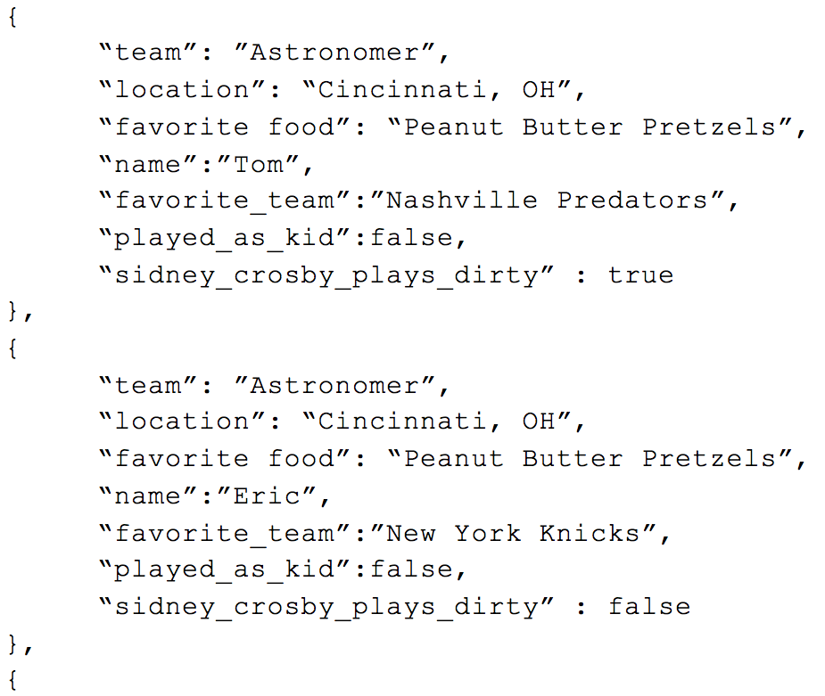 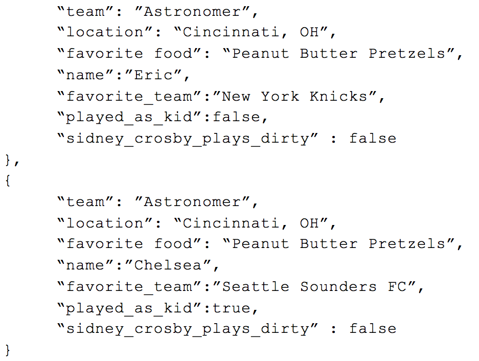

This organization is called [**First Normal Form**](https://en.wikipedia.org/wiki/First_normal_form), where all attributes are represented by individual columns and each value within that column represents an atomic value (e.g. name="Chelsea”; not name=`[“Eric”,"Chelsea"]`). This is very easy to conceptualize as a person new to database structure because it basically functions as any CSV or Excel file we may have used in the past and is thus very intuitive to analyze. If you want a count of people from Cincinnati, you only need to count how many rows are are in the table with the correct value in the location column.

**First Normal Form** helps us create fewer tables but now we have a lot of duplicate data that we don’t need to unnecessarily include. We end up sacrificing storage for ease-of-use, and speed improvements by having minimal tables are likely a wash with the unnecessary data you end up traversing (unless your storage is columnar based, but that’s a whole other story). If Astronomer is in Cincinnati and the team’s favorite food is Peanut Butter Pretzels, those values don’t need to be explicitly repeated for each person on the Astronomer team. We could instead take the previous JSON object with the array of people and break up the response into two tables.

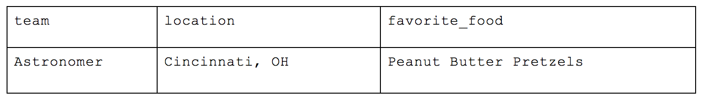

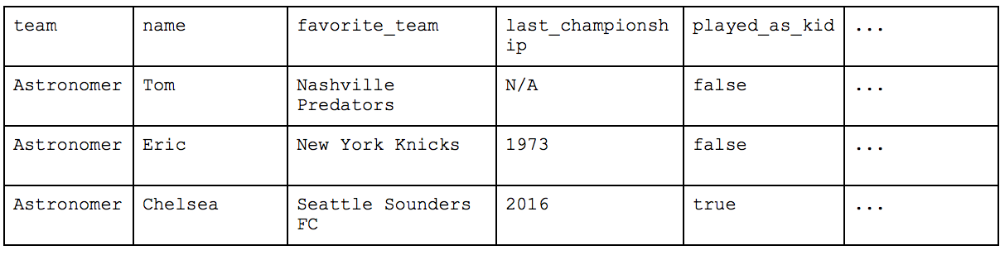

This is much better. Organizing your data this way is called [**Second Normal Form**](https://en.wikipedia.org/wiki/Second_normal_form) and, in addition to the requirements of 1NF, requires that “_no non-prime attribute is dependent on any proper subset of any candidate key of the relation._” The simpler way of thinking about this is that no variables can relate directly to each other instead of to the key value of the table.

In our case, the key for our table is “name”—each person can have the same favorite\_team or played\_as\_kid values but as long as their names are unique, the record itself is valid. Each unique key (name) relates directly to the “Team” but the inclusion of other values like “location” and “favorite\_food” would violate 2NF as they have a direct relation to Astronomer. In the above example, Astronomer is the unique key of the first table as there could be multiple teams in Cincinnati and multiple teams who love Peanut Butter Pretzels but not of the second table as there can be multiple people who are on the Astronomer team.

If we want to get a count of people who work in Cincinnati, we can easily join the two tables with the “Team” value that exists in both places and see how many matches there are. This does add an additional step to our analytics workflow from 1NF but as our datasets grow, the amount we could save on space could be substantial.

The last organizational method is the [**Third Normal Form**](https://en.wikipedia.org/wiki/Third_normal_form), and this is a highly, highly normalized structure.&nbsp;The rule of thumb with Third Normal Form follows the oath you swear in court: “Every non-key attribute must provide a fact about the key, the whole key and nothing but the key.” In this scenario, each person’s last attended championship of their favorite team would violate 3NF as, while it does reflect a fact about the key (i.e. the person), it is only transitively related through the person’s favorite team. To solve this, the table needs to be broken out further.

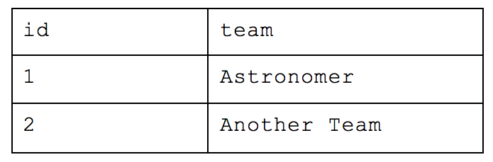

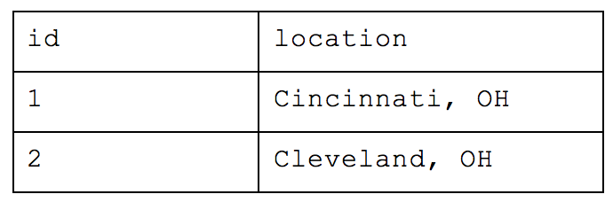

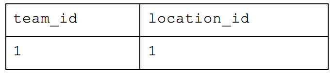

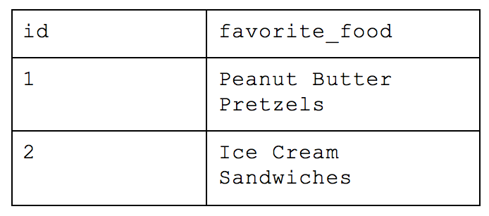

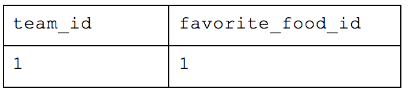

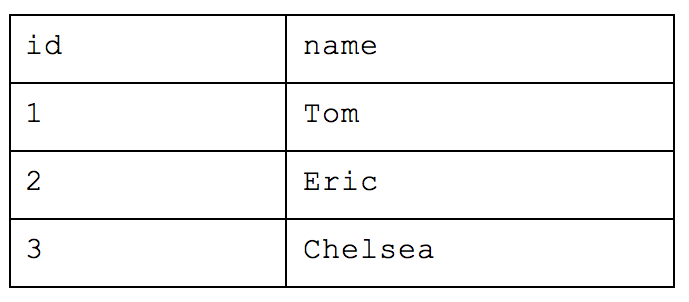

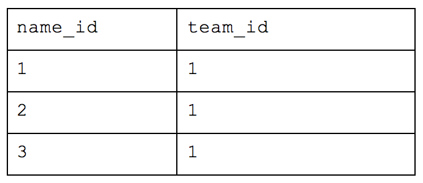

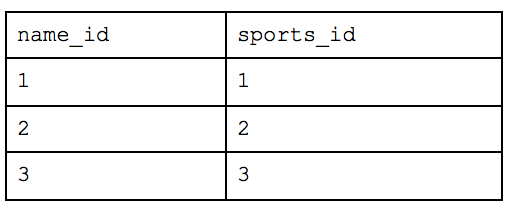

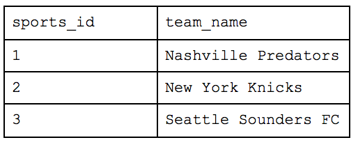

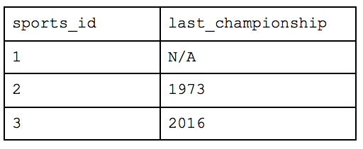

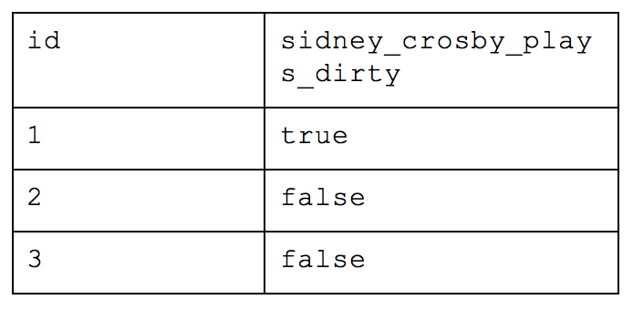

What was originally one table when we started is now nine! With this method, you would be able to return simple requests (e.g. how many people are there) very efficiently while reducing a lot of the storage we saw earlier. But let’s take our example from before and ask which people are in Cincinnati. We would have to query the table of names for each person, the table that maps those people to the appropriate team, the table that maps teams to locations and the table of overall locations. If we also wanted to know how many people worked at Astronomer in Cincinnati, we’d have to bring in yet another table. This all drastically slows down your query performance and will cause your analyst to want to strangle you with an ethernet cord. While this atomic structure can make sense if application building, it’s too normalized for people who need to deftly maneuver around a large amount of complex data and experiment quickly.&nbsp;&nbsp;&nbsp;&nbsp;&nbsp;

### So, Which Form Is Best?&nbsp;

Each form, of course, has pros and cons, which means every choice is based on individual needs. But Second Normal Form is what we most often recommend at Astronomer&nbsp;when building your analytics warehouse. Even within 2NF, however, there is flexibility—whether to lean more or less normalized will be specific to your project.

Additionally, when we publish a new connector, we typically do so with a “recipe” or a recommended 2NF schema mapping that helps our customers skip the legwork of creating their own data structure and go straight to analysis (though that can be modified). Your situation might be different depending on factors like whether your dashboards are ultra-specific and static or if you have a team of analysts constantly manipulating the data for insights. The most important thing,&nbsp;[like every data initiative](https://www.astronomer.io/blog/approach-the-next-data-initiative-like-a-data-analyst), is to know how you plan to use your data—and consider storage, speed and ease-of-use in relation to your needs—ahead of time.&nbsp;

