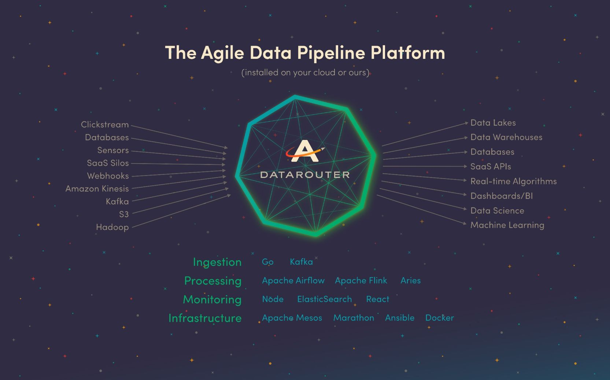

<!-- markdownlint-disable-file -->s
Last year, I wrote a blog post about [why we built our platform on AWS and rebuilt it with open source](https://www.astronomer.io/blog/why-we-built-our-data-platform-on-aws-and-why-we-rebuilt-it-with-open-source). It chronicles our journey to build our _ideal_ unified system, one that checks all our boxes (like cross-infrastructure, secure, efficient, highly available, self-healing and able to execute long running processes as well as spin up one-off processes and specialized clusters of machines on the side).&nbsp;  
  
But this post is different.

Yes,&nbsp;the capabilities of best-in-class open source components like&nbsp;Apache Airflow, Apache Mesos, Docker, Marathon and more enabled us to build this&nbsp;ideal platform, [an engine to power everything we do](https://www.astronomer.io/the-machines), called DataRouter.

But there’s a deeper, philosophical reason we are pursuing open source—and why we are, in turn, open sourcing our platform: **we want to live in a world that's open source**.&nbsp;

## We love open source because it's...

### Innovative 

[According to Wired](https://www.wired.com/2016/03/google-facebook-designing-open-source-data-center-gear-together/), when Facebook decided to stop “treating data center design like [_Fight Club_](https://www.youtube.com/watch?v=dC1yHLp9bWA),” companies like Microsoft, HP and even Google followed suit. This changed the game. No longer are&nbsp;companies forced to waste time reinventing the wheel. Now they can&nbsp;implement the components they need—created by top developers—and innovate elsewhere (let’s get to Mars!).&nbsp;

### Reliable

We’ve all had “technical difficulties” when our technology operated unreliably. Professionally, that can cause a variety of outcomes, from mild annoyance to genuine detriment. When everybody’s using the same components, everybody’s optimizing the same components. As Linus Torvalds, the creator of Linux, said, "Given enough eyeballs, all bugs are shallow” ([Linus’s Law](https://www.pcworld.com/article/209891/10_reasons_open_source_is_good_for_business.html)). In other words, the more people who can see and test a set of code, the more likely any flaws will be caught and fixed quickly. When smart people who’ve spent years doing academic research and real world work build tried and true components, we can&nbsp;be confident in it.

### Diverse&nbsp;

It's a huge benefit to have a large number of developers look at and contribute to the same systems. Instead of a few people with the same view of the world building components, an entire community with varying perspectives and strengths contributes to the system (and has a stake in its success and adoption), which makes the system more resilient.&nbsp;

### Transparent&nbsp;

Not transparent [like the world Dave Eggers helped us envision](https://www.nytimes.com/2013/11/03/books/review/the-circle-by-dave-eggers.html), where privacy is forsaken, but one where people aren’t tied down to a proprietary system protected&nbsp;in a black box. Transparent, as in the ones _actually_ using and building on the system can see everything; they can pop open GitHub, look at the code and trust that the code has been reviewed publicly. This gives decision-makers insight to what’s going on and where components can be swapped around—and the control they need to actually do it.&nbsp;

### Agile&nbsp;

When components are living in a community-curated open source world, they are built to “play nicely” with other components. For example, one of our ingestion systems can dump a file in a well-known format to our distributed file system. We can write some common transformations using the Apache Beam API, but are free to swap around the underlying execution engine. &nbsp;We may use Apache Spark today, but may move to Apache Flink, or whatever comes next. Beyond that, we can even swap components of the execution engine, like the in-memory representation. This flexibility allows us (and anyone) to stay cutting edge. And with open source, any organization can take a piece of code and customize it to best fit their needs.&nbsp;

When it comes to tech, we want to live in a world where we’re totally free to explore, invent best-in-class technology and use it in revolutionary ways. We can do it through open source.

