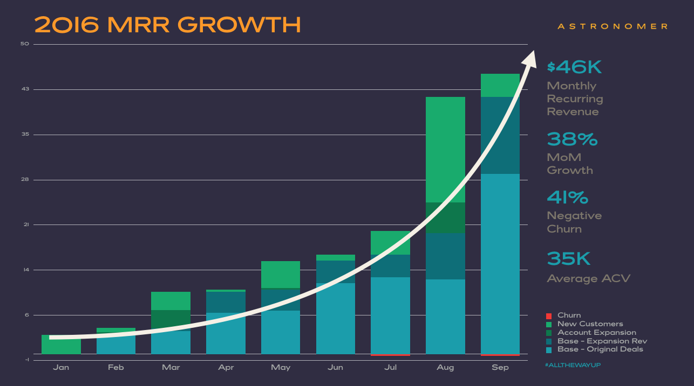

_The story of our path to raising $2M is a series of short stories with some amazing protagonists. A huge thanks to everyone! Let’s dig in._

### Driving on “E”

Throughout the course of Astronomer, we’ve been driving on empty. In other words, we’ve only had enough money in the bank to survive, at most, a few months—often less—at a time. We lost count of the number of times we’ve had to warn staff about possibilities of trouble with upcoming paychecks. It was rough.

This forced us to focus on a constant cycle of short-term progress and has been quite stressful for everyone. On the positive side, the pressure to perform has led to higher performance, and caused us to be focused on producing revenue traction, which is a big advantage to us as we approach Series A.

We wouldn’t do it again this way if we had the choice, but if you’re running a startup in the same situation, you probably have some comfort in knowing that better startups are usually created during downturns, and we’re certainly in [a bit of one](https://mattermark.com/heres-need-know-q3-vc/).

### Fall '14: USERcycle

We began in the fall of 2014, as USERcycle, a user analytics product. While a managing director of [Differential](https://differential.com/), I got an email from [Ash Maurya](https://www.linkedin.com/in/ashmaurya), who originally founded USERcycle, asking if Differential would like to take the business over. It took us just a few moments to jump on the opportunity. With the increasing acceleration of data generation, we were big fans of the analytics space, and we had just tried a few internal ideas at Differential that weren’t panning out. Mostly because we were naively expecting VC-backed results from bootstrapped effort, but that’s a post for a different day.

Right away, we recruited Tim Brunk, who was then looking for his next challenge after getting his men’s fashion company, [Cladwell](https://cladwell.com/), off the ground. Within a couple of weeks, he brought Ben Gregory, a super smart VFA fellow, into the mix, and they were off to the races.

As things picked up, Greg Neiheisel and I began working on the effort too. After struggling with the solid-but-dated technology, we decided to just rebuild the product from the ground up over the coming months. &nbsp;

### Winter/Spring '15: Early Investors (first $250K)

The product looked good, and early signs were promising! Promising&nbsp;enough to snag our very first investor...Tim’s dad (it’s those early friends and family who&nbsp;believe in you when no-one else will!). After Tim’s father-in-law also took the bait, a local entrepreneur and friend, Michael Wohlschlaeger, connected us to a “rockstar Angel investor” named [Morris Wheeler](https://www.linkedin.com/in/mowheeler). A quick glance at Morris's&nbsp;Crunchbase profile revealed his pedigree (over 100 investments)—this was our first legit investor pitch! The morning of the pitch, Tim was able to get David Willbrand, a prominent local tech/startup attorney and Michael W. to bombard Morris with “encouragement” about us. I believe Morris’s words were “After that, I didn’t really have a choice but to invest.”

Next came Kyle Wild, CEO of [Keen.io](https://keen.io/) and one of Morris’s top portfolio companies. Kyle was a huge win for us as we were building the new version of USERcycle to sit directly on top of Keen. He also brought some coastal validation to our vision and fledgling team.

With Kyle and Morris in, Tim convinced several of his former Cladwell investors and some new folks to jump on the bandwagon, including [dunnhumby](https://www.dunnhumby.com/)’s managing director Andy Hill and [Modulus](https://modulus.io/) co-founder Charlie Key. Ask any founders: getting these early investors are the hardest, not just because the company is so early, but because you are putting your friends' and family’s money on the line! Locking those in gave us reason to clebrate.

_(Courtesy of "Trong Enterprises")_

### May '15: Pivot from Analytics

As May approached, however, we were out of cash again. We had just enough to go to Vegas for the Collision Conference. You’ve probably heard Steve Blank’s advice to “get out of the building” and talk to real customers. Turns out, for us, “getting out of the city” was exactly what the doctor ordered. We had a USERcycle booth at the conference, but we were frustrated. For several months we had struggled to get people onboarded and using USERcycle. The desire was there, but the data we needed was not...

This struggle plus&nbsp;the “glitz” of old Vegas (or, more likely, the sessions we attended) sparked new creative thoughts for Tim and I, and we decided after day one of the two-day conference to PIVOT THAT NIGHT, abandon our booth and spend day two doing customer development for the new vision. We grabbed some cheap beer and Tim, Ben and I worked through the night getting things ready.

The next day was exhilarating.&nbsp;Our new pitch, while certainly a hot mess, was working. People resonated with the much larger, more significant problem we were solving: data extraction and transportation. We were simply addressing our own challenge: helping companies get control of their data so they could use tools like USERcycle.

### July '15: AngelPad Interview + Building Our&nbsp;Team

Inspired by our&nbsp;new clarity, we applied days later to [AngelPad](https://angelpad.org/), the top-rated accelerator in the world, on a whim. In July, [we drove to New York and back for a 15-minute interview](https://www.astronomer.io/blog/why-we-drove-to-ny). Miraculously, we got in, though they liked USERcycle more than Astronomer, causing us to wonder if we pivoted too soon. With AngelPad’s vote of confidence, we managed to raise enough money from existing investors to get us to September, when we’d start the program and get AngelPad’s investment.

Rather than play it safe and try to make the money last, we opportunistically brought on Brad Kirn to do customer development and early sales, and Chris Hendrixson to lead brand/design. If we were going to do this, we wanted to do it well.

In the face of a dwindling bank account, we accelerated. We were the first Midwest company ever accepted to AngelPad, and that fall, we spent three months in New York City, away from our families and team, growing Astronomer and pivoting to enterprise.

### Fall '15: The Power of A&nbsp;Strong Intro

During AngelPad, we spent a number of weeks in San Francisco and managed to meet not just [Social Starts](https://www.socialstarts.com/), but also [500 Startups](https://500.co/), thanks to our friend [Dave Fetterman](https://www.linkedin.com/in/davefetterman) and this lively email:

> _McClure,_  
>   
> _A friend of mine from the bygone Famo.us days, Ry Walker, is in SF this whole week his new company, Astronomer, to present at Wednesday’s AngelPad Demo Day. The good news is that you may KNOW him from a previous pitch at some point._  
>   
> _And he definitely knows you: From Ry himself re: McClure: “Definitely would like to talk to him; he's literally my most favorite investor because he gives no fucks.”_  
>   
> _So yeah, it’s not another Dave McClure._  
>   
> _I didn’t know much about Astronomer until I started helping one of my advisees, Quizlet, start looking at setting up their data warehousing solution. There are a ton of options for streaming, storing, aggregating, analyzing, and visualizing real-time data, with everything from the free-but-weak Google Analytics all the way to the expensive-and-brittle Omniture approach. &nbsp;_  
>   
> _It’s been quite an ordeal but Ry impressed me with his understanding of the space, and the success his company has seen since joining the AngelPad incubator in New York a few short months ago. They have real customers, real revenue, and solve a real problem that’s important to people._  
>   
> _Astronomer is looking for angel investment and you came to mind. I’ve added Ry to the email if you guys were interested at all and had time this or subsequent weeks._  
>   
> _Best,_  
> _DF_

Two days later, 500 Startups invested: we met Mat Johnson at noon. At 2pm, got an email: “Ok - I'm in for $75K using our SAFE-like KISS docs. If this works for you, I'll get process going.” Truly legendary. Thanks, Mat.

### Nov./Dec. '15: SV Fundraising Attempt #1

And this is where things get heartbreaking, at least to us. First, a little bad luck: The bubble talk had become worrisome to a lot of early-stage investors, so they cut back on investments right as we were graduating AngelPad. We met with 60 investors in SF over 30 days, got very close to getting a round done, but couldn’t pull together a lead investor. So we left town to spend Christmas with our families, empty-handed.

Discovery: it’s [hard to get a Silicon Valley institutional seed lead without first relocating to SV](https://www.astronomer.io/blog/location-wars-part-1), unless you’re in NYC.

Fortunately, Tim’s cousin and SF-based banker, [Joel](https://www.linkedin.com/in/joel-brunk-28650489), and Brian and Jeff Holmes, with [First Ascent](https://www.firstascentassociates.com/), decided to jump in, quite frankly expecting that we’d raise more money right around the time of their investment. We expected it too. But it didn't happen, and while they were worried, they worked with us. We appreciate the faith you put in us, guys.

### Jan '16: Push for Revenue

The new year began, and we hadn’t gotten our round closed. It was becoming clear the only path to Seed was through results…traction. We needed revenue. On January 1, we had $3.5K MRR, and it was a start. But our focus through the spring and summer paid off. We’ve come a long way, baby:

### Spring '16: Possible Acquisition + Possible “Big Investor”

I can’t believe I haven’t mentioned [Cintrifuse](https://www.cintrifuse.com/) yet. In true startup fashion, they’ve grown from a three-person team to a dominant force driving [StartupCincy](https://www.startupcincy.com/). At this point in the&nbsp;story, Cintrifuse’s Tim Schigel played matchmaker with a startup who could potentially acquire us.&nbsp;At the same time, we got into serious talks with a potential Series A investor.&nbsp;[For various reasons, both fell through](https://www.astronomer.io/blog/an-almost-acquisition-story).

Once again, we had very little money. This time, however, revenue (and delivery obligations) was growing. Time to hire three more people: Alois, Trong and Becky. Damn the torpedos.

### Summer '16: More of the Same

With customers added daily, and a growing team, we needed to finish this round, stat. I sent an email to my friend [Pat Keefe](https://www.linkedin.com/in/pat-keefe-41a1738), former COO of [OmniCare](https://www.omnicare.com/), and two hours later got this email back: “Thanks. I will take you up on the offer. I will commit $100,000 to the round. Please send me the offer letter for my review.” He dropped off a check that afternoon.

I can’t make this stuff up. Startup roller coasters can be quite roller coastery.

But our high burn rate threatened our solvency, and big checks didn’t last long. Are you seeing a pattern here? Running on “E” as always. Fortunately, Morris and Charlie stepped up just in time to help us keep the lights on (again).

### Aug '16: $1M seed round

Somehow, we survived until August, which turned out to be just what we needed. August was a great month. We more than doubled our MRR. We closed the $1M round that we had been&nbsp;working on for a few months with [CincyTech](https://cincytechusa.com/) (thanks, Mike, John, Doug, Bob), [Connectic](https://connetic.ventures/) (thanks, Brad and Kyle), [Core Network Fund](https://corenetworkfund.com/) (thanks, Bob and Eric), and [Router Ventures](https://www.routerventures.com/) (thanks, Jeff).

### Fall '16: MRR Growth + Quest for Differentiation

So now is the moment we’ve been waiting for: [we get to announce the fundraising](https://www.bizjournals.com/cincinnati/news/2016/10/11/exclusive-cincinnati-big-data-startup-secures.html?ana=e_me_set1&s=newsletter&ed=2016-10-11&u=McVLtNuVUnm3uOmQV%2Fvucw0ad4e4e4&t=1476186333&j=76082841)!&nbsp;For a few months, we'll&nbsp;put it behind us &nbsp;to work on refining our message and sales process and scaling up marketing, sales and customer success. We have competition in every direction, so we have to refine our story of differentiation and prepare to go back to battle in early 2017 to take our game to the next level and raise Series A. We’re spending a lot of time connecting with potential Series A lead investors, listening to what they need to see in order to place a bet on us.

But today, we wanted to stop&nbsp;to reflect on&nbsp;how we got here. What a journey! We hope it inspires you to keep pushing. The struggle is real but you’re not alone. Just keep pushing.

