**_TL;DR:_** _We value and encourage remote working at Astronomer. This is the first of a series of Remote Working Guides in our favorite cities to work in, outside of Astronomer’s home town_ _of Cincinnati._

### Introduction: The Rise of Remote Working

At the Global Leadership Summit in London recently, 1 in 3 business leaders predicted that a majority of their full-time workforce will be [working remotely by 2020](https://www.fastcompany.com/3034286/the-future-of-work/will-half-of-people-be-working-remotely-by-2020). We’re living in an increasingly mobile world, aren’t we? Aside from the fact that we have supercomputers in our pockets, laptops are thinner, lighter and more powerful than ever. My entire hard drive is in the cloud, to boot. As a graphic designer, I used to dream of the Apple G5 tower with multiple monitors and stacks of hard drives to store all my stuff. Now, I’m happier than ever with nothing but my Macbook and [Topo](https://topodesigns.com/collections/bags/products/trip-pack) backpack.

 __

_To see this and more of Dan’s work, check him out on_ [_dribbble_](https://dribbble.com/DanDragomir)_._

Remote working is on the rise, and it’s becoming easier than ever to do work away from the office while staying connected. I just found out—literally, today—that you can type [“/hangout”](https://keen.io/blog/105456820166/9-slack-hacks-we-couldnt-live-without) inside of a Slack channel or direct message and it will automatically create a Google Hangout. I had a successful meeting today via video with the design team, which consists of me and Greg, a developer with a great eye for design who lives in Denver.

Speaking of Denver, I recently spent a week in the city working remotely. Most of the Astronomer team, including me, lives and works in Cincinnati, but [as a part of our culture of wholeness](https://www.astronomer.io/blog/why-we-chose-fun-as-a-core-value), we all try to work remotely sometimes—it gets us out of our comfort zones, breaks old routines and habits, and exposes us to new, beautiful and interesting places that inspire and stretch us.

Personally, I try to get to Denver whenever I can. It is, by all accounts, a city of growth and excitement, and that includes a burgeoning tech and startup scene. My goal was to have a productive work week in a city I love.

One of the biggest challenges about working in a new city, however, is figuring out how to maximize productivity. As a team, we decided to share ways we are&nbsp;successful in different cities by drafting up “remote working guides.” Then, we thought, with the rise of remote working in general, why not share it? I agreed to take on our inaugural guide during my most recent trip.

_Read the story behind this cool map of Denver by Raybo Design_ [_here_](https://raybodesign.wordpress.com/2012/01/30/map-of-denver-co/)_._

So, when I arrived in Denver, I started searching Google for [“best coffee shops to work denver.”](https://www.google.com/webhp?sourceid=chrome-instant&ion=1&espv=2&ie=UTF-8#q=bestcoffeeshopstoworkdenver) I found a bunch of articles, blogs and lists but only some were helpful. Many were outdated or featured way too many places to convey any real sense of curation. After much sifting and a lot of cross referencing, I began to notice a few places that tended to make the lists. I stockpiled some favorites in Google Maps and on Monday morning, I started at Black Eye Coffee, but I’ll get to all that.

During my week, I visited a lot of different places by rail, bike and foot, talked to many Denverites from shop owners to Uber drivers, explored the city extensively, and even, to my own surprise, got a lot of work done. I made notes throughout the week about each coffee shop, restaurant, neighborhood, form of transportation, conversation, etc.

This guide offers tips on the two main&nbsp;hurdles I faced while trying to stay productive during the work week in a new city: _where to work_ and _how to get around_.&nbsp;

### Chapter 1: Getting Around Denver

#### The Light Rail

Denver’s RTD transit system comprises bus and rail transit, the latter of which is known to locals as the _light rail_. The light rail opened to much fanfare in 1994 with 11 rail cars on a line connecting downtown and the city’s southern suburbs, a 5.3 mile section now known as the _D Line_. Today, the light rail boasts a fleet of 174 rail cars that cover 47 miles throughout the region.

 _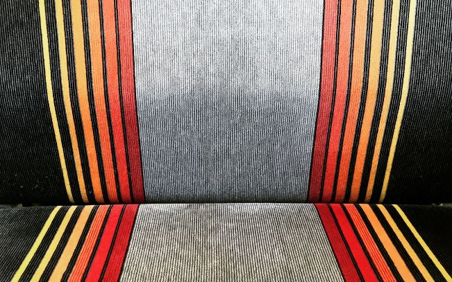_

_This is a photo I took of the seats in the light rail car._

The newest line opened in April 2016 and connects Denver International Airport to Union Station, right in the heart of downtown Denver. It’s called the _A Line_. Trains run every 15 minutes, the ride takes about 30 minutes and it costs just $9 (by comparison, a similar UberX ride costs $30-40).

Nearly 90,000 visitors and locals ride the light rail everyday, and new lines are being built as I'm typing this. There are numerous expansion routes planned via the multibillion dollar [FasTracks](https://en.wikipedia.org/wiki/FasTracks) project, including a rail to Boulder, which is about 30 miles northwest of Denver. The Boulder expansion is planned for completion in 2044, which I find equally&nbsp;perplexing and amusing.

My advice? Ride the light rail as much as possible! It’s convenient, [cheap](https://www.rtd-denver.com/Fares.shtml) ($5–$9 for an unlimited day pass) and can get you to downtown Denver from almost anywhere in the area.

**_Fun Tip:_** _Sit on the left side of the rail car on northbound trains and the right side when heading southbound for stunning views of the Front Range mountains on a sunny day.\*_

#### Denver B-Cycle

B-cycle is a public bicycle sharing company formed in partnership with [Trek Bicycle Corporation](https://en.wikipedia.org/wiki/Trek_Bicycle_Corporation), [Humana](https://en.wikipedia.org/wiki/Humana) and the advertising agency [Crispin Porter + Bogusky](https://en.wikipedia.org/wiki/Crispin_Porter_%2B_Bogusky). The mission: develop a technologically and visually appealing bike share system. B-cycle launched in 2010 in Denver on Earth Day and is now in 29 US cities.

_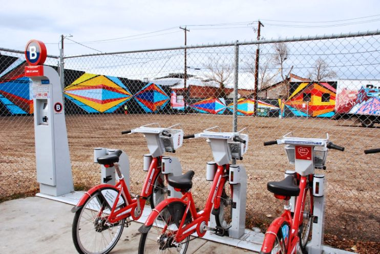A Denver B-cycle station at 28th & Larimer in the colorful RiNo neighborhood._ [_Photo source._](https://www.r4bb1t.com/2014/01/photos-of-larimer-businesses-rino.html)

Today, Denver B-cycle has 88 stations and 700 bikes throughout ten central Denver neighborhoods. You can check out and return a B-cycle bike at any station, 5am to midnight, 365 days a year.

Denver B-cycle is a _fantastic_ way to get around Denver! There are a ton of stations, and many streets in downtown Denver have dedicated bike lanes, which make driving in the city at rush hour much less daunting. Also, the [Cherry Creek Trail](https://www.walkridecolorado.com/denver-metro-single-trails/cherry-creek-trail-downtown-denver-to-parker) is an awesome bike-and-pedestrian-only path that cuts through the heart of downtown along Cherry Creek.

_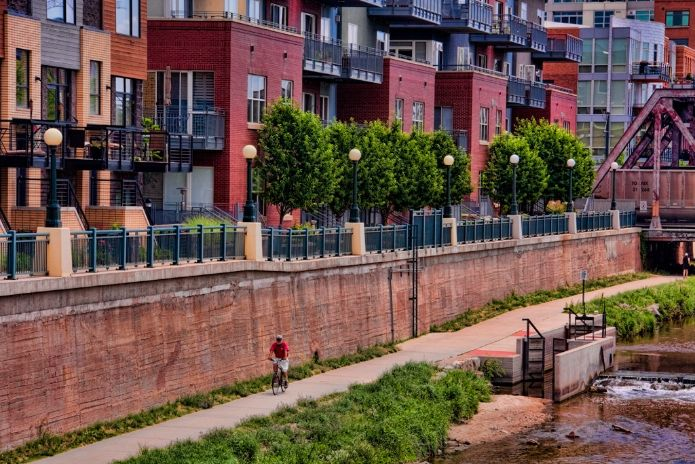Denver’s Cherry Creek Trail alongside some downtown condos. Photo via_ [_www.denverphotoblog.com_](https://www.denverphotoblog.com/wp-content/uploads/2011/09/RidingCherryCreekTrail.jpg)_._

During my week in Denver, I logged 33.8 miles on Denver B-Cycle (once you set up an account, you’ll gain access to some cool data on your trips). The bikes are 3-speed, feature a front basket big enough for my small backpack and as a bonus, I got some good exercise (not always an easy thing to do while traveling).

**_Important Financial Tip:_** _For $9, you can take unlimited 30-minute bike rides in a 24-hour period. However, if you are spending a few days, a week or more in Denver, I’d suggest the $15 monthly pass, which gives you unlimited 30-minute rides for 30 days, saving you money even if you only use it for two days out of the month._

#### Uber … Occasionally

In my experience, you can get almost anywhere you’ll want to go via light rail and B-Cycle, but you’ll still have to Uber occasionally, moreso when the weather is especially treacherous. On several occasions, I rode a B-cycle bike or light rail as close as possible to a destination and took a short Uber ride to complete the trip, which was easy. Like almost any moderately-sized city nowadays, you can pretty much count on&nbsp;an UberX to be able to pick you up in 5 minutes or less.&nbsp;

### Chapter 2: Five Best Places to Work

While I didn’t visit every single coffee shop in Denver, I did test drive a bunch. These are the best of the best, in my opinion. Others didn’t make the cut because the wifi was sub-par, the seating area was just too small or I simply found the place uninspiring. The following list is in no particular order.

#### Black Eye Coffee, LoHi

_3408 Navajo St, Denver, CO 80211 •_ [_Find it on Google Maps_](https://www.google.com/maps/place/Black+Eye+Coffee+-+LOHI/@39.7646929,-105.006154,17z/data=!3m1!4b1!4m5!3m4!1s0x876c78edc38eb7e5:0xfede72592910c9bc!8m2!3d39.7646929!4d-105.0039653)

Small but cozy and comfortable, [Black Eye Coffee LoHi](https://www.drinkblackeye.com/lohi/) is one of my favorite places to work in all of Denver. Most of the seating is around big, communal, reclaimed wood tables, and most of the patrons are listening to headphones and working on their Macbooks. So if you are trying to get locked in on some deep work in a bright spot in the company of others doing the same, this is your place. In addition to coffee, Black Eye features sandwiches, pastries, small bites and sodas made in-house daily.

Black Eye opens at 6:30am on weekdays and I’d suggest arriving as early as possible to secure a good spot, as the place fills up pretty quickly by 10am or so. Feel free to stay a while too; most people do.

**_Neighborhood Tip:_** _Black Eye is in the Lower Highlands neighborhood (more commonly referred to as “LoHi”), one of the most popular areas of Denver right now. Walk out, take a left and follow Navajo Street to_ [_Avanti_](https://www.google.com/maps/place/Avanti+Food+and+Beverage/@39.7622587,-105.0083362,17z/data=!3m1!4b1!4m5!3m4!1s0x876c78ecf56f38ed:0x2d23e42db4133a08!8m2!3d39.7622546!4d-105.0061422) _for lunch. Along the way, check out the brand new, modern architecture alongside more traditional homes in this eclectic and thriving neighborhood, which reminds me a bit of Palo Alto._

#### Carbon Beverage Cafe, LoHi

_1553 Platte St, Denver, CO 80202 •_ [_Find it on Google Maps_](https://www.google.com/maps/place/Carbon+Cafe+%26+Bar/@39.7572419,-105.0106415,17z/data=!3m1!4b1!4m5!3m4!1s0x876c78eace38748f:0x8d39ecbcaa64f94f!8m2!3d39.7572419!4d-105.0084528)

 _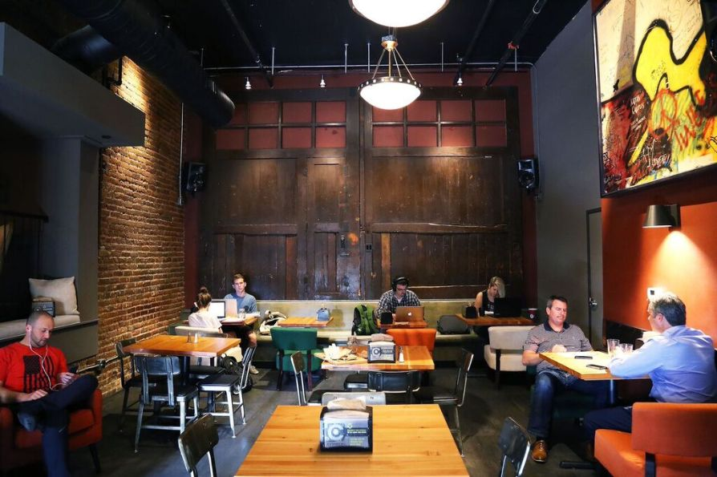_

_Photo by_ [_Colorado Beer Girl_](https://coloradobeergirl.com/2015/12/22/where-to-brunch-on-new-years-day-2016/carbon/)_._

If there’s no place to post up at Black Eye in LoHi, walk 15 minutes southwest to [Carbon Beverage Cafe](https://www.carbondenver.com/space.html) in the same neighborhood, where you’ll have no problem finding a seat. This place is huge but still feels quite cozy. Though it opened only a year ago, Carbon is one of those places that feels lived-in&nbsp;and comfortable.

Grab a coffee and make your way to the back rooms where you can linger for hours and hours, working and listening to Tame Impala at full volume in your headphones while sitting in one of a couple dozen chairs of various shapes and sizes. Carbon is a great place to lock in for a few hours in the late afternoon or evening. They’re open until 11pm and also sell beer, wine and cocktails if you need a little creativity bump.

#### Crema Coffee House, RiNo

_2862 Larimer St, Denver, CO 80205 •_ [_Find it on Google Maps_](https://www.google.com/maps/place/Crema+Coffee+House/@39.7611445,-104.9839116,17z/data=!3m1!4b1!4m5!3m4!1s0x876c791f1b608a1f:0xbdce7db3efcc0a50!8m2!3d39.7611445!4d-104.9817229)

[_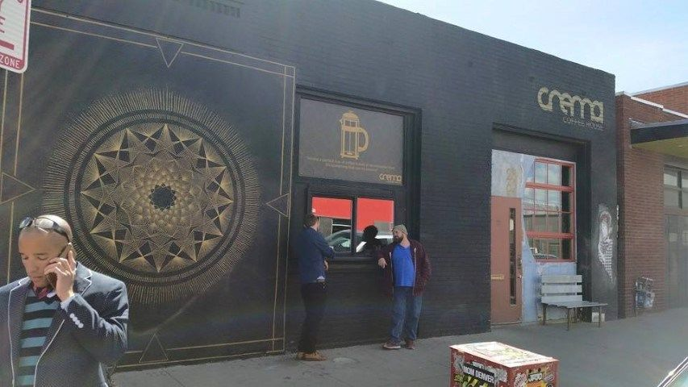Photo source_](https://denverrealestateviews.com/denver-vespa-coffee-shop-tour/)_._

Crema is a colorful, hipster joint filled with craftsmen/baristas and funky, local artwork on the walls. Don’t be turned off by the hipster vibe though. We’re talking about Denver here, not Portland, so you’ll fit right in with your Patagonia fleece.

While the wifi seemed sufficient and there are plenty of places to sit, I had a difficult time finding a power outlet—which can quickly become a deal breaker when working at a coffee shop. You can find them, but you may have to wait to snag the right seat.

More people were having conversations around me than in Black Eye Coffee, but there were enough people working that the vibe still felt productive. The local artwork is wild and inspiring, too. Crema is a great place to go drink an espresso, do some light work or catch up on those Fast Company articles you favorited on Twitter months ago.

_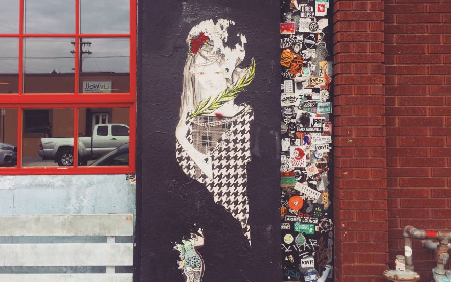This is a photo I took of the street art in RiNo, outside of Crema._

Crema’s best feature, though? The neighborhood.

**_Neighborhood Tip:_** _River North (almost always just referred to as “RiNo”) is adjacent to downtown and is one of the most exciting and interesting areas of Denver today. Considered by many to be_ [_the most up-and-coming neighborhood_](https://www.thegoodlifedenver.com/2014/01/29/is-river-north-rino-the-most-up-and-coming-neighborhood-in-denver/) _in all of Denver, RiNo is full of old auto body shops, junk yards and a ton of abandoned buildings being turned into a CrossFit studio, bar or Kit and Ace. The area still has a way to go until it’s considered “bustling,” but the creative energy is palpable as entrepreneurs, developers, restaurateurs, artists, startups, investors and other opportunists are moving to the neighborhood in droves. Take a long walk up and down Larimer Street and pop into a gallery or clothing store and jog a block north to do the same on Walnut Street, parallel to Larimer._ &nbsp;&nbsp;&nbsp;

#### Union Station, LoDo

_1701 Wynkoop St, Denver, CO 80202 •_ [_Find it on Google Maps_](https://www.google.com/maps/place/Union+Station/@39.7532165,-105.0024244,17z/data=!3m1!4b1!4m5!3m4!1s0x876c78e7f8f754ff:0xade48799fe7a5cdd!8m2!3d39.7532165!4d-105.0002357)

_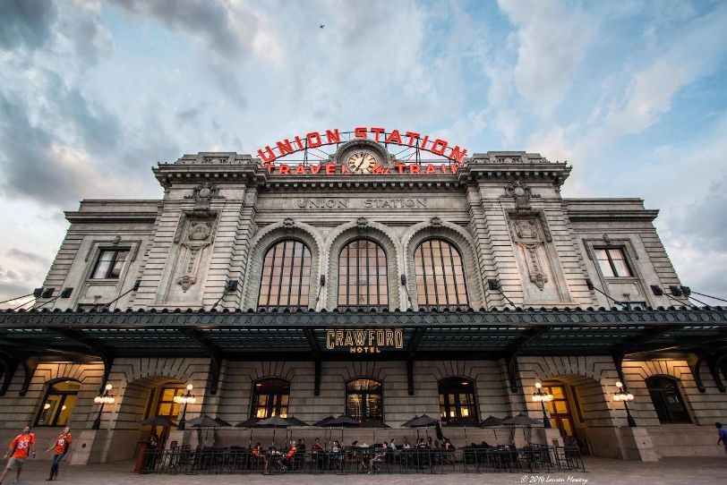_

Located right in the heart of lower downtown—or "LoDo"—Union Station is the main railway station and central transportation hub in Denver. But it’s also much more.

Opened in 1881 and rebuilt after a fire in 1914, Union Station underwent a major renovation from 2012–2014. Many Denverites believe the renovation of Union Station was a watershed moment in the revitalization of downtown and beyond. Generally, the renovation sought to create [“Denver’s Living Room”](https://en.wikipedia.org/wiki/Denver_Union_Station) in the Great Hall, which now functions as part hotel lobby, part Amtrak ticketing office, part waiting area, part retail and part public space.

_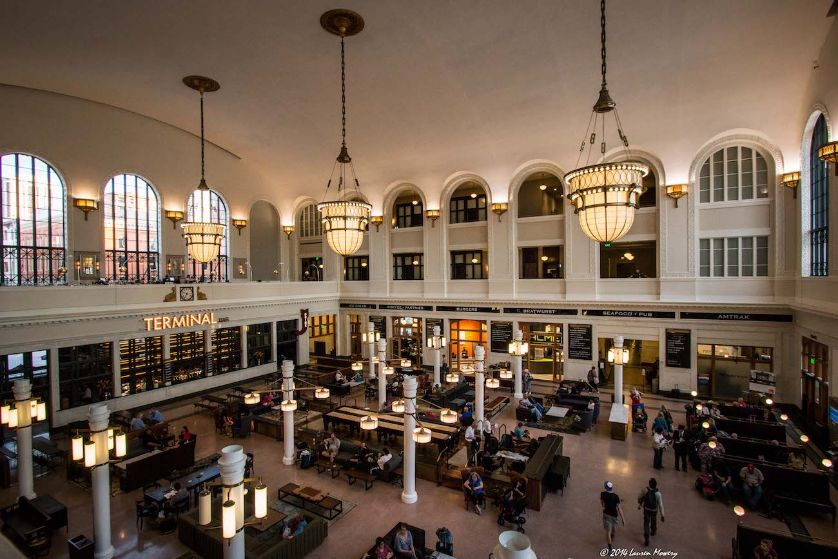Union Station’s “Great Hall,” photo by_ [_Lauren Mowery_](https://chasingthevine.com/2014/09/23/postcards-first-look-at-union-station-and-the-crawford-hotel-in-denver-co/)_._

I came to Union Station more than ten years ago when I was visiting Denver and, on a whim, decided to take an Amtrak train to San Francisco. The Great Hall was unmemorable back then, little more than a cavernous waiting room, as I recall. Today, the Great Hall is a destination in itself.

Union Station is a fantastic place to hang out, read a book, have a drink with friends or open up a&nbsp;laptop and get some work done. Power outlets are all over the place, and I sat and did some work around a big table with a half dozen or so doing the same. The place is certainly bustling, so if you like that environment, you’ll really enjoy working there. When you need a break, go grab a delicious milkshake at [Milkbox Ice Creamery](https://www.google.com/maps/place/Milkbox+Ice+Creamery/@39.7531828,-105.0024023,17z/data=!3m1!4b1!4m5!3m4!1s0x876c78c309f3382f:0x79cbee7e4d3a8708!8m2!3d39.7531828!4d-105.0002136) (you’re working, yes, but you’re also kind of on vacation, right?).

**_Neighborhood History:_** _After discovering gold in the river in 1858, General William Larimer set down roots in the current LoDo neighborhood, making it both the site of the original city of Denver and its oldest neighborhood. Much like today, LoDo was bustling and sometimes wild back then, full of saloons and brothels. But by the mid-twentieth century, LoDo had become a ghost town, as cars, highways and airports eliminated the importance of Union Station as a transportation hub and people moved out of the city. When Coors Field—one of the most picturesque&nbsp;ballparks in Major League Baseball—opened in 1995, LoDo was back on the upswing following an initiative set forth by city council in the 80’s to restore the neighborhood. Today, LoDo is one of the most expensive places to buy or rent in Denver, and the skyline is chock full of cranes building new high-rise apartment buildings._

#### Thump Cafe, Capitol Hill

_1201 E 13th Ave, Denver, CO 8021 •_ [_Find it on Google Maps_](https://www.google.com/maps/place/Thump+Coffee/@39.7370362,-104.9749953,17z/data=!3m1!4b1!4m5!3m4!1s0x876c7ecd99f86413:0xc5dc140e3e4da2f8!8m2!3d39.7370362!4d-104.9728066)

 _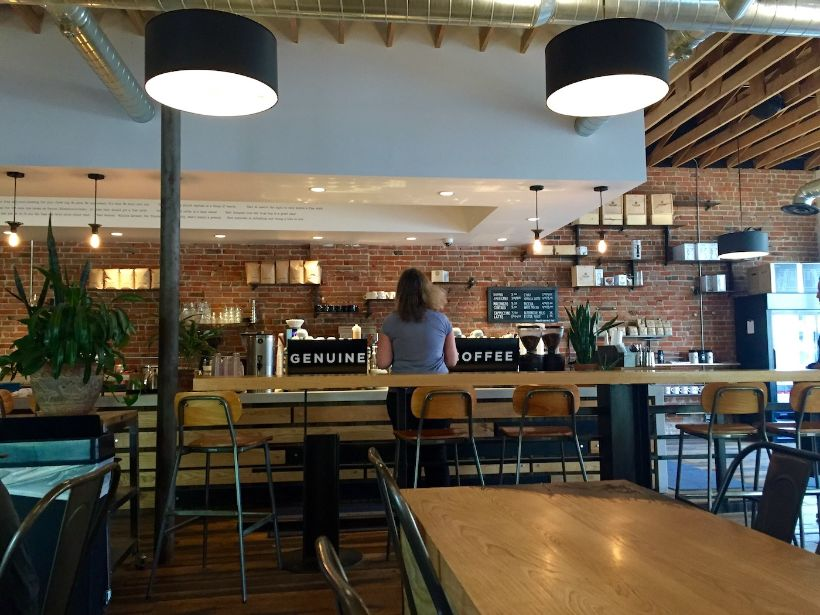_

_Photo by_ [_The Meandering Mates_](https://themeanderingmates.wordpress.com/2016/07/13/thump-coffee-all-the-way-from-bend-or/)_._

If you’re looking for a place to work (just slightly) outside of the city core, [Thump Cafe](https://thumpcoffee.com/denver-cafe/) is your spot. Thump is right in the heart of Capitol Hill, one of the city’s most cosmopolitan neighborhoods, well known as a [haven for artists and bohemians](https://en.wikipedia.org/wiki/Capitol_Hill_(Denver)).

The space is minimalist and modern and has lots of places to sit. Still, I was there in the early afternoon and could only find a seat at the bar in the front window, so the Denver sunshine\* made it especially difficult to see what I was working on in Photoshop. Like most coffee shops in a city full of young people working remotely, the best seats are hard to come by no matter what time it is. Thump also has some good food options along with beer and kombucha on tap.

I rode a B-cycle bike to Thump from downtown—an easy 15-minute ride.

**_Neighborhood Tip:_** _Colfax Avenue in_ _Capitol Hill is known in Denver for its nightlife—lots of bars, coffee shops, restaurants and stores open late and many concert venues. Check out_ [_Humble Pie Store_](https://www.humblepiestore.com/) _for some late-night homemade pies, ice cream and cocktails all under one roof. The space used to be an auto repair shop so keep an eye out for various car parts used as bar stools._

### Bonus: Three Great Places to Eat

Great restaurant options are endless in Denver and there are plenty of places to find that information online (or better yet, ask the locals). But you still need to eat while you’re out and about working, so here are three of my favorite places to do so in Denver.

#### Breakfast: Snooze an A.M Eatery, Ballpark District

_2262 Larimer St, Denver, CO 80205 •_ [_Find it on Google Maps_](https://www.google.com/maps/place/Snooze+an+A.M.+Eatery/@39.75557,-104.989009,15.36z/data=!4m13!1m7!3m6!1s0x876c7ea0eb1cb497:0x78c659beebc9d3a6!2sSnooze+an+A.M.+Eatery!3b1!8m2!3d39.7275964!4d-104.9404616!3m4!1s0x0:0x6f96b200b0914674!8m2!3d39.7555211!4d-104.9889404)

__

[Snooze](https://snoozeeatery.com/) is one of the hottest breakfast spots in Denver right now, and this is the original location. The space is bright and cheery and feels equally retro and modern (something we’ve tried to accomplish with [our own Astronomer branding](https://www.astronomer.io/blog/a-logo-story)). Make up a new pancake, drink some coffee and catch up on some morning news on your iPhone, but don’t stay too long since Snooze always has a line out the door.

#### Lunch: The Source, RiNo

_3350 Brighton Blvd, Denver, CO 80216 •_ [_Find it on Google Maps_](https://www.google.com/maps/place/The+Source/@39.768559,-104.9817705,17z/data=!3m1!4b1!4m5!3m4!1s0x876c791b58032d5d:0xa9e4305da902aeee!8m2!3d39.768559!4d-104.9795818)

 _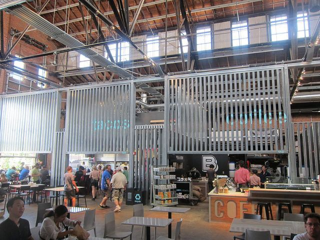_

_Photo by_ [_The Minty_](https://theminty.com/2014/08/29/denver-favorites-cheesesteak-at-denver-teds-corvus-coffee-and-the-source/)_._

[The Source](https://www.thesourcedenver.com/) is an uber-trendy place to eat in a neighborhood that feels like it’s on right on the cusp but is still sort of a secret. Much like [Avanti](https://avantifandb.com/) in LoHi, The Source is a massive space with a variety of restaurant options (and a couple of super hip, mini retail stores) surrounding an open, public space in the middle, where you can sit and eat or pull out the laptop and catch up on some emails.&nbsp;&nbsp;

#### Dinner: Linger, LoHi

_2030 W 30th Ave, Denver, CO 80211 •_ [_Find it on Google Maps_](https://www.google.com/maps/place/Linger/@39.759526,-105.0136293,17z/data=!3m1!4b1!4m5!3m4!1s0x876c789485128b17:0xf787e81b653c2464!8m2!3d39.759526!4d-105.0114406)

One night in Denver, I met some friends at [Linger](https://lingerdenver.com/) just before sunset. We sat on the tightly-packed but good-sized rooftop lounge and shared a few satisfactory small plates. You know those tall, metal card-holders—often bearing a square card with a big number—restaurants sometimes give you to put on your table so the server can find you? At Linger, it was a card-holder with a photo inserted. Each photo was a celebrity no longer living, like Chris Farley. Ours was Whitney Houston, RIP. I ordered a gin and juice from a VW bus … on the roof. This place was whimsical if not slightly off kilter, and I found it amusing. The views of downtown directly south and the Rocky Mountains to the west were remarkable. We sat underneath a large, old neon sign that surely once served as the tenant’s only form of marketing. “Olinger Mortuaries.” As the sun went down and the stars came out, I noticed something different about the old neon sign towering above us. “Linger Eatuaries.”

_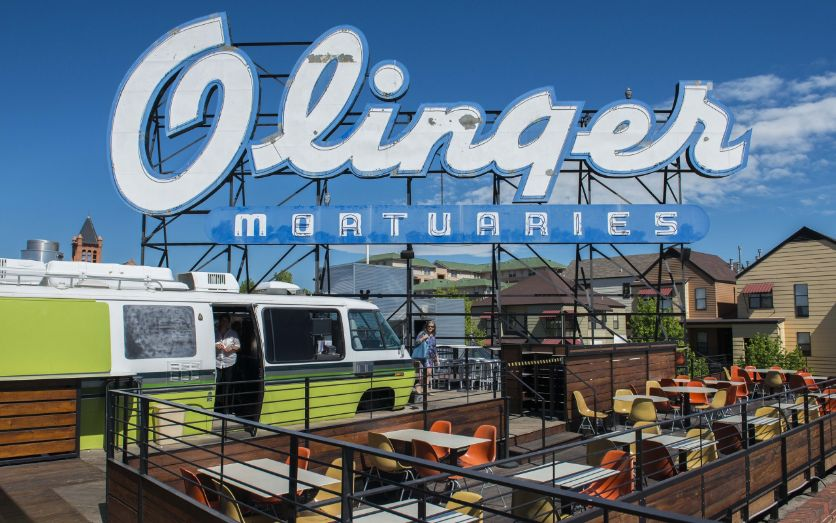Photo by_ [_Voices of Insanity_](https://voicesofinsanity.com/2013/06/25/olinger-mortuaries-denver/)_._

### OK, One More Bonus: Where to Get a Fresh Haircut

#### Semion Barbershop For All, South Broadway

_507 Lincoln St #102, Denver, CO 80203 •_ [_Find it on Google Maps_](https://www.google.com/maps/place/Semion+Barbershop+For+All/@39.7246636,-104.9886715,17z/data=!3m1!4b1!4m5!3m4!1s0x876c7f275d5b9cbf:0xcec9e93a6289bdad!8m2!3d39.7246636!4d-104.9864828)

One of my favorite traditions while traveling is to find a good barbershop or salon and get my hair shaped up. No matter who you are, a fresh haircut makes you feel like a million bucks. While I didn’t scour the city for barbershops like I did for coffee shops to work in, I did do a lot of Google searching. Semion was the one I chose after it showed up on multiple “best-of” lists. And I did indeed walk out feeling like a million bucks. The place is sort of a barbershop but also a bit like a salon. It’s a safe bet, which can be particularly helpful while traveling.

### Conclusion

Enjoy your stay in Denver and do some exploring of your own! I’ve long felt that Denver is a wonderful place to visit as a tourist and I’ve discovered it’s a great place to work too. Don’t forget to get to the mountains in the evenings or on the weekend. I’ve always found that a hike in the Rockies helps put just about everything into perspective and does wonders for productivity.

—

_\*While many Denver locals like to claim “300 sunny days a year,” that is more myth than reality. Denver actually has, on average, [115 clear days](https://www.westword.com/news/colorados-300-days-of-sunshine-claim-its-a-myth-and-states-climatologist-tells-us-why-5875821) a year, which is still really, really good compared to the rest of the country._

&nbsp;

