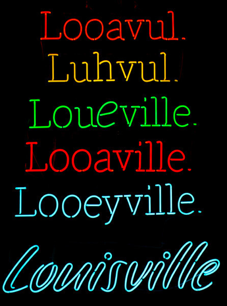
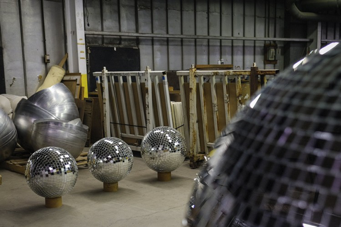
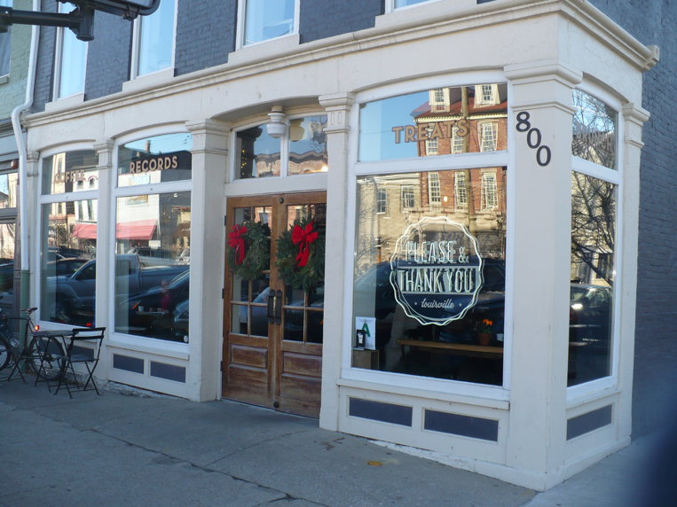
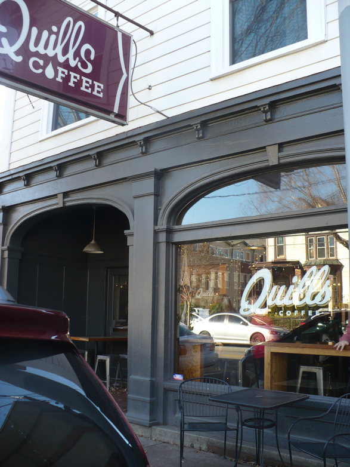
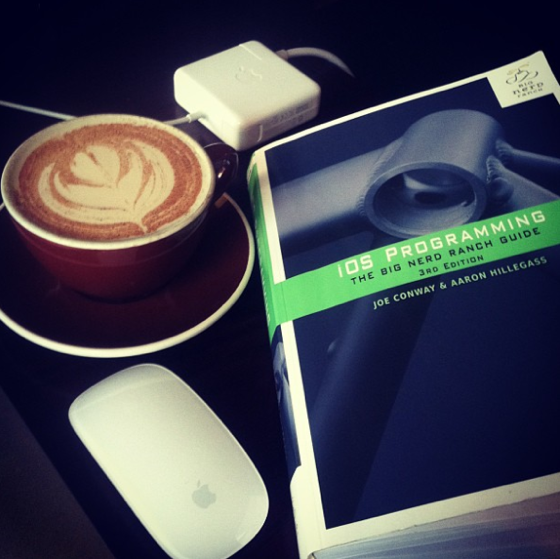
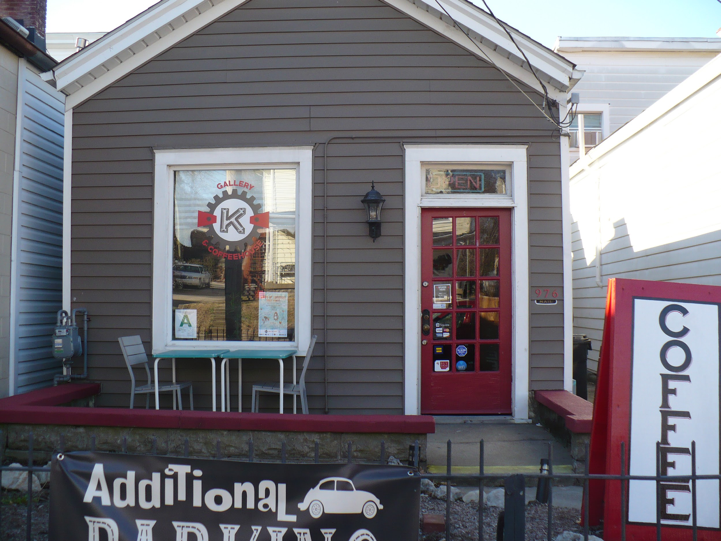
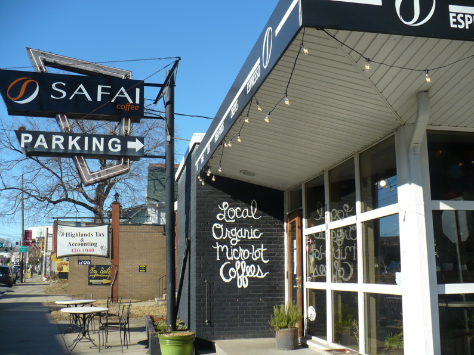
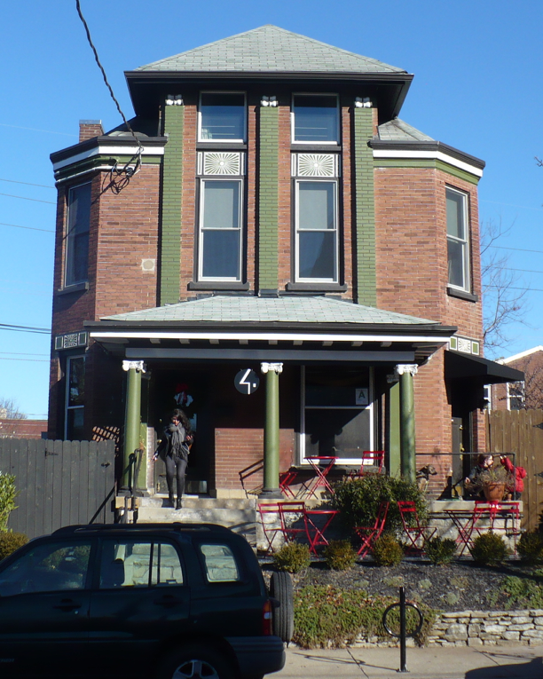

_Disclaimer: Astronomer account manager and author of this blog post, Becky Steele, lives in Louisville and shamelessly—no, fiercely—loves her fair city. Although she wasn’t born there, she would tell you that she got there as quickly as she could and plans to stay for life. She is one of a few Astronomers who works remotely full-time and makes a day trip once per week to the Astronomer homebase in Cincinnati, Ohio._

This edition of Astronomer’s Remote Working Guide takes you to Louisville, Kentucky. Or Loo-a-vul. Or Loo-ee-ville? You choose your pronunciation—we accept them all!

What does the idea of visiting Louisville bring to mind? The Kentucky Derby? Bourbon? Home of The Greatest, Muhammad Ali (another soul taken by the curse of 2016, RIP)? Perhaps the lesser-known yet super cool title of [largest (and last) producer of disco balls in the world](https://www.wsj.com/articles/louisvilles-secret-past-disco-ball-building-boomtown-1464708833)?

_\*Photo Source: [Wall Street Journal](https://www.wsj.com/articles/louisvilles-secret-past-disco-ball-building-boomtown-1464708833)_

Actually, while we’re at it, add [one of the greatest destination food towns](https://www.huffingtonpost.com/2014/10/31/best-food-cities_n_6054716.html) (with over 2,500 restaurants for my foodie friends out there), [home of the largest annual fireworks display in the country](https://en.wikipedia.org/wiki/Thunder_Over_Louisville) and [Google Fiber candidate city](https://fiber.google.com/cities/louisville/) to your list. &nbsp;

### Let’s finish that list with “a great city for remote working.” &nbsp;

The four coffee shops I recommend most highly are located along a 2.6 mile stretch, west to east, between Louisville’s up-and-coming NuLu (“New Louisville”) district and the well-established, trendy Original Highlands. Now, I know that 2.6 miles seems like a long walk, and no, Louisville doesn’t have a fancy bike rental service (yet), but hear me out.

If you have a vehicle, it’s very easy to get around Louisville. According to Kiplinger, Louisville is #9 out of their [10 Best Cities for Commuters](https://www.kiplinger.com/slideshow/real-estate/T006-S001-10-best-cities-for-commuters-slide-show/index.html) list, with an average commute time of 23 minutes. This drive will take half that amount of time.&nbsp;Starting at the first remote working destination (Please & Thank You in NuLu) and finishing at my last recommendation (Safai Coffee in the Highlands), you can expect a total drive time of 11 minutes. &nbsp;

If you’re cycling, expect an end-to-end commute between the destinations to take between 15 and 20 minutes. If you’re walking, expect a longer but enjoyable 45-minute stroll at a very casual pace, with plenty to see along the way!

The remote working destinations in this guide are rated on a scale of 1 to 5 stars, lowest to highest, in the following categories: wifi reliability, availability of outlets and available seating. Ambience is difficult to quantify on a ranked scale, so I’ve provided a few comments as a guide. I’ve also made some recommendations on beverages and snacks to pair with your productive remote working session.

All of the destinations are Louisville originals and have free parking within steps of their entrances. Okay, let’s go!

### Destination #1: [Please & Thank You](https://www.pleaseandthankyoulouisville.com/)

_800 East Market Street, Louisville, KY 40206 • [Find it on Google Maps](https://www.google.com/maps/place/800+E+Market+St,+Louisville,+KY+40206/data=!4m2!3m1!1s0x886972c4fa664b73:0x51f20d40579a73ee?sa=X&ved=0ahUKEwjYk-_lrqbRAhVERSYKHT4xDP8Q8gEIGzAA)_

####   
  
 The Stats:

Wifi Reliability: ★★★★★

Availability of Outlets: ★★★

Available Seating: ★★★★

Ambience: the front portion of the coffee shop gets pretty loud during peak hours, which is fine if you’re going to wear headphones and don’t need to speak. Otherwise, set up in the back portion of the shop, which has a wall to separate the coffee bar & patron noise. There is outdoor seating, but expect noise from traffic on Market Street.

#### The Details (to be called “Deets” from this point forward):

This small-batch southern bakery and coffee house aims to please (pun intended). As equally revered for its chocolate chip cookies as its coffee, P&TY (as abbreviated by the locals) is located in the heart of the recently revitalized NuLu district. &nbsp;

The front of the coffee house includes the coffee bar itself, seating for ~15 people and a vinyl record booth. That’s right: spin up any vinyl record from their house collection and sip on delicious brew while you work! &nbsp;

The back room of the coffee house is quiet and spacious, with seating for another ~10 people, and has a wall of vinyl for purchase.

The open wifi is solid, and I have never had an issue holding a strong connection for hours. &nbsp;Outlets are another story. There are a few outlets available in the front and a few in the back, which attests to the age of the building more than anything. I’d snag your seat during off-hours or come with plenty of battery life.

#### Productivity Pairings:

They make a _mean_ soy latte, and their coffee is excellent! I’d be remiss if I didn’t mention their chocolate chip cookie, and if you just can’t get enough of it, you can take one of their [bake-it-yourself mixes](https://www.pleaseandthankyoulouisville.com/biy/) home with you.

### Destination #2: [Quills Coffee](https://quillscoffee.com/)

_930 Baxter Avenue, Louisville, KY 40204 • [Find it on Google Maps](https://www.google.com/maps/place/930+Baxter+Ave,+Louisville,+KY+40204/data=!4m2!3m1!1s0x8869732a801393d9:0x5a22e3040ea8c6bf?sa=X&ved=0ahUKEwif9NLxr6bRAhXDWSYKHXAyA8kQ8gEIGzAA)_

   
  

#### The Stats:

Wifi Reliability: ★★★★★

Availability of Outlets: ★★★★

Available Seating: ★★★★★

Ambience: During peak hours, Quills is pretty loud, and all of the seating except for the tables outside are subject to the noise of the coffee machines. Plan to have to speak up to hold conference calls and speak with humans. You can also sit outside at the tables provided in the cozy nook between the buildings or in front of the entrance, but expect some noise from busy Baxter Avenue traffic.

#### The Deets:

If it were possible to marry a coffee shop, I’d put a ring on Quills Coffee. Seriously.

Quills has a special place in my heart: this is where I taught myself iOS Programming almost three years ago (below, circa June 2013). &nbsp;I credit where I am today to long hours in this coffee shop.

The atmosphere is highly conducive to deep work. If you’re looking for a place to put your headphones on, crank up your favorite playlist and turn out your best work, this is it.

Recently remodeled, the shop easily holds 40 - 50 people inside, with outdoor seating facing Baxter Avenue and a small outdoor nook between the buildings that can accommodate another 8 people. Local artwork dons the walls all around the shop and is rotated often, providing the patron with something interesting to look at (or purchase). &nbsp;

Wifi at Quills is rock solid, even during peak hours, and the availability of outlets is excellent. &nbsp;The only reason I didn’t give it five stars is due to a few tables in the middle not having direct access to outlets as a result of the remodel, but the seating options with outlet access are the best out of all my recommendations.

#### Productivity Pairings:

Two words: bottomless cup. At under $4, you can enjoy an infinitely refillable bottomless cup of their delicious coffee/fuel. Honorable mentions: Cafe Miele, single-origin espresso. And pick up one of their locally-sourced pastries and sweet treats to give yourself an extra boost.

### Destination #3: [Gallery K Art & Coffee Bar](https://galleryk.net/)

_976 Barret Avenue, Louisville, KY 40204 • [Find it on Google Maps](https://www.google.com/maps/place/976+Barret+Ave,+Louisville,+KY+40204/data=!4m2!3m1!1s0x88690d2b0dce73a7:0x687c3f5caeabba7e?sa=X&ved=0ahUKEwjkyu2NsKbRAhViq1QKHTzPCOwQ8gEIGzAA)_

   

#### The Stats:

Wifi Reliability: ★★★★★

Availability of Outlets: ★★★★

Available Seating: ★★★★

Ambience: This is the quietest coffee bar on the list! The coffee bar itself is central in the shotgun-style house-turned-coffee bar, with walls on all sides to block most of the noise between the front and back parts of the house. Great for conference calls and conversations! The outside seating does expose you to occasional noise from Barret Avenue, but it’s not bad at all.

#### The Deets:

Gallery K Art & Coffee Bar relocated to its Barret Avenue location in 2016, and the neighborhood is better for it! [Thrillist happens to agree](https://www.thrillist.com/DRINK/LOUISVILLE/BEST-LOCAL-COFFEE-SHOPS-IN-LOUISVILLE).

In addition to serving up delicious [Red Hot Roasters Organic coffee](https://www.redhotroasters.com/wordpress/), loose-leaf teas by [The Metropolitan Tea Company](https://www.metrotea.com/)&nbsp;and [Kentucky Kombucha](https://www.kentuckykombucha.com/), Gallery K is a combination art gallery and performance venue. You’ll find yourself looking forward to your next visit, as the rotating art exhibit keeps regular remote working sessions interesting. Plan your visit on&nbsp;a Thursday if you want to&nbsp;wrap up your work day with their open mic comedy night (6:30pm sign-up if you’re feeling adventurous; 7:00pm start if you’re in the audience).

Because Barret Avenue lines the edge of Germantown ([read about this cool neighborhood here](https://www.gotolouisville.com/neighborhoods/germantown/)), Gallery K fills a historic shotgun house with tons of charm. You can enter through the front door or the side door.

The front of the house is spacious, with table seating for around 15, and has a separate, old-school living room to lounge in (complete with a vinyl record player and a good listening selection). The back of the house has a couple of tables and seating for maybe another 8 people. The backyard is currently under development, but I suspect that the innovative owners will create a lively purpose for it in 2017. A few tables and chairs are available outside, near the front entrance, and a couple of tables are available on the shaded back porch.

The wifi at Gallery K is reliable—more than enough for a full house of seated guests. &nbsp;Ask the coffee bar hosts (usually either Will or Wade) for the password, and they’ll provide that along with a sincere, warm welcome. Outlets are available at almost all of the seating areas. &nbsp;If you can’t land a seat next to an outlet, I’ll bet a friendly remote worker would share their table while you charge, or swap seats with you entirely. You’ll find that Louisvillians are very friendly. :)

#### Productivity Pairings:

I’m a big fan of the loose leaf tea (over 10 varieties to choose from)! The Red Hot Roasters organic coffee is also a great choice. If you’re not from ’round here, try a bottle of Kentucky Kombucha! The staff can make a flavor recommendation if you’re new to the beverage.

### Destination #4: [Safai Coffee](https://safaicoffee.com/)

_1707 Bardstown Road, Louisville, KY 40205 • [Find it on Google Maps](https://www.google.com/maps/place/1707+Bardstown+Rd,+Louisville,+KY+40205/data=!4m2!3m1!1s0x88690cb7ad87328d:0x930da7ab3654816f?sa=X&ved=0ahUKEwiJ3MOtsKbRAhWMKCYKHdWlBowQ8gEIGzAA)_

   
  

#### The Stats:

Wifi Reliability: ★★★★★

Availability of Outlets: ★★★

Available Seating: ★★★★

Ambience: If you sit in the room nearest the bar, expect to have to speak up during busy times. &nbsp;There are two great spaces on either side of the front portion of the building, with walls that reduce most of the coffee bar noise. Outdoor seating is available, but expect to hear some noise from Bardstown Road traffic.

#### The Deets:

Safai Coffee is named after master roaster Mike Safai, and presents the perfect blend of passion and purpose ([see the Safai Foundation here](https://safaifoundation.org/), which is committed to replanting 80 coffee farms in Central and South America). &nbsp;

Roasting coffee seeds from over 11 countries, Safai serves their coffee pour-over style, every time. Yep, I said seeds, not beans: coffee beans are actually the seeds of a cherry-like fruit, which came as a surprise to me. The more you know…

Anyway, the inside of Safai can seat between 30 and 40 people spread between the main area and two separate seating areas in the front-most portion of the building. Outdoor seating can accommodate about 8 more people.

The wifi has yet to let me down. Access to outlets is decent, but is reserved for the perimeter seating and is limited in the two separate rooms in the front. I recommend securing your seat during the non-peak hours or coming with plenty of battery juice. &nbsp;

#### Productivity Pairings:

Try their pour-over coffee! Safai also has great seasonal lattes, so be sure to inquire about anything you see on the “specials” board. &nbsp;Lastly, take a chance on one of their delicious crescent rolls. You won’t regret it!

### Bonus: Awesome Places to Stay (near all of these destinations)

No buddies to crash with in Louisville? Want a unique Louisville multi-day stay? Look no further. You’re welcome in advance!

#### **[Gralehaus Bed & Beverage](https://gralehaus.com/sleepytime/)**
   

[Gralehaus Bed & Beverage](https://gralehaus.com/sleepytime/), my top recommendation for overnight accommodations, delivers an unforgettable bed and “beverage” (and breakfast) experience with a Louisville twist. The guestrooms are the upstairs portion of a beautiful, century-old Victorian house.

The best part is, they will stock your room with beer (specify at check-in) from the downstairs [Gralehaus](https://gralehaus.com/good-beer-and-cider/) and sister alehouse, [Holy Grale](https://holygralelouisville.com/) (a Louisville original). Holy Grale is one of the [best bars for craft beer in America](https://www.businessinsider.com/the-best-bars-for-craft-beer-in-america-2016-7/#holy-grale--louisville-ky-9), with 26 taps of “ever-changing beers from all over the world.” Just sayin’.

Order [Gralehaus breakfast](https://gralehaus.com/good-food/) to your room, or show up in person for one of the best brunches in Louisville.

#### Good ol’ Airbnb

Airbnb is another excellent option to get an&nbsp;authentic Louisville experience. Depending on when you’re visiting, you can stay at one of [over 65 Airbnb options in the Original Highlands](https://www.airbnb.com/s/Highlands--Louisville--KY--United-States?guests=1&checkin=&checkout=&adults=1&infants=0&children=0&ss_id=5dg3lean&ss_preload=true&source=bb&page=1&s_tag=oBNr1hl5&allow_override%5B%5D=) or at one of [over 20 options in NuLu](https://www.airbnb.com/s/NuLu--Louisville--KY--United-States?guests=1&adults=1&children=0&infants=0&place_id=ChIJVwrt8MRyaYgRYd2BLGMea7s&ss_id=k9zjw7ko&source=bb&page=1&s_tag=idSAUdw5&allow_override%5B%5D=).&nbsp;

If you've got a favorite place to work or stay in Louisville, please share it in the comments! Our team is always looking for inspiring locations, and I love discovering new places in my home city. Who knows? Maybe one day we'll even share&nbsp;an outlet, fight over a&nbsp;pastry at last call or wave to each other across the street on the way to our next productive destination.&nbsp;

