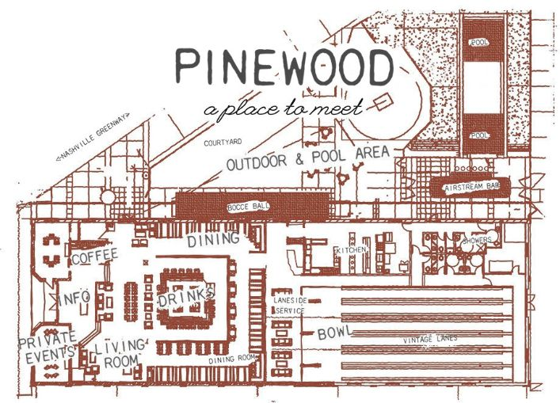

_Estimated reading time: 9 minutes, 50 seconds_

Our team hit the road in November for our first-ever Astronomer remote-working week. Or, as we like to say, we “orbited.” (The metaphor breaks down pretty quickly, but we can’t help ourselves with the space analogies.)

Anyway, we’ve written remote working guides for [Denver](https://www.astronomer.io/blog/remote-working-guide-denver) and [Louisville](https://www.astronomer.io/blog/remote-working-guide-louisville), so far. In the Denver guide, we explained a little bit about why we believe in working remotely. In a nutshell: it’s healthy to get out of your routine, inspiring to see new places and completely feasible to work from anywhere! Our co-founders wanted to make it easy for everyone to partake in remote-working, so they rented a house in Nashville.\*

The “rules” were simple: (1) figure out how to get there, (2) stay for as little (none) or as long (whole week) as you like, (3) feel free to stay in a more private setting on your own dime and (4) it’s not a vacation, so do work.

_Sidenote: Why Nashville? Sure, a week together meant spending a night out at the_ [_honky tonk bars_](https://www.greatamericancountry.com/places/travel/nashville-guide--top-10-honky-tonks-and-dive-bars) _one envisions in “Music City U.S.A.”—and sharing_ [_Spotify_](https://open.spotify.com/user/benjamingregory/playlist/2puHDq5aDGcbrxwhr69Qhf) _playlists, for better and for worse. But what really cinched it were these three factors: the easy driving distance from Cincinnati, the plethora of large yet affordable Airbnb options (probably thanks to its growing popularity as a_ [_bachelor/bachelorette party destination_](https://www.tennessean.com/story/news/2015/07/25/bachelor-bachelorette-parties-mean-big-business-nashville/30653483/)_) and the fact that it’s_ [_a mid-sized city_](https://en.wikipedia.org/wiki/Nashville,_Tennessee) _with excellent biz dev options._

### A Quick Note on Transportation and Lodging

Getting around Nashville is easiest by car. Most of us drove from Cincinnati and had vehicles, but Uber is a great option&nbsp;as well. According to the Travel Channel, most “Nashvillians are car people,” so you’ll fit right in that way. But [there are a few other options](https://www.travelchannel.com/destinations/us/tn/nashville/articles/getting-around-nashville) if driving isn’t your thing.

As for lodging, thanks to [Airbnb](https://www.airbnb.com/), it was easy for us to find the kind of house we wanted in [one of the hottest neighborhoods](https://www.nashvillelifestyles.com/bestof/the-five-hottest-neighborhoods-in-nashville) in Nashville, 12 South. [The BIG House](https://www.airbnb.com/rooms/6660503?sug=50#host-profile) allowed us to share spontaneous dance parties, late night drinking games and bathrooms: you know, it brought us together in ways an office can’t. (We highly recommend this location. And if you want something smaller for 1-2 people, check out [Elm “Hotel” Room Tree House](https://www.airbnb.com/rooms/14729724) around the corner. We can vouch for that one, too.)

_Photo cred: Brad_

From our pad in 12 South, we came up with some tips on where to be productive, some favorite Nashville experiences and a bit of general commentary. We didn’t follow any formula to make these decisions, but the whole team was polled and asked to consider typical productivity necessities. So assume that the wifi is reliable, outlets are available and seating is ample, unless otherwise specified. Without further adieu, here is our collective guide to working remotely in Nashville:

### Our Five Favorite Places to Work in Nashville

#### 1. Bongo Java, Belmont-Hillsboro

_2007 Belmont Blvd, Nashville, TN 37212_ _•_ _[Find it on Google Maps](https://www.google.com/maps/place/Bongo+Java/@36.1321781,-86.7958277,15z/data=!4m2!3m1!1s0x0:0x7d883328f08511e?sa=X&ved=0ahUKEwiUn9SJ2pnRAhUo64MKHfkLBBYQ_BIIcDAN)_

“Nashville’s Original Coffee House” is a great choice for those who want the traditional coffee shop feel.

 

_Photo cred: [In the Middle&nbsp;](https://inthemiddlenashville.com/2016/08/23/bongo-java/)_

Becky, one of our account managers, put it like this: “I love the white noise effect of a busy coffee shop, and this one fit the bill. Plus, it won me over with the good wifi and great food. Finding a seat was relatively easy, especially since you could almost always find a fellow Astronomer to sit with! The clientele were largely headphone-wearing coffee enthusiasts cranking out what seemed to be [deep work](https://www.amazon.com/dp/B00X47ZVXM/ref=dp-kindle-redirect?_encoding=UTF8&btkr=1). Worth noting: there were not enough outlets.”

**Bonus tip(s) from Becky**: Favorite drink: Mochahontas (vanilla mocha with almond milk). Favorite food: grilled pineapple and black bean salad.

#### 2. Pinewood Social, Downtown Nashville

_33 Peabody St Nashville, TN 37210 •_ _[Find it on Google Maps](https://www.google.com/maps/place/Pinewood+Social/@36.1583837,-86.76778,15z/data=!4m2!3m1!1s0x0:0x6225534e5374516e?sa=X&ved=0ahUKEwibk7Wj3ZnRAhUE0oMKHfAFCYcQ_BIIhAEwEA)_

If you want a one-stop shop for food, drinks, work and play—and maybe like to mix business with a little pleasure—you’ll love this.

 

_Photo cred: [Livingly](https://www.livingly.com/States+Of+Style+Nashville+2014/articles/LTQxOm9wZN5/To+Play+Pinewood+Social)_

Nashville native and Head of Delivery, Ben, chose this spot. “Okay, so it’s a restaurant, a bar, a coffee shop/coworking space and a vintage bowling alley,” he says. “Not the kind of place that you can work day in and day out, but it has solid wifi and good coffee/food. It’s nice to post up for a few hours and maybe throw in a few frames of bowling if things start to get slow.”

He’s right, describing Pinewood Social is tricky. The space seeks to “accommodate your needs, morning, noon and night.” There’s a coffee shop created in conjunction with [Crema Coffee](https://www.crema-coffee.com/), a central (full) bar serving cocktails with hand-chiseled ice and a restaurant that will satisfy not just those who&nbsp;eat to live, but also those who live to eat. And there’s plenty to keep you inspired. Just check out this floor plan from their homepage:

   
  

**Bonus tip from Brad** (Solutions Director) **:** Go to a Predator’s game downtown. The crowd is rowdy and the energy is addicting...even though it’s a bit cold in there.

**Double bonus** : If you’re in Nashville on a second Saturday, see a laser show at [Sudekum Planetarium](https://www.adventuresci.org/events/event/second-saturday-3/). (It’s also a great way to celebrate a 21st birthday.) Here's&nbsp;the sweet tracklist that some of us experienced:

 

_Photo cred: Becky_

  

#### 3. Fido, Hillsboro West End

_1812 21st Ave S, Nashville, TN 37212_ _•_ _[Find it on Google Maps](https://www.google.com/maps/place/Fido/@36.136344,-86.800786,15z/data=!4m2!3m1!1s0x0:0x50a2d27a32cbbd44?sa=X&ved=0ahUKEwiUytqA45nRAhUE2IMKHVdpBo4Q_BIIezAK)_

We’re not sure if Fido is a coffee shop or a restaurant, but [they’re okay with that](https://www.bongojava.com/fido-cafe/about/). If you want a little of both, this is your spot.

_Photo cred: [Great American Country](https://www.greatamericancountry.com/places/local-life/nashville-essentials)_

“Fido is a huge place with a ton of seating,” says Head of Design, Chris. “It’s also in a very cool strip of Nashville on 21st Ave near Vanderbilt University, featuring a lot of restaurants and boutiques. You &nbsp;get the sense that it’s been a Nashville staple for a long time. Plus, they have a full breakfast, lunch and dinner menu and are open until 11pm 7 days a week for some late night work.”&nbsp; 

**Bonus tip from Ben** : Need a break? Drive or Uber 8 minutes further west to visit the [Parthenon](https://en.wikipedia.org/wiki/Parthenon_(Nashville)), the only full-size replica of the original from Athens in the world. Oh, and there’s a 50-foot-tall gold plated statue of Athena inside.

#### 4. Frothy Monkey, 12 South (The Original Location)

_2509 12th Ave S, Nashville, TN 37204_ _•_ _[Find it on Google Maps](https://www.google.com/maps?q=2509+12th+ave.+south+nashville,+tn+37204)_

Here’s another traditional coffee shop option. It’s a 15-minute walk from Bongo Java if you want to clear your head and settle into some deep work again.

_Photo cred: [Tails of the Trail](https://www.tailsofthetrail.com/product/frothy-monkey-30-gift-card/)_

“Lots and lots of white noise, decent wifi and a table large enough to seat a handful of us made Frothy Monkey my go-to,” says Trent, a support analyst. This is a true coffee_house_ with a big porch and side deck that have&nbsp;outdoor seating. The selection of table sizes, including a large community table, made it a great spot for team meetings or individual work.

 

_Photo cred: Brad_

\*Important to note: This place fills up quickly, so the earlier you can get there, the better. A lot of people like to camp out and work, which can be irritating when looking for a seat, but ideal once you’ve found one. With plenty of outlets and healthy food options, it’s worth the wait.

**Bonus tip from Max** (General Counsel/Business Analyst): Treat yourself and get a&nbsp;haircut at [Brave Barber and Beauty](https://www.bravebarber.com/),&nbsp;just off the 12 South drag. Master barbers, sci-fi-inspired deco, great conversation and a slick cut. Felt and looked fresh.

#### 5. Walk the streets of Nashville

_Especially around 12 South, Belmont and Vanderbilt_

Over half the team said one of their favorite things about working in Nashville was walking and seeing the architecture change from street to street: from cozy bungalows to historic mansions to new construction. So we decided this counts as a top five “place” to work, because of the link to productivity:

In 2014, Stanford [published a study](https://news.stanford.edu/2014/04/24/walking-vs-sitting-042414/) in which they claim a person’s creative output increases by 60 percent when walking. Even access to a treadmill does the trick. Great thinkers [from Aristotle to Charles Dickens to Soren Kierkegaard](https://www.marksdailyapple.com/why-these-nine-famous-thinkers-walked-so-much/) relied on walking. In fact, Kierkegaard said:

> Above all, do not lose your desire to walk. Everyday, I walk myself into a state of well-being & walk away from every illness. I have walked myself into my best thoughts, and I know of no thought so burdensome that one cannot walk away from it. But by sitting still, & the more one sits still, the closer one comes to feeling ill. Thus if one just keeps on walking, everything will be all right.

Nashville happens to be a great city for walking, so here’s hoping that a week of walks—and, quite literally, stopping to smell the roses—keeps Astronomers in a state of well-being!

 

_Photo cred: Becky_

**Bonus Tip from Co-founder Tim** : For ideas of other non-traditional habits that cultivate great thinking, read [Daily Rituals: How Artists Work](https://masoncurrey.com/), edited and with text by Mason Currey. Maybe you need to add not just a walk, but a nap and martini to your day. Currey covers the gamut of producers: novelists, poets, playwrights, painters, philosophers, scientists and mathematicians. It’ll definitely make you reassess your life.

### Other Favorites: Three Meals You Won’t Want to Miss

#### Breakfast/Brunch: [Biscuit Love](https://biscuitlove.com/)

_316 11th Ave S, Nashville, TN 37203 •_ [Find it on Google Maps](https://www.google.com/maps/place/Biscuit+Love/@36.1530655,-86.7832026,15z/data=!4m5!3m4!1s0x0:0x823fb320453f25b!8m2!3d36.1530655!4d-86.7832026)

_Photo cred: [Nashville Lifestyles](https://www.nashvillelifestyles.com/restaurants/biscuit-love-brunch)_

According to [Zagat](https://www.zagat.com/r/biscuit-love-nashville), “this Gulch breakfast mecca can do no wrong.” Chris describes the experience like this: “The line to get into Biscuit Love stretched outside and around the block but it moved fast and was well worth the wait. Biscuit Love has become a hotspot among locals and tourists alike since it opened in 2015 and features a ‘playful take on Southern brunch.’ The place felt modern, open and airy. The menu is pretty standard but with a few twists, like ‘bonuts’ — Fried Biscuit Dough, Lemon Mascarpone, Blueberry Compote — and bacon that had some sort of sweet topping that was borderline life changing.”

Biscuit Love is also a great kick-off or cap to a hike on the gorgeous [Timberland Park Nachez Trace](https://www.natcheztracetravel.com/natchez-trace-tennessee/nashville-franklin-tn/1911-timberland-park.html), which has a trailhead right by the restaurant.

 

_Photo cred: Becky_

#### Lunch: Martin’s Bar-B-Que Joint

_\*410 4th Avenue South, Nashville, TN 37201 •_ [_Find it on Google Maps_](https://www.google.com/maps/dir//Martin%27s+Bar-B-Que+Joint,+410+4th+Avenue+South,+Nashville,+TN+37201/@36.1567223,-86.8441436,12z/data=!3m1!4b1!4m8!4m7!1m0!1m5!1m1!1s0x8864665d062417d7:0x6d496fe1a8b336a2!2m2!1d-86.7741035!2d36.1567427)

 

_Photo cred: [Nashville Guru](https://nashvilleguru.com/martins-bbq-sobro-4)_

Hands down, the establishment favorited by most Astronomers was [Martin’s Bar-B-Que Joint](https://www.martinsbbqjoint.com/), a great place for a large crew with spicy BBQ sauce that was actually spicy, unbelievable customer service (including replacing two half-drunk “terrible” beers) and gigantic portions of good ‘ol authentic Tennessee BBQ.

_\*The best part is, you can find_ [_locations_](https://www.martinsbbqjoint.com/locations/) _in different parts of Nashville and now even in Kentucky and West Virginia._

#### Dinner: [Catbird Seat](https://thecatbirdseatrestaurant.tocktix.com/)

_1711 Division St, Nashville, TN 37203 •_ _[Find it on Google Maps](https://www.google.com/maps/place/The+Catbird+Seat/@36.1512805,-86.7941007,15z/data=!4m5!3m4!1s0x0:0x44c610fe5e04492e!8m2!3d36.1512805!4d-86.7941007)_

****_Photo cred: [In the Middle](https://inthemiddlenashville.com/2015/03/31/the-catbird-seat/)_

If you’re a foodie and can plan ahead (exactly a month in advance, in fact), reserve your coveted spot at this elite establishment. For $115 per person, you’ll get the chef’s tasting menu for that evening. Three Astronomers opted to invest in this experience, and here’s what they said, “Catbird Seat was legendary. Best meal I have had in recent memory (freaking sunflower seed risotto).” And, “It was absolutely unreal, without a doubt the best meal I’ve had this year, and likely on my top 5 best restaurants. Not only was the food absolutely amazing, but the dining experience was something the likes of which I’ve never experienced. An absolutely must-see for foodies in Nashville.” &nbsp;

**Bonus Tip:** Southern hospitality is real. If you have a friend in Nashville and they are generous enough to invite you for dinner, go! Ben’s parents hosted the team and served cajun food from [Calypso Cafe](https://calypsocafe.com/) (voted “Best Takeout”) and popsicles from [Las Paletas](https://laspaletasnashville.com/) (with unique flavors like avocado, chocolate with cayenne, pineapple blackberry, pistachio and lots more). They also shared a generous sampling from their extensive collection of bourbon. The whole evening was a highlight for everyone.

Our first whirlwind orbit was a smashing success. We came home tired but knew each other better, had a chance to strategize in unique ways all hours of the day or night and tasted new experiences offered by a different city. If you can spend time working remotely in Nashville, do it. And if you can take a coworker or twenty with you, even better.

