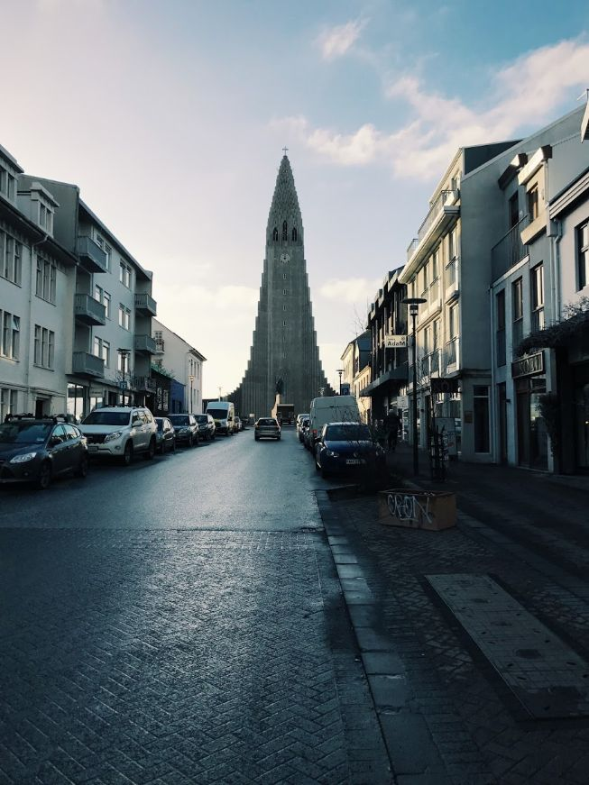
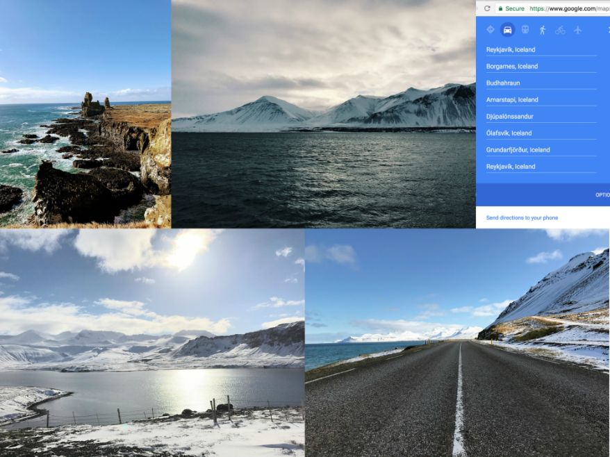
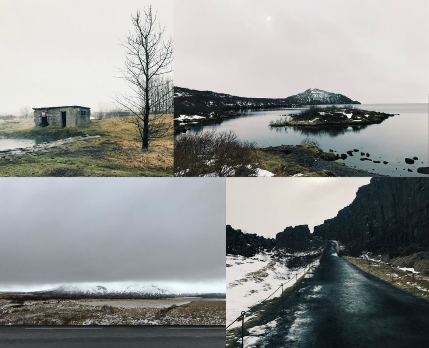
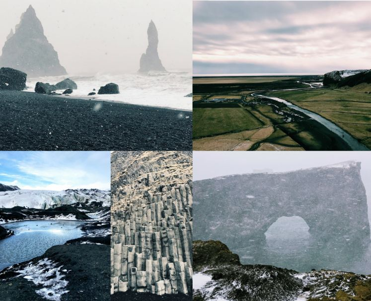

One doesn’t traditionally think of Reykjavik as a place to do work, or at least I didn’t. But a few months ago, I read that the [northern lights will get harder to see](https://www.travelandleisure.com/articles/northern-lights-fading) for the next decade, so immediately, that shot up to #1 on ol’ bucket list. Since Astronomer fully supports if not encourages remote working—so far, we have guides to [Denver](https://www.astronomer.io/blog/remote-working-guide-denver), [Louisville](https://www.astronomer.io/blog/remote-working-guide-louisville) and [Nashville](https://www.astronomer.io/blog/remote-working-guide-nashville)—Astronomer co-founder Tim Brunk and I decided to book a trip to Iceland.&nbsp;

And let me just say, if you’re looking for a new place to work remotely (and explore a little on nights and weekends), you should seriously consider Reykjavik.

### First, Get There

Iceland is getting easier and easier to access. This guy, [Scott](https://scottscheapflights.com/), sends out regular emails recommending cheap flights all over the world out of cities across the US. With a little self-sleuthing and the help of Scott, I nabbed $400 Icelandair direct flights out of Chicago.

From there, it was an easy six-hour&nbsp;flight to Keflavik airport (bonus: we saw aurora borealis from the plane!). Once you land, you can get a shuttle called Flybus to take you the final 40 minutes to Reykjavik for about $25-$30. If you plan to stay in the city or leave only with guided tours, take the shuttle. If you want to explore on your own, however, rent a car. We rented through Pro Car, which was perfectly adequate. They’ll probably bully you into doubling your price by adding a premium insurance package, especially if you’re in a vulnerable state, fresh off a red-eye. But passing trucks kicked up rocks that chipped our windshield, twice … so in the end, you might thank them for it.

### Then, Settle In

My favorite part of Reykjavik is that it feels lively and European, yet it’s small enough to walk to tons of cute restaurants and shops as long as you stay on the west side, or downtown. For reference, find a location close to [Hallgrimskirkja](https://www.visitreykjavik.is/hallgrimskirkja-church), the iconic Reykjavik church.

We opted for an Airbnb and stayed at [Sigga’s "Fabulous Studio”](https://www.airbnb.com/rooms/3263774) which was clean, well-located and not a bad place to work for a few hours a day if you need to take calls or recharge your computer. Turns out, it was nice to have a kitchen too. The price of food surprised me: ~$25-30 for a single breakfast or lunch entrée, ~$45-65 for a single dinner entree, ~$15 for a libation, even plain old beer.&nbsp;

The good news is, if you don't want to pay up, grocery shopping at the local Bonus is pretty fun. You get to test drive with unknown ingredients (unknown to anyone who doesn't speak Icelandic, that is), not to mention feel like a local. Oh, and if you want a bottle of wine or some other alcoholic beverage, make a&nbsp;trip to the only stores that sell alcohol, called vínbúðins. Most (if not all) close early, though. So plan ahead.&nbsp;

Once we arrived, got our bearings and settled in, it was about 8am Monday morning and&nbsp;time to do what we came for…

### Get to Work: The Top 5 Places to Work Remotely in Reykjavik

Every day, I left with a fully charged computer, so it may be worth noting, I won’t include access to outlets&nbsp;in my criteria. The following locations, unless otherwise specified, have these key characteristics: (1) strong, free wi-fi, (2) freedom to hang out for hours on end without feeling conspicuous and (3) nice ambiance. Also noted are the hours: Reykjavik days seem to start and end later, so check the hours before you head out, especially in the morning.

A few additional items worth noting that are true across the board: Pretty much everyone is so quiet that if you speak above a whisper, you'll feel conspicuous. Coffees are small; prepare to down a few if you have a caffeine requirement. Nobody tips. Bathrooms are clean. The food is, frankly, disappointing (it’s tough to get fresh produce and, according to one native Icelander, they _prefer_ old food). And most importantly, the internet is fast and _way_ more reliable than most American coffee shops.&nbsp;

Now, on to our&nbsp;five favorites:

#### 1. Café Babalu

Skólavörðustígur 22, 101 Reykjavík, Iceland • [Hours: 11am-11pm](https://sites.google.com/a/babalu.is/babalu/)

Day one, this became our go-to. It’s got an old, eclectic, almost-hippie feel. The ground level is cozy but tight – so if you really plan to settle in, head upstairs. Don’t take up more space than you need (they’ll ask you to move). But if you’re quiet, respectful and keep buying coffee, you’re set for the day. This place always had a smattering of guests, but never got so full that we&nbsp;couldn’t find a table. Don’t miss: the Star Wars-themed bathroom with life-size cutouts of Hans, Leia and 3CPO pasted on the walls under soft pink lights.

**Bonus tip:** Since it doesn’t open until 11am anyway, start the work day at your Airbnb/hotel, then pause for breakfast at [The Laundromat Cafe](https://www.thelaundromatcafe.com/en/home), whose shelves of color-coded books and friendly menu make you fall in love with the city instantly.

#### 2. C is for Cookie

Týsgata, 101 Reykjavík, Iceland • [Weekday hours: 7:30am - 6pm](https://www.facebook.com/cookie.reykjavik)

 

_\*Astronomer at C is for Cookie!_

This one doesn’t have quite the flair Café Babalu does, but it’s still pretty great. For one thing, it smells like a cookie. As if that isn’t compelling enough a reason to go there, it also opens at 7:30am and doesn’t fill up until 11am, so you can get a solid start to the day, which is particularly convenient when 7:30am is 3:30am back home, and you can work without a single Slack or email distraction. Anyway, while this shop didn’t capture my eye from the outside, the inside has a palpable charm. Don’t miss: The view you get if you walk straight out the front door, turn left and round the corner of the building to start walking left up the adjacent street. When you hit the second cross street (Skólavörðustígur), peek to the right for this view:

**Bonus tip:** After a full day, walk three minutes north toward the coast and stroll along the walkway. If you’re up for it, stop for dinner at [Geysir](https://www.geysirbistro.is/), which offers an unforgettable Icelandic tasting plate. You’ll get herring three ways, salmon, dried fish that looks like bread but is literally unchewable (that’s ok: it dissolves …). The grand finale? Rotten shark. Served in covered jar so the smell doesn’t overwhelm you and chased with a shot of vodka.&nbsp;

#### 3. Stofan Cafe

Aðalstræti, 101 Reykjavík, Iceland • [Hours: 10am - 11pm](https://www.facebook.com/stofan.cafe/)

This gem is in the heart of downtown and has the luxury of _space_. Upstairs, order your food and beverages in a light room with big overhead beams, painted wood panels, exposed brick and bright&nbsp;windows. Then head down to the street-level “basement” with solid stone walls, a central bar and a big piano. It’s darker down there but the vibe feels cozy. Classic jazz played as we sunk&nbsp;into old, mismatched furniture among randomly-placed antiques. Don’t miss: the nighttime version, where cocktails flow by glowing lamplight.

**Bonus tip:** Contrary to what the Icelandic tasting plate led us to believe, the real Icelandic food to eat is hot dogs, made of lamb. [Even Bill Clinton ate one](https://www.cntraveler.com/stories/2014-08-21/the-one-dish-to-eat-in-iceland). Near Stofan is [Bæjarins Beztu Pylsur](https://www.bbp.is/). It literally means “best hot dog in the city.” Get one with everything: raw onions, crispy onions, ketchup and two kinds of mustards. When in Iceland, right?

#### 4.&nbsp;Kaffitár

Bankastræti 8, 101 Reykjavík, Iceland • [Hours: 7:30am – 6pm](https://kaffitar.is/)

Most notable&nbsp;to me about this place is its color. Walls of uneven wooden poles painted brightly lined several walls and gave the illusion of waving. Honestly, it made it feel darker than it needed to be, which brought the ambiance down a notch (as did the American-sized paper coffee cups) but the constant stream of people brought a great energy and we stayed for hours without feeling any pressure to leave. Don’t miss: the Swiss mokka. Really, you can get one anywhere or everywhere, but I got one here. Hot chocolate + espresso + whipped cream + chocolate shavings gives you just the rush you need to wrap up a productive work day.

**Bonus tip:** Work here for the late afternoon shift, then head down to the water toward Iceland’s theater house, Harpa. It’s a stunning building with windows everywhere, offering even more stunning views. If you want, check out the one-man comedy show called “How to Become Icelandic in 60 minutes” that's been running for years. Beware that it’s completely based on stereotyping, but it’s a peek into Icelandic culture in that self-deprecating, good-natured European way.

#### 5. Reykjavik Roasters

Brautarholt 2, Brautarholt, Reykjavík, Iceland • [Hours: 9am – 5pm](https://reykjavikroasters.is/)

If you have a short, _offline_ project, check out this place. It felt far more local than any of the others, was a lot smaller and sure was hopping. We confidently pulled out our laptops when we saw another gentleman doing the same. The constant, shifting energy of comers and goers and warm air interrupted by cold, open-door blasts created a kind of frenetic feel that seemed to make us work faster. However, there was no fee wi-fi and even though a hotspot did the trick for awhile, it soon became apparent that our fellow laptop-wielder was actually the owner of the shop, creating schedules for his employees. To be fair, he never made us feel unwanted, but we left soon after that revelation.

All that said, don’t miss Reykjavik Roasters. Just be prepared: bring a notebook for good old-fashioned brainstorming or sit in the corner and take a call (this shop is far louder, and it wouldn’t be inappropriate to have a long conversation).&nbsp;

**Bonus tip:** Stay over a weekend and take an extra day off, if you can. There are three road trips out of Reykjavik you won’t want to miss (probably more; we only had time for three). I&nbsp;won't turn this into a travel blog,&nbsp;but here's a peek and a&nbsp;link to the trips we did, all doable in 2-wheel drive (though 4x4 definitely would have been smarter).&nbsp;

 

_\* [Snæfellsnes Peninsula road trip](https://bit.ly/2o1M2Sm)_

_\*[Golden Circle road trip](https://bit.ly/2nwadqY)_

_\*[West Coast road trip](https://bit.ly/2nef2CU) plus stop to hike Sólheimajökull Glacier near Eyjafjallajökull_&nbsp;

And some good-to-knows for your days off: Check the weather before you hit the road; it gets intense. At the same time, don’t be afraid to [power through a snowstorm](https://www.weathergamut.com/2016/06/10/if-you-dont-like-the-weather-in-iceland-just-wait-five-minutes/). Skip the man-made [Blue Lagoon](https://www.bluelagoon.com/) for the [Secret Lagoon](https://secretlagoon.is/) on a cloudy, snowy day (magic!). With the third lowest crime rate on the planet and no threatening wildlife except a few polar bears who made it here via glacier from Greenland (seriously), explore freely! Really,&nbsp;Iceland is otherworldly; go see it for yourself.

