Several months ago, our CTO wrote about [our transition from AWS services to open source counterparts](https://www.astronomer.io/blog/why-we-built-our-data-platform-on-aws-and-why-we-rebuilt-it-with-open-source). In that post, he discussed the reasons for building on AWS in the first place, as well as why we now had to move off of it. In essence, Astronomer needs the ability to run in any cloud, so breaking our dependence on any one cloud provider is a must. In addition to the SaaS version of Astronomer, we&nbsp;have an enterprise edition that gives enterprises full control of running the Astronomer platform in their own cloud deployments.

Since that original post, we’ve&nbsp;swapped in many new services to our platform. SWF for Airflow, Elastic Beanstalk for DC/OS (Marathon + Docker), CloudWatch for BELK (Beats, ElasticSearch, Logstash, and Kibana) are just a few of the migrations we’ve worked through over the past few months. However, we’ve yet to tackle one of our most crucial services that still relies on AWS: our Clickstream Ingestion API. Clickstream is one of our top products. It’s typically the first service our customers sign up for, and opens the gate to showing them what else they can do with their data.

Astronomer's ingestion API is currently built on AWS services. We rely on API Gateway to define our routes, which calls a Lambda function in order to stream and process data through our platform. The Lambda function’s job is to put the incoming data onto a Kinesis Stream for processing. This implementation is what's known as a server-less API, and so far it has worked very well for us. We don't need to concern ourselves with performance, as it's on AWS to ensure that our API scales and can handle as many requests as necessary.

However, we're moving fast towards making sure our entire platform isn't tied to any one cloud provider, so we're looking into alternative solutions. Our goal is to allow for a "one-click" Astronomer install anywhere, whether that's on your own cloud provider (AWS, Google App Engine, Azure) or ours.

So, since we’ve decided that it’s time to move away from AWS specific technologies, what are our options for this component of our platform? Astronomer is heavily invested in Node.js to power our ETL jobs and data processing and streaming. We love Node.js for [all the reasons](https://blog.xervo.io/top-10-reasons-to-use-node) countless others have discussed: It allows us to reuse existing JavaScript knowledge on the front-end and the back-end, and for what we're using it for the performance is great. But our API needs to be able to eke out every bit of performance it can muster, and scale to handle an arbitrarily large number of requests. There are certainly optimizations one can make to tune Node.js for maximum performance, but we think we can get there a bit easier if we use a language built for maximum concurrency and performance. We think that language could be [Go](https://golang.org/).&nbsp;

### Why Go

Astronomer hasn't deployed a single line of Go to production. It's admittedly a new language for us, so it will take some time before we're confident enough to run critical systems on code we write in Go. So why would we want to test the waters and move away from Node.js, a platform I just said has been working out so well for us? Well, as a language, Go has built in constructs for handling concurrency and dealing with heavy workloads. Also, as a compiled language, it doesn’t have the overhead of interpreting JavaScript that Node.js has. It gets us close to the performance of C, but with a clean, modern syntax that we feel we can learn fairly quickly.

### Requirements

To aid in our decision to use Go, we thought it’d be a great idea to write a quick and dirty implementation in Node.js and Go and compare. Our current API takes in data via HTTP POST requests and simply places that data onto an AWS Kinesis stream. That's where all of our data processing takes place, with Kinesis consumers written in Node.js handling the rest. For this experiment, we're only going to focus on how we get the data to Kinesis in the first place. So we need a server capable of replacing API Gateway and Lambda, taking over defining the API as well as placing the data onto a Kinesis stream. Our Node.js and Go implementations needs to be able to perform the following:

- Accept HTTP posts to an /import route
- Parse the HTTP body and place the incoming data onto Kinesis

As we’re mostly interested in comparing the languages directly, we’ll minimize our dependence on third party libraries, sticking to what’s available in the standard libraries as much as possible. In both implementations, we’ll only pull in two third party libraries; the AWS sdk for interfacing with Kinesis and another for parsing environment variables from a .env file. We’ll use the latter for providing our AWS tokens when authenticating with Kinesis.&nbsp;

This isn’t meant to be a full fledged tutorial on writing server apps in Node or Go, but let’s compare the final versions of the test code. FYI, this code is nowhere near something you’d want to use in production. No unit tests, everything is in a single file, and certain features such as routing, body parsing, and security were completely ignored for time’s sake. Here are the basic requirements we had when we set out to write the code:

1. An HTTP server listening on a defined port (we used port 3000)
2. A single route handler that put all incoming data to an AWS kinesis stream. Again, we didn’t bother with proper routing. This code treats every request as an HTTP POST with a request body.
3. All available CPUs should be used to handle requests concurrently. See below for a quick comparison on the methods used to achieve concurrency in each language.
4. The ability to read environment variables. This one wasn’t critical to the functionality, but allowed us to authenticate with the Kinesis client without hardcoding access keys in the repos.

### The Code

Let’s see some code. First, let’s take a look at the Node.js version. We’ll discuss what’s going on below.

 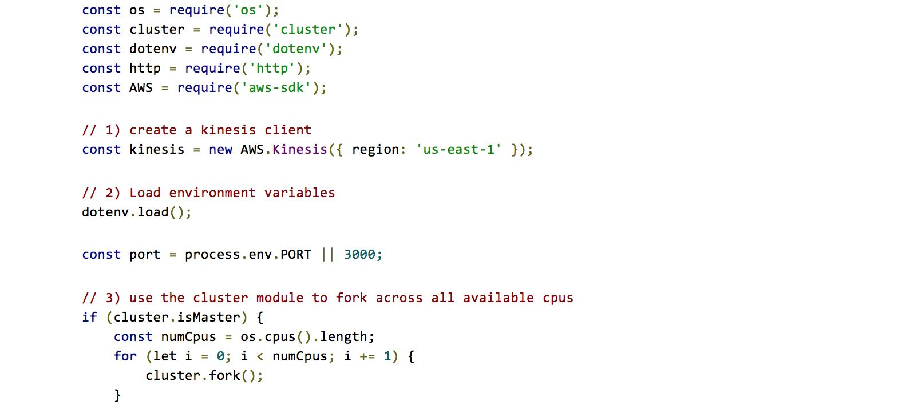 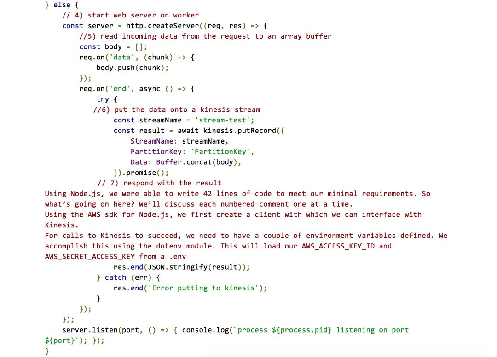
#### &nbsp;

#### Server.js: Node.js Implementation

Using Node.js, we were able to write 42 lines of code to meet our minimal requirements. So what’s going on here? We’ll discuss each numbered comment one at a time.

1. Using the AWS sdk for Node.js, we first create a client with which we can interface with Kinesis.
2. For calls to Kinesis to succeed, we need to have a couple of environment variables defined. We accomplish this using the dotenv module. This will load our AWS\_ACCESS\_KEY\_ID and AWS\_SECRET\_ACCESS\_KEY from a .env file.
3. By default, Node.js runs in a single process. This means that only a single CPU core will ever be used. To get around this, we use the built in cluster module to fork to as many processes as there are cores on the machine.
4. One each core, we start an http server using the http module.
5. Each request to the server is handled the same (again, we’re not handling routing here). So we assume the request has a body and we read the body into an array buffer.
6. Once we’ve read all the data from the request body, we put the data to a kinesis stream. Here, we’re using async/await to make the request concurrently to Kinesis.
7. Finally, we respond to the HTTP request with the result of putting to Kinesis.

Next stop, Go. We ended up writing two files here, just to separate some of the logic needed to put records to Kinesis. So there’s a bit more code, and therefore more to discuss, but the idea is the still the same.

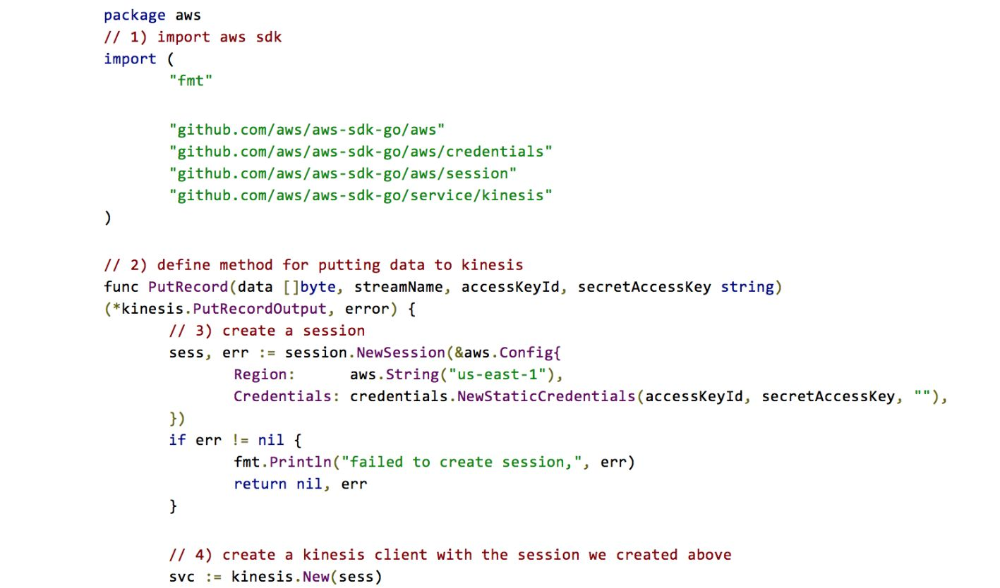

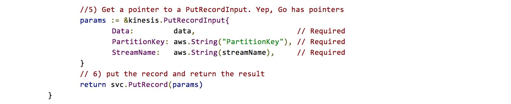

#### aws/aws.go: Go Implementation

Let’s break this down again.

1. First we need to import the AWS SDK for Go. There are actually several packages we need from there, so we import them one per line.
2. We encapsulate the logic for putting an array of bytes to a Kinesis stream in a function named PutRecord. In Go, capital method names are exported from a module.
3. This is an additional step we didn’t need in the Node.js version. We need to create a session object and pass it the region, as well as manually pass in the credentials.
4. Once we have a session, we can create a Kinesis clien
5. The Kinesis client has a method named PutRecord for putting data onto a Kinesis stream. It accepts a pointer to a PutRecordInput, so we define one of those here. We use the & token for getting the address.
6. Finally, we return the result of calling PutRecord.

Now that we have a helper function for putting data to Kinesis, we can focus on the web server. This part is the most similar to what we discussed above for the Node.js version.

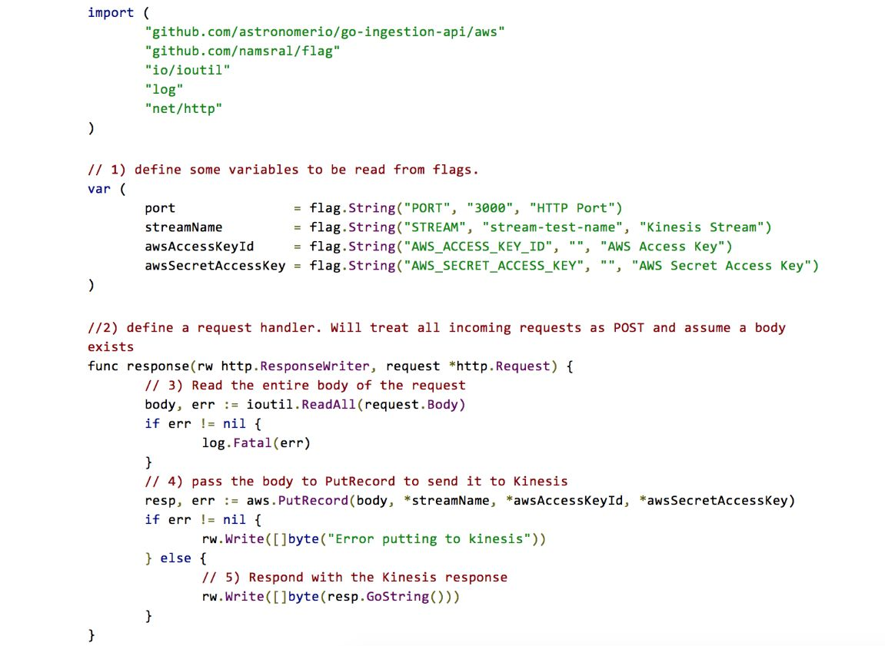 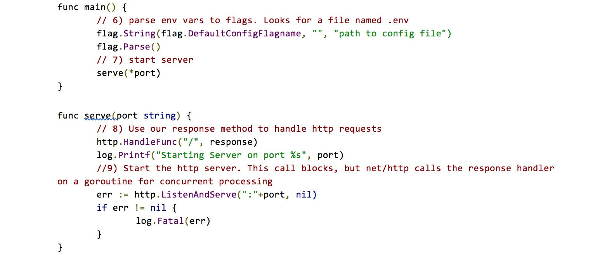

#### main.go: Go Implementation

Alright, last time to discuss some code.

1. In Go, we need to explicitly declare the variables we’re reading in from the environment. Here we define variables that allow for the stream, port, and aws keys to be set at runtime.
2. The meat of the program is here. This method will be called in response to any requests to the server.
3. The request handler will first read all of the data from the incoming request into an array of bytes.
4. With the byte array, we can simply call the PutRecord method we defined in the aws package.
5. Assuming the call to PutRecord was a success, we respond with the response we got back from Kinesis.
6. Just like C, every program written in Go begins in a function named main. This is where the parsing of environment variables actually takes place.
7. We just need to call the serve method to start the web server
8. The serve method simply tells the server to use the response method to handle incoming requests.
9. Last thing we need to do is start the HTTP server. This call is blocking, which means it will prevent our main function (and therefore our program) from exiting. While the call to listenAndServe is a blocking one, when a request comes in the server will call response on a go-routine, giving us the concurrency we’re after for free.

The end result is 78 lines of code split across 2 files. So we nearly doubled in the amount of code written. Part of this has to do with the increased verbosity of the AWS SDK’s API in Go vs Node.js. We also check for errors a few more time in the Go version, and we have to explicitly define our environment variables before we can use them. This is one of the things we love about Node.js. It’s great for writing code quickly and tends to be fairly succinct as well.

Despite its increased length in lines of code, the Go version takes care of one big thing automatically for us: concurrency. As mentioned above, when we discussed the Node.js version, we needed to take an additional step to utilize all available processing power by forking the Node.js process to as many CPUs as were available on the machine. Concurrency in Go is handled quite a bit differently. Go has concurrency built right into the language itself via a construct called a goroutine. A goroutine is created simply by calling a function and prefixing it with the go statement. Without goroutines, we would only be able to handle a single request at a time. But with them, we can spawn thousands of goroutines at once to handle requests. Check out [this excellent blog post](https://divan.github.io/posts/go_concurrency_visualize/) to learn more about goroutines.

### The Test

So how do these service perform when compared against one another? Benchmarks are a fickle thing at best, but at the very least we felt some quick tests would give us more confirmation we were heading in the right direction.

I’m actually going to say that one more time: benchmarks are tough. This is in no way a true scientific effort to compare the performance of one language to another. This is a highly specific test for our use case that helps us make an informed decision. After all, performance isn’t everything and there are many factors to consider when picking a language to do a job. Factors such as company knowledge, iteration speed, 3rd party package support and many others are all things you should consider before making a decision.

To simulate load against both servers, we used [Apache JMeter](https://jmeter.apache.org/). JMeter bills itself as “a 100% pure Java application designed to load test functional behavior and measure performance.” I won’t go into too much detail on using JMeter, but I’ll include the test plans I made with it at the end of this post. In short, JMeter allows you to spawn many concurrent threads (or users), each of which can interface with the system under test. In our case, we ran multiple tests against each server with 1 user (for a baseline), 50 users, 500 users, and 1000 users. In addition to the number of users, JMeter allows you to specify the ramp time, or the time it takes for all specified threads to become active. In the case where we ran the test with a single user, a ramp time of 0 seconds was used. For all other tests, a ramp time corresponding to 1/10th of the number of users was used. For the duration of the test, each “user” made an HTTP request equivalent to the following curl command:

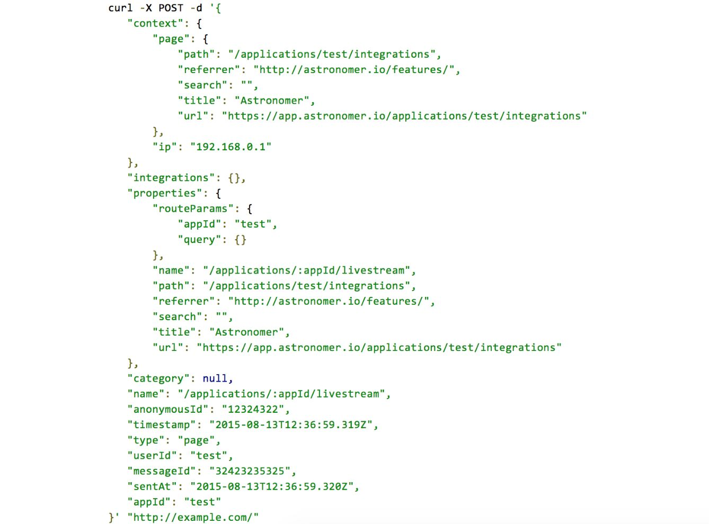

The body of this request (the value specified after the -d) is an example of what a single event looks like when tracked from one of our many sdks.&nbsp;

### Test Setup

Here’s the setup we went with for both web servers:

- Debian 8.7x64 running on DigitalOcean droplets
  - New York Region 1
  - 8 GB RAM
  - 4 CPU
  - 5TB Transfer

Additionally, we needed an instance to perform the load test with Apache JMeter. That instance looked like the following:

- Debian 8.7x64 also on Digital Ocean
  - New York Region 1
  - 32 GB Ram
  - 12 CPU
  - 7 TB Transfer

We tested the Node.js server with version 7.4.0 and used the `harmony-async-await` v8 flag. The Go server was running version 1.7.5 of Go.

In hindsight, I didn’t need anywhere near this much horsepower for these tests. I have a habit of always going for more, but in this case I never saw CPU over 10% of utilization, even at peak load.

### Results & Discussion

As we mentioned above, we ran this test multiple times with varying numbers of users (threads). For each variation, we ran the test 3 times. In order to get a baseline, we first ran the tests against both servers with a single user with a ramp time of 0 seconds. For each test, we were interested in seeing what &nbsp; was (typically, I’d use median or percentile, but I'm really only using it to see the patterns that emerge when running two similar implementations under load). The graph below compares the results of the Node.js and Go versions for all three tests.

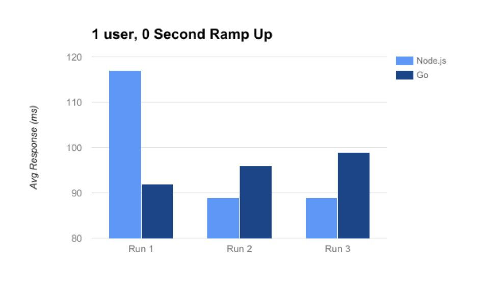_Figure 1: 1 user, 0 Second ramp up time_

What’s interesting about this first test is that in the first run, the Node.js version was drastically slower than the Go version to respond. However, in the final two runs, the Node.js version was slightly faster.&nbsp;

Alright, so we have a one user baseline out of the way. Now let’s add some more users and see what happens. For the second test, recall that we used 50 users with a ramp up time of 5 seconds (ramp up time is the time it takes for all users to become active).

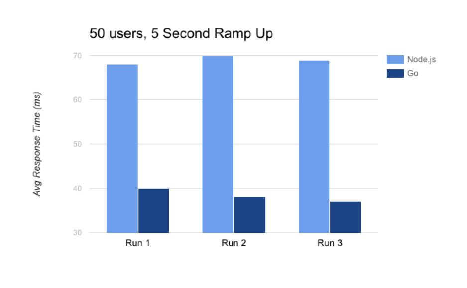_Figure 2: 50 users, 5 second ramp up time_

Here we start to see that performance we’ve heard from so many others. Node.js is still performing very well, but the Go version is able to process and respond a whole lot more quickly. From here on out, the pattern is pretty consistent in these tests so I’ll just leave the remaining results below. In every case, Go is simply better suited at handling the increasing load.

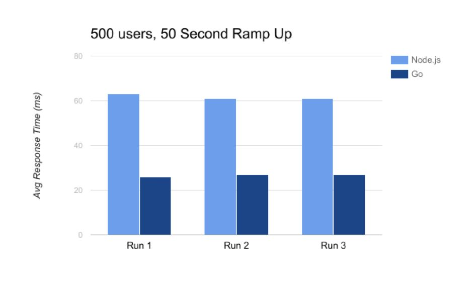_Figure 3: 500 users, 50 second ramp up time_

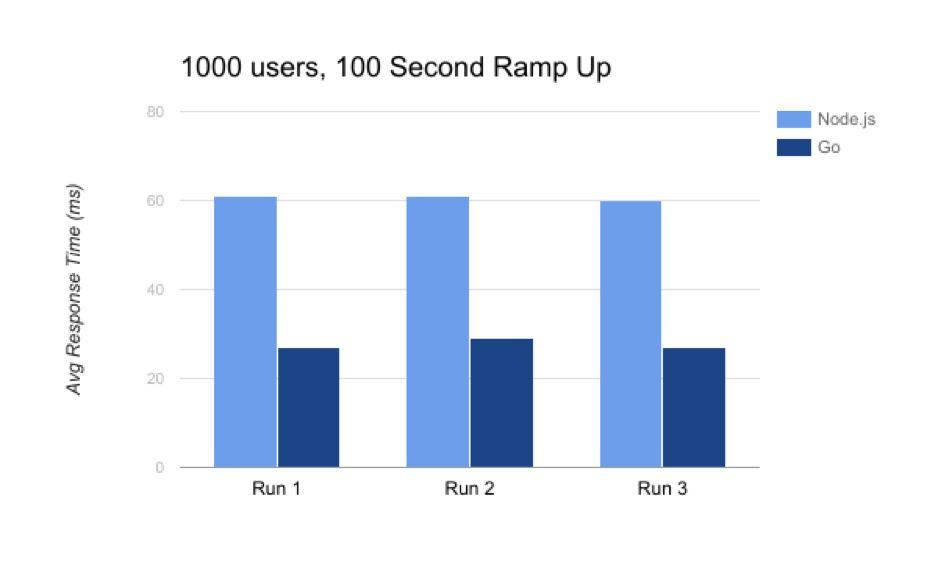_Figure 4: 1000 users, 100 second ramp up time_

What can we infer about these results? Again, this alone is not a definitive enough answer to prove that one language is faster than other. But by running this test multiple times with an increasing amount of load, patterns start to emerge. It’s the pattern that we’re most concerned with, rather than the actual numbers themselves. Our tests show us that Go is able to consistently process requests in nearly half the time as the Node.js version, regardless of the number of the requests we throw at it.

### What’s Next?

We’re feeling pretty good about introducing Go as another language in our stack. We’ll continue using Node.js in a lot of places (most of them actually), but for areas where performance is the #1 concern, we’ll do another analysis (maybe not quite so involved) to see if Go is a better fit. As a developer, it’s exciting to work at a company where language wars aren’t really a thing. Instead, we’re all constantly learning and seeing what’s out there, and when there’s a use case that makes sense for us, we don’t hesitate to bring that language in to do the job. But for now, we’ll get back to work on the Go version we’ve discussed. Once we get that production ready, we’ll report back in a few months with our results.

_Go Implementation: [https://github.com/astronomerio/go-ingestion-api](https://github.com/astronomerio/go-ingestion-api)_

_Node.js Implementation:_ [_https://github.com/astronomerio/node-ingestion-api_](https://github.com/astronomerio/node-ingestion-api)

