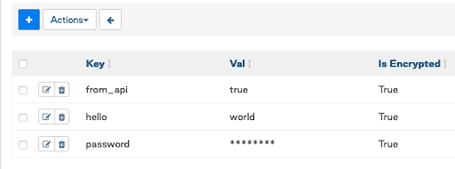
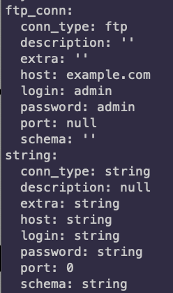
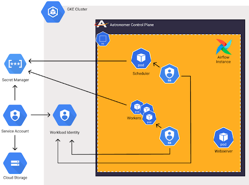

## What are Airflow Secrets?

**Secrets** are sensitive information that are used as part of your DAG.

Types of Secrets: 

* **Variables** are a generic way to store and retrieve arbitrary content or settings as a simple **key value** store within Airflow.
* **Connections** are information needed to connect to external systems. Must be stored in the format of a **URL-encoded URI**.
* **Configurations** are Airflow Configurations that can be stored in your secrets backends.

To get started check out our webinar below on the best practices for Secrets Management in Airflow 2.0. You can also use these [example DAGs](https://github.com/astronomer/webinar-secrets-management/tree/master) from the webinar. 

<!-- markdownlint-disable MD033 -->
<iframe width="560" height="315" src="https://www.youtube.com/embed/Mf2uTVe3GPA" frameborder="0" allow="accelerometer; autoplay; clipboard-write; encrypted-media; gyroscope; picture-in-picture" allowfullscreen></iframe>

## Where are all the Secrets?

### Environment Variables

* Simple and easy to use, difficult to maintain. 
* No encryption built in.
* Cannot access them from UI or the Airflow CLI.
* Using them from Kubernetes secrets is safer.
* Lives and dies with your Airflow deployment or its configuration.

### Airflow Metastore DB

* Can be accessed from the Airflow UI, CLI, or API.
* Adding Connections with these does the URL-encoding and URI formatting for you.
* Encrypted with Fernet key in the DB.
* Lives and dies with the Airflow Metastore DB.
* Can be exported and imported easily.
* Probably won’t be approved by many security teams in production.

\---

### Alternative Secrets Backend

* HashiCorp Vault
* GCP Secret Manager
* AWS Secrets Manager
* Azure Key Vault

Airflow was designed to orchestrate and connect to everything needed for pipelines. So why should your Secrets be any different to Airflow?

* Secure storage and access of your sensitive Secrets.
* Lives beyond your Airflow deployments.
* Can be managed, rotated, versioned, and audited easily.
* Flexibility to choose what combination of Secret types you use with the backend (new in 2.0).

## GCP Workload Identity & AWS IAM Roles

IAM Integration allows you to connect to cloud resources implicitly with Service Accounts. 

* **Secure:** No one needs to touch the Service Accounts.
* **Flexible:** Cloud Service Accounts are tied to Kubernetes Service Accounts.
* **Easy to manage:** Set it up once and just maintain permissions.

## So Where Should Secrets Be Kept?

* Cloud Resources should use Workload Identity / AWS IAM Roles when possible.
* Connections and sensitive Variables should be stored in an Alternative Secrets Backend.
* Variables depend on development and security patterns.
* Ideally use an Alternative Secrets Backend whenever possible.
* Use Airflow Metastore DB if you want to be able to see, access, and manage them directly from Airflow.

## Best Practices

* Separation of Concerns
* Use Airflow for what it does best.
* Integrate it with systems that are better for other things.
* Do not pass sensitive information around when possible.
* Have a strategy for how to manage your Secrets and and controlling access.
* Use the right combination of Secrets Backends.
* Sensitive information should be in an Alternative Backend or integrated with IAM Roles.

This repo contains an [example DAG and configurations](https://github.com/astronomer/webinar-secrets-management/tree/master) that were used in an Astronomer webinar on Secrets Management with Airflow 2.0.

\
The easiest way to get started with Apache Airflow 2.0 is by using the Astronomer CLI. To make it easy you can get up and running with Airflow by following our [Quickstart Guide.](https://www.astronomer.io/docs/cloud/stable/develop/cli-quickstart)
