Do a quick search of data warehousing options and you'll quickly see that Amazon Redshift has become an overwhelmingly popular alternative to spinning up your own solution. It's become so popular that entire companies exist to get data into it. (We're not knocking that; Redshift connectivity is an important part of our business too.)

The reasons behind this popularity are simple:

### 1) It's Just Postgres

At its heart, Amazon Redshift is just PostgreSQL; one of the most popular SQL databases&nbsp;over the past 20 years. If you've used Postgres, you're 99% of the way to understanding Redshift. If you haven't but you know SQL, you're 95% of the way there. If you don't know SQL, you're an afternoon of tutorials ([SQL School](https://community.modeanalytics.com/sql/tutorial/introduction-to-sql/), [Code Academy](https://www.codecademy.com/learn/learn-sql)) away from being 100% there.

### 2) It's Something Better Than Postgres

Yeah, we lied. It's not Postgres. It's better! Without getting into the specifics, Redshift is actually a columnar based, massively parallel version of Postgres. What this means for you as the end user is that it's much faster and scalable than just Postgres. Especially for larger datasets (up to&nbsp;Petabyte scale! PETABYTE!) performing&nbsp;OLAP (Online Analytic Processing) tasks with complex queries (i.e. not just transactionally adding in rows), Redshift is going to perform much better.

### 3) It's a managed version of something better than Postgres

So it's SQL based, it's bigger and faster...what third thing could make it better? How about being able to manage it via the AWS console? How about spinning a cluster up in 5 mins flat? How about two months to evaluate whether it's something you want to use long term? Well, it's true, and in this post, we're going to walk you through how easy it is to get set up and going.&nbsp;

First thing's first: Go to [https://aws.amazon.com/redshift/free-trial/](https://aws.amazon.com/redshift/free-trial/)&nbsp;and click the button on the right labeled 'Start Free Trial.'

If you don't have an AWS account already, you'll need to create one before you can get started with Redshift. It's a pretty basic set up (name, email, phone number, personal/company account, etc.) and the good news is that you'll only need to do this once for any of AWS's suite of tools.

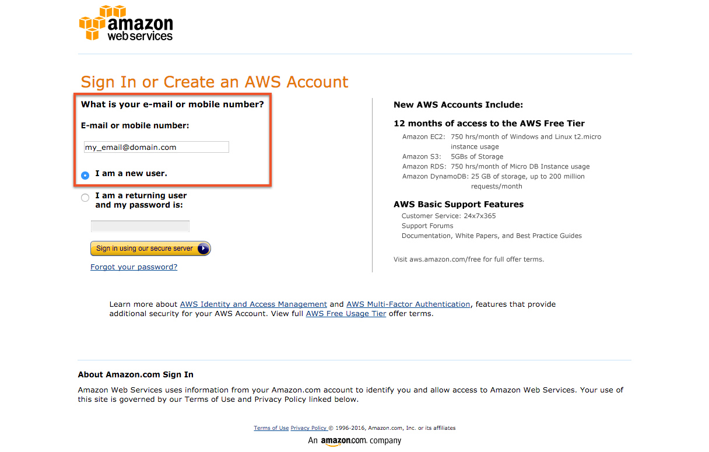

&nbsp;

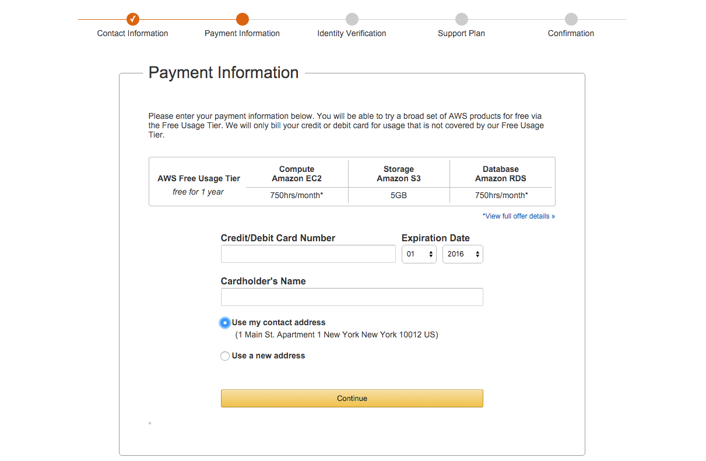**NOTE: While the Redshift trial is good for 750 hours/month of a DC1.Large node for two months, you will need to put in your credit card information in case you upgrade your cluster or go over usage hours (_which shouldn't happen if you're using a&nbsp;single&nbsp;basic DC1.Large node.)_**

After you put in your payment method, you'll need to&nbsp;choose your support plan. It's important to point out that w 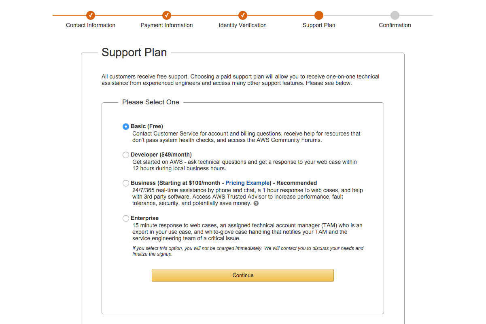hat you choose here does not affect your access to Redshift; it's just about the level of support around the product. If you're just starting out, we recommend going for the Basic plan. You can always upgrade later.

&nbsp;&nbsp;

After you've put in the tedious but necessary contact, payment, and support information, you'll hit a launch screen for all the AWS products. Redshift is on the bottom left hand side.

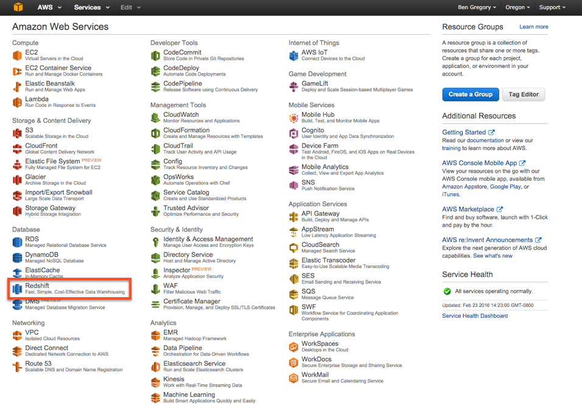

After you click on the Redshift option, you'll land on the _Redshift Dashboard_.&nbsp;This is the main view&nbsp;that you'll use to monitor all your activity with Redshift but, since you don't have anything running yet, you'll want to click the blue 'Launch Cluster' button to, well, launch your first cluster.

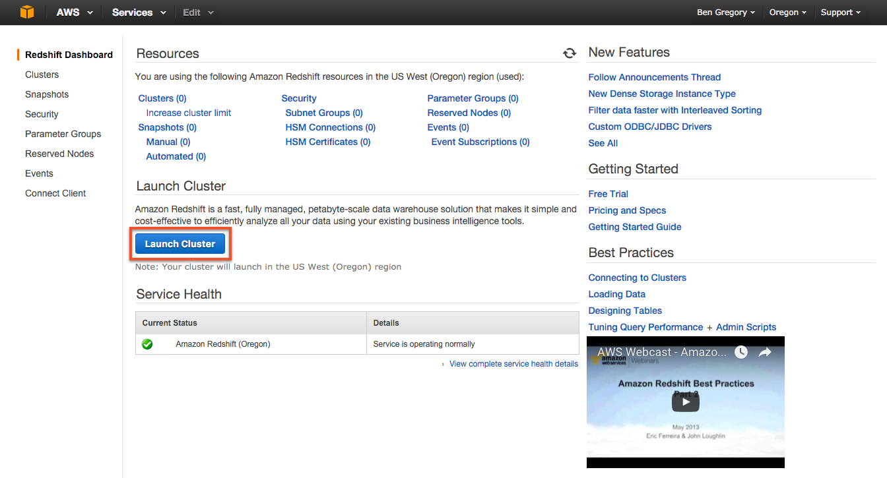

You'll then be directed to a series of configuration pages. On the first, you'll create a unique identifier for your cluster (e.g. {company-name}-cluster-1) to help you identify it when you have multiple clusters running and then you'll create some basic credentials for the databases itself.

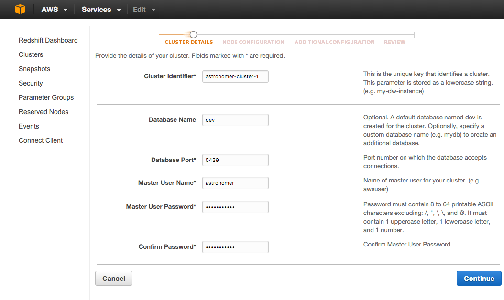

After that, you'll hit a page asking you to configure the actual cluster. You can upgrade the node type from dc1.large to something more powerful or increase the number of total compute nodes. **NOTE: If you still want to remain on the free tier for your trial, it's important that you don't&nbsp;change anything on this page.** The free trial only covers 750 hours of dc1.large usage and anything above that will incur additional charges. If you&nbsp;decide you want to upgrade your cluster size down the line, you can&nbsp;[resize it](https://docs.aws.amazon.com/redshift/latest/mgmt/working-with-clusters.html#cluster-resize-intro)&nbsp;without much issue.&nbsp;

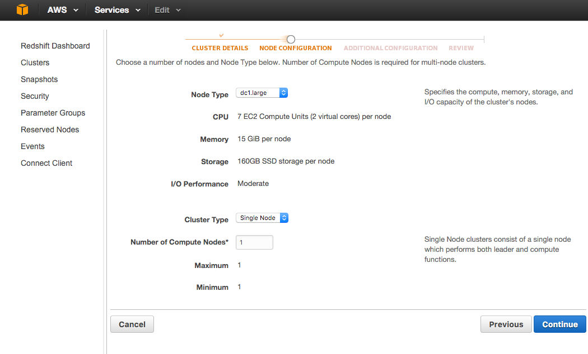

On the next page, you'll be able to set more advanced configuration for your cluster. This is a slightly complicated but very important step in&nbsp;protecting and accessing your data once your cluster is created so make sure you don't rush through it.

In the first section, you'll have the option to set up [KMS](https://docs.aws.amazon.com/kms/latest/developerguide/crypto-intro.html) or [HSM](https://docs.aws.amazon.com/redshift/latest/mgmt/working-with-db-encryption.html#working-with-HSM) encryption for your newly created database. This is a highly recommended step, especially if you are planning on using Redshift for your business. You can learn more about encryption with Amazon Redshift&nbsp;[here](https://docs.aws.amazon.com/redshift/latest/mgmt/working-with-db-encryption.html).

In the second section, you'll set up your networking configuration. Here you'll choose whether or not to make the database publicly accessible. If you are planning on using Redshift with a&nbsp;cloud based BI tool (and aren't keen to do additional advanced configuration with your own VPC), you'll want to set up public IP.&nbsp;

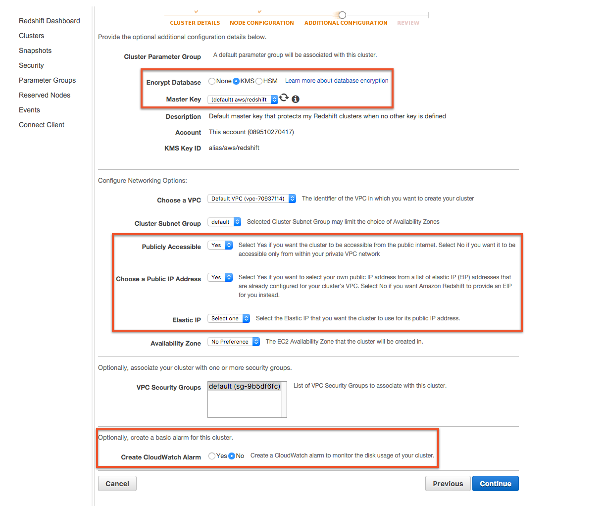

Lastly, you'll have the option to set up CloudWatch Alarms, a separate AWS product&nbsp;that monitors the health and performance. While this will take some familiarity with&nbsp;[CloudWatch](https://aws.amazon.com/cloudwatch/), it's&nbsp;ultimately worth the time invested if you're looking to use Redshift actively for your business. Nothing is worth than realizing something went wrong and your data is lost...five days too late...

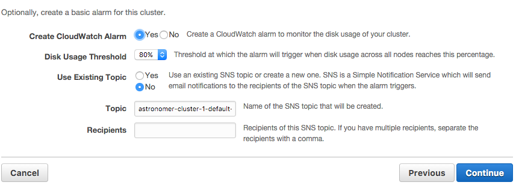

ALRIGHT! Moment of truth!&nbsp;Quick recap - We've...

- Created our AWS account (if we didn't have one)
- Set up our payment method (don't forget that after the two months you'll start getting charged)
- Named our cluster with a unique identifier
- Set up basic login credentials
- Upgraded our cluster (OR left it alone if we want to stay on the free tier)
- Chosen an encryption option (KMS or HSM)
- Decided whether to make it publicly&nbsp;accessible and assigned relevant IP addresses
- Set up Cloudwatch alarms to monitor the cluster post-launch

Only one thing left to do and that's to Launch the Cluster!

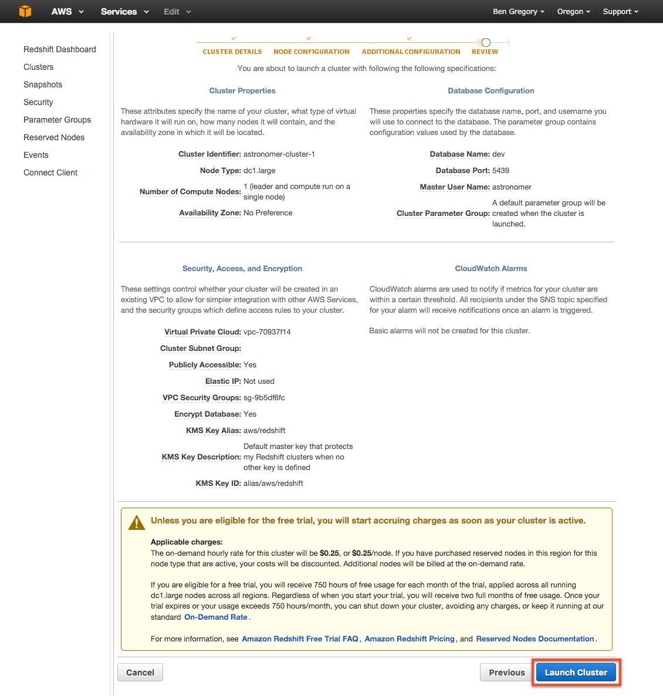&nbsp;

It will take&nbsp;around ~10 minutes for the cluster to become fully set up. You won't need to do anything during this period; once it's all done, the "Cluster Status" will turn to the green 'available' label.

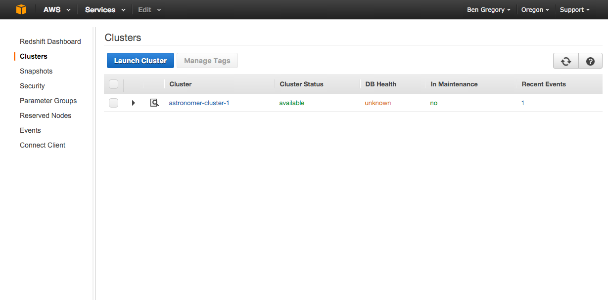

Clicking into our newly created first cluster, we can see both our cluster properties (which we'll need if/when we connect it to a tool, like, say...Astronomer...) as well as get a holistic picture of current&nbsp;status and backups. If you're having trouble accessing it from a local client, check the security settings of the EC2 instance it's running on and make sure your IP address is whitelisted.

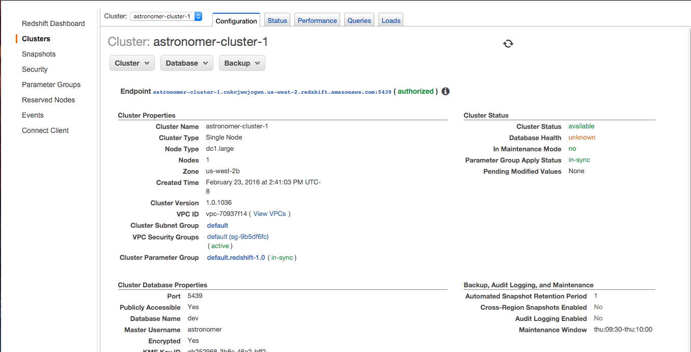

&nbsp;

Well, that's all the time we have for this session! For more info about working with Redshift and managing a data warehouse, check out our [other posts](/blog/) or feel free to reach out to ben@astronomer.io!

