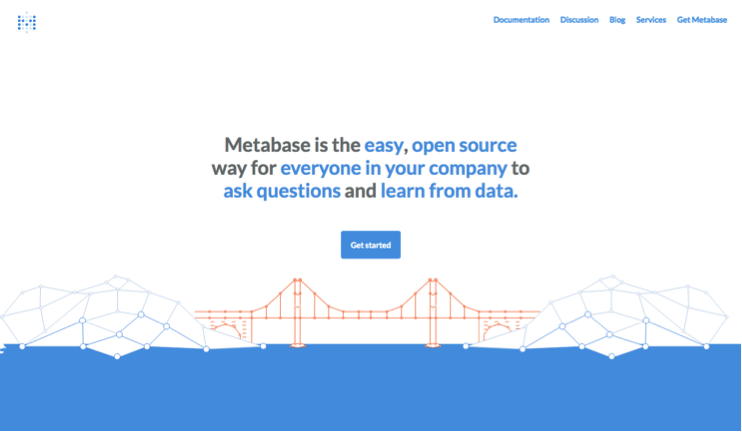
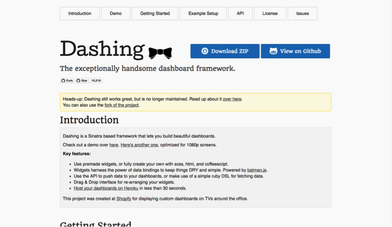
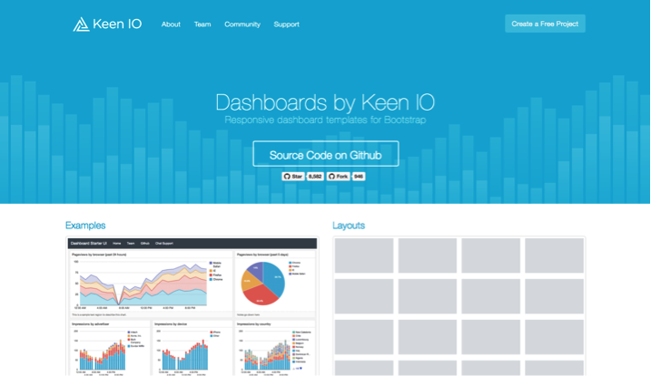
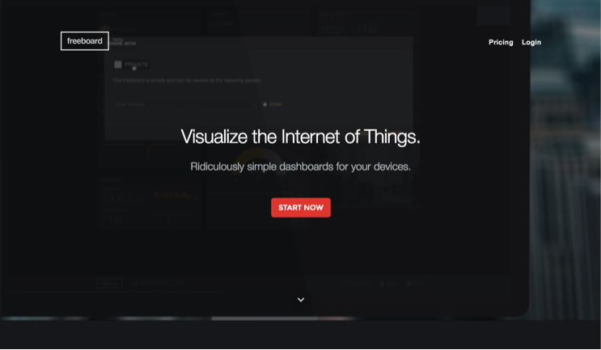
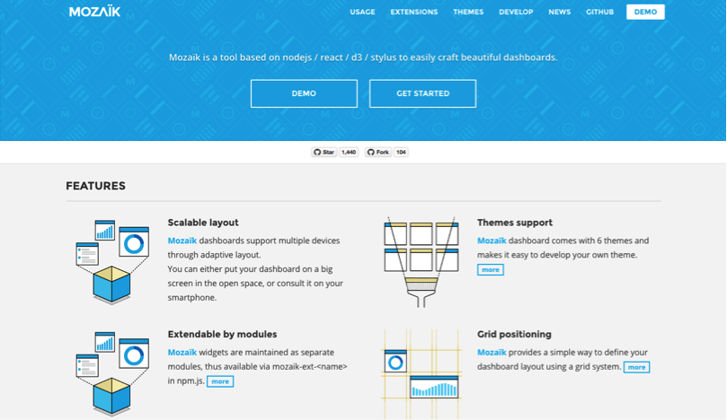
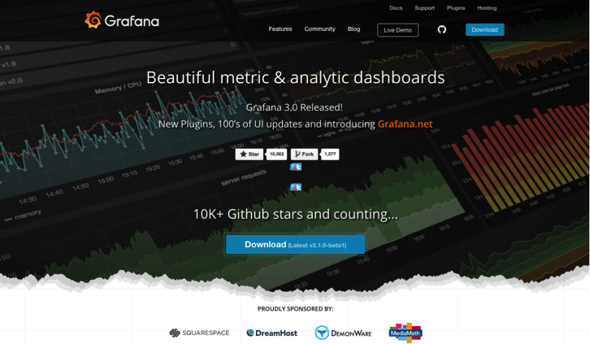
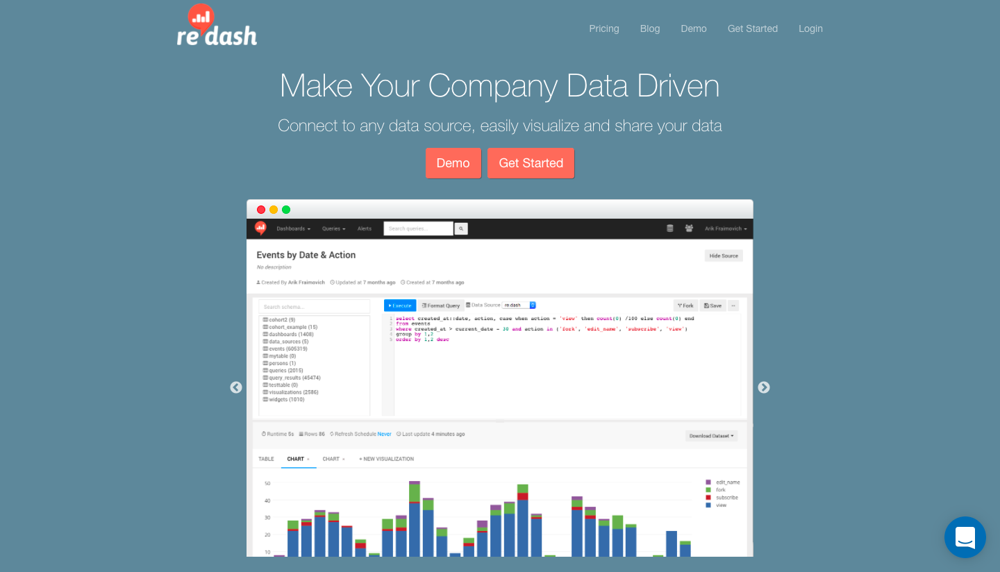

Updated: October 28, 2016

At Astronomer, we believe that every organization can benefit from having their data properly centralized, organized and cleaned. We’re building a company to do just that.

When a client comes to us, they might have weather data from [OpenWeatherMap](https://openweathermap.org), viewership data from [Streamspot](https://streamspot.com/), real-world presence data from [Bliptrack](https://bliptrack.com/), clickstream data generated by users from a number of apps, and partner data from an external SQL Server. All of this data tells them different things about their business and can be enriched further by combining the data in new and interesting ways. Their data is available and streaming in as real-time as the sources allow. The problem they then face (and the new bottleneck in achieving their data goals) is how they can quickly and flexibly present this data in a way that benefits their entire team. Most often, this presentation comes in the form of – wait for it – a dashboard.

For most businesses requiring flexible and powerful BI, [Tableau](https://tableau.com) is the first word that comes to mind. Tableau has spent a good deal of money, time, and effort to make that the case and it shows. They host a massive annual conference ([plug!](https://tc16.tableau.com/)), they’ve built their platform to run on your desktop or server, and they cater to massive and diverse organizations such as the Texas Rangers and Wells Fargo. They’re also not cheap, with licenses ranging from $500-2k/user/year. The crazy thing is, compared to some of Tableau’s competitors, this is relatively affordable. Many clients of ours exploring options outside of Tableau have been quoted at $25k/year for an unlimited license or even buying “tokens” that give you per hour credit.

If you [know what KPIs you want to track](http://www.astronomer.io/blog/5-ways-to-make-sure-your-analytics-spark-growth/) and don’t have the budget for a traditional enterprise dashboard, there are a number of open-source options with greater flexibility and affordability that we’re really excited about. Each has their pros and cons (we’ll lay out both as clearly as we can) but are generally good replacements to match a more expensive tool’s use case, if not its polish.

**The Every(wo)man’s Dashboard - [Metabase](https://github.com/metabase/metabase)**

The [Pareto Principle](https://en.wikipedia.org/wiki/Pareto_principle) says that 80% of effects can be traced back to 20% of causes, and this holds true with dashboards. When you’re paying for an expensive suite of tools, the majority of your work will require you to return to the same core functionality over and over again without a lot of the fine-tuning, in most cases. Metabase _is_ the 20% that lets you answer 80% of your questions without needing to know SQL or navigate a complicated interface.

You start with a question like, _”How many women between the ages of 18 and 25 in either New York or LA have made a purchase in the last week?”_ Then use Metabase’s dropdown filters (_Gender = Female; City is LA or NYC; Age between 18 and 25)_ to answer them. Metabase establishes data types for each column when a new table is added, so these filters are generated automatically. What this means from a practical standpoint is that everyone in your organization can subset tables (and even create basic charts!) without knowing any SQL. The only problem is that if you DO know SQL, you’ll probably find Metabase to be a bit limiting and might want explore more advanced options.

**EDIT:** _Thanks to the Metabase team for reaching out to us to clarify that Metabase does support native SQL querying when you need some extra customization. Thanks Metabase team!_

**The E-Commerce Darling - [Dashing](https://github.com/Shopify/dashing)**

If you’ve done work in the ecommerce space in the past 5 years, you’ve probably seen Dashing in action or, at least, will recognize the patron company behind it: Shopify. Originally published in 2012, Dashing is a battle-tested dashboard with over 10,000 stars on Github and roughly 50 contributors. It’s designed for static monitoring of important key metrics (perfect for an e-commerce use case) and has a beautifully clean design to make that unused flat screen in your office the new centerpiece. In our mind, there are only two cons with Dashing. 1) It was written in Ruby (for us that’s a con...#JS) 2) It’s not really being maintained anymore....

As it turns out, neither of these cons are actually too bad. Although Dashing was written in the heady days of 2012 when Ruby ruled with an iron fist, there is a ported [Node version](https://github.com/fabiocaseri/dashing-js) that has since popped up on Github. And as to the “not being maintained” issue, the current version still works well, and a separate fork from the original Github repo has been started – and is actively maintained by the original Dashing creator ([Daniel Beauchamp](https://github.com/pushmatrix)) who merges pull requests on a fairly regular basis.

**The Superpowered Open Source - [Keen Dashboard](https://keen.github.io/dashboards/)**

Like Dashing to Shopify, the Keen Dashboard is built and maintained by the fantastic team at Keen IO. But unlike Shopify, Keen IO is all about analytics so it makes sense that their dashboard is streamlined to work especially well with their ‘Analytics as a Service’ infrastructure.

When [we interviewed Dustin Larimer](https://www.astronomer.io/blog/way-more-an-interview-with-dustin-larimer), Product Designer at Keen IO, the repo already had 6.5k stars on Github (circa May ’15, back before we were even Astronomer!) and at the time of this writing, it has gained 2k more. If you’ve had any experience with [Bootstrap](https://getbootstrap.com/), you’ll be able to work with the Keen Dashboard with relative ease as that is the underlying framework. As Dustin told us, “_We considered other layout frameworks, but Bootstrap is the most ubiquitous and well known, and we wanted to minimize the initial learning curve._”

While your life might be easier if you use Keen IO’s backend and [visualization library] (https://github.com/keen/keen-dataviz.js) to power your dashboard, the Keen team is generous and thus made their open-source dashboard compatible with any data source or charting library. But honestly, if you choose to use the templating dashboard without Keen IO’s other features (e.g. the backend, the actual viz itself), you’ll be missing out on some core functionality. Without Keen IO, it’s a great, open-source dashboard framework. With Keen IO, it’s open-source with super powers.

**The IoT Tracker - [Freeboard](https://github.com/Freeboard/freeboard)**

Although IoT can be accomplished by and is even an area of strength for Keen IO ([partnership with Electric Imp](https://keen.io/blog/88522353601/electric-imp-keen-io-iot-analytics-magic)!), another dashboard is putting that use case front and center (literally). Freeboard bills itself as the “free open-source alternative to Geckboard,” another dashboard that allows chart embedding from various tools and services. Freeboard is written in Node and has an [easy-to-follow architecture](https://freeboard.github.io/freeboard/docs/plugin_example.html) for building your own plugin. The biggest (perhaps only) con that we can see is that Freeboard _seemingly_ only supports event data (read: real-time, JSON objects) but doesn’t pull from databases. So if you’re looking to connect your SQL database to a simple dashboard that you use to visualize some basic KPIs, this might not be your best bet.

**The Modular Master - [Mozaik](https://github.com/plouc/mozaik)**

A relatively new entry (first commit in Dec ‘14) into the open-source dashboard space that we’re pretty excited about is the modularly designed Mozaik. Mozaik was built using our favorite JS trifecta (Node, React, d3) and while it still has room to grow, its extendable and customizable modules make it both a powerful and flexible choice. Need to add a new widget type to your dashboard? Just `npm install mozaik-ext-{widget-name}` and there you have it. There are already widgets built to access Github, Travis, Google Analytics, Twitter, AWS, and ElasticSearch, among many others. And if they don’t have what you’re looking for? Build it yourself with React and d3! Simple as that.

For more information on when to choose Mozaik, the Cloud Data Services team at IBM has a [great write-up](https://developer.ibm.com/clouddataservices/2015/12/01/humans-vs-apache-spark-building-our-rock-paper-scissors-game/) about why they chose Mozaik over alternatives like Dashing (see above) and others.

**The Dashboard Hipster - [Grafana](https://github.com/grafana/grafana)**

Grafana is powerful but by no means is it a dashboard for the faint of heart. This project has graphing plugins, embeddable apps, and integrations to databases too intense for the typical analyst. Best way to sum up Grafana? They were connecting to Prometheus BEFORE it was cool.

This project is the most active we’ve profiled with ~250 active contributors, 10k stars, and ~7.5k commits over the last two years. Of all the dashboards on this list, Grafana is best used when monitoring engineering systems rather than sales KPIs but in a world where every company is a tech company, it’s more useful than ever to have a universal view of your infrastructure’s health. If the words Cloudwatch, InfluxDB, or Graphite don’t mean anything to you, then you probably don’t need to worry about Grafana. Still might be worth showing it to your dev team though; devs need metrics too.

**Oh, and one more thing...**

**The Dashboard Hustler&nbsp;-&nbsp;** [Re:Dash](https://github.com/getredash/redash)

This one is an honorable mention of sorts because, in all honesty, we didn't initially have Re:Dash on our list when this post was first published. That's absolutely our mistake because after it's creator Arik Fraimovich reached out (see below), we checked it out and have had a great experience with it. Re:Dash uses the robustness of other open-source guru Plot.ly (see previous adorations of plot.ly from this blog [here](https://medium.com/the-astronomer-journey/what-i-learned-from-analyzing-1700-blog-posts-4a607431a32f#.5br7nk5xh), [here](https://www.astronomer.io/blog/what-i-learned-from-analyzing-1700-blog-posts-part-ii), and [here](https://www.astronomer.io/blog/data-in-basketball)) to power its&nbsp;visualizations and plugs in easily with mail clients like [Mailgun](https://mailgun.com) to create a simple but reliable alert system. Hat's off to Arik for creating some [AWS AMI's](https://docs.redash.io/en/latest/setup.html) for easy install on EC2. We&nbsp;set Re:Dash up the day we've learned about it and have had it running without incident ever since. Highly recommend.

We at Astronomer are committed to making data more readily available because we believe data can be transformative. Sometimes using data properly means hiring an analyst and getting them a Tableau account to begin pumping out reports. Other times, it’s feeding data into a learning algorithm to find new patterns. Most often, however, proper use of data is just the ability to keep your eye on the same metric and know how it changes over time.

No matter what dashboard you end up going with, bear in mind that 1) if you have a small number of metrics to track (i.e. no need for reports) and 2) no full-time analyst (i.e. no resources for reports), you will not reap the benefits of an extensive and expensive tool like Tableau. Those tools are appropriate when the questions you ask are always changing and you have the people on your team who can answer them. If you know the 10 metrics you’ll always need to monitor and are comfortable these will be relevant for some time, consider using an open-source dashboard that is both free\* and more customizable to your needs.

&nbsp;

