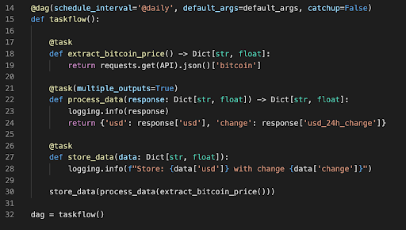

<iframe width="560" height="315" src="https://www.youtube.com/embed/DljJg_lXBYQ" title="YouTube video player" frameborder="0" allow="accelerometer; autoplay; clipboard-write; encrypted-media; gyroscope; picture-in-picture" allowfullscreen></iframe>

# What is the TaskFlow API?

Prior to Airflow 2.0, Airflow did not have an explicit way to declare messages passed between tasks in a DAG. 

XComs could be used, but were hidden in execution functions inside the operator.

The TaskFlow API is a functional API that allows you to explicitly declare message passing while implicitly declaring task dependencies. 

# TaskFlow API Features 

TaskFlow API Functionality Includes:

* XCom Args, which allow task dependencies to be abstracted and inferred as a result of the Python function invocation
* A task decorator that automatically creates PythonOperator tasks from Python functions and handles variable passing
* Support for Custom XCom Backends

# Decorators

**Task decorator** allows users to convert any Python function into a task instance using PythonOperator. 

**DAG decorator** allows users to instantiate the DAG without using a context manager.

# Custom Xcom Backends

The TaskFlow API supports a new \`xcom_backend\` parameter, which allows you to

* Store XComs external to Airflow
* Implement your own serialization and deserialization methods.

# Future Work

The TaskFlow API is a new Airflow feature, and will likely be expanded on in the future. 

Development of additional decorators to support other operators is already ongoing.

The easiest way to get started with Apache Airflow 2.0 is by using the Astronomer CLI. To make it easy you can get up and running with Airflow by following our [Quickstart Guide](https://www.astronomer.io/guides/get-started-airflow-2).