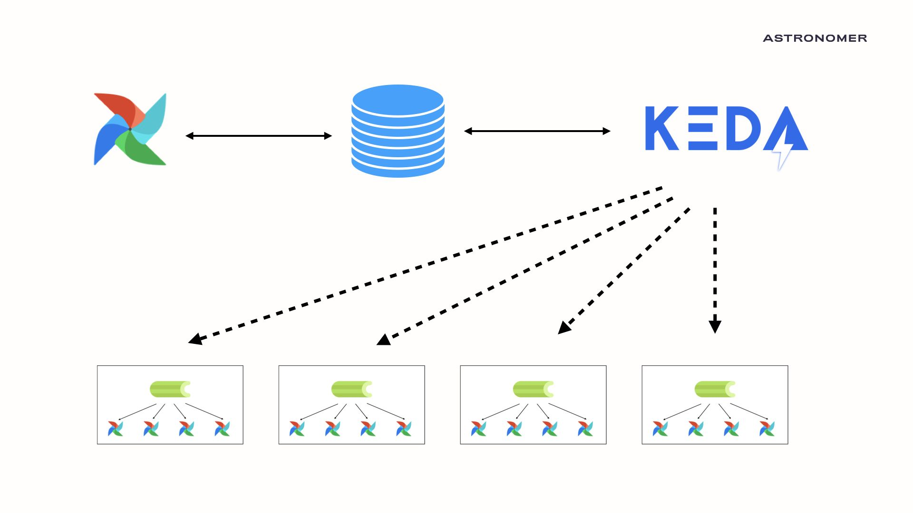

Hello there, fellow Airflowers!

As some of you may know, we've been busy for the past few years trying to find an ideal autoscaling architecture for Apache Airflow. This journey has taken us through multiple architectures and cutting edge technologies. With the release of KEDA (Kubernetes Event-Driven Autoscaler), we believe we have found a new option that merges the best technology available with an architecture that is both efficient and easy to maintain.

When the KubernetesExecutor was first released, it was the first time that Airflow had a working scale-to-zero solution. The executor can launch a pod for each task, and shrink back down to a single instance when all tasks complete. While this system has huge benefits for users, it is not without its drawbacks.


Launching an entire Airflow virtual environment for each task leads to a fair amount of wasted resources, and running hundreds or thousands of tasks in parallel can place significant pressure on a Kubernetes cluster. So while the KubernetesExecutor is valuable for users who want per-task configurations and don't want to use Celery, it is not our ideal autoscaling solution.


In continuing our search for an ideal autoscaling solution, we felt that these were the three most important factors:

1. Any autoscaling system for the Airflow community should be easy to install and easy to maintain
2. Any autoscaling system for the Airflow community should maximize efficiency and allow multiple tasks to run per-worker
3. Any autoscaling system for the Airflow community should scale to zero and be reactive to Airflow's scaling needs

With these factors in mind, we feel that with KEDA we might finally have our optimal solution!
<!-- markdownlint-disable-next-line -->
## What is KEDA?

KEDA stands for Kubernetes Event-Driven Autoscaler. KEDA allows users to define autoscaling using external state of things like [Kafka Topics, RabbitMQ queue size, and PostgreSQL queries](https://keda.sh/). Over the past few months, we've teamed up with our friends at [Polidea](https://www.polidea.com/) to investigate how to use KEDA as an autoscaler for Apache Airflow. We are happy to say that the results have been fantastic.
<!-- markdownlint-disable-next-line -->
### So What Does This Have to do With Airflow?

Using Keda's flexible scaler system, we created an autoscaler capable of scaling celery workers based on data stored in the Airflow metadata database. Given that all metadata regarding an airflow cluster lives in the backend SQL database, we can now autoscale the number of Celery workers based on the number of running and queued tasks!

In the following example, we start with an Airflow cluster that has zero Celery workers as it is running no tasks.

```shell
CEIL(0 RUNNING + 0 QUEUED/16) = 0 WORKERS
```


Using the equation CEIL(RUNNING + QUEUED)/worker_concurrency, KEDA launches a single worker that will handle the first 16 (our default concurrency) tasks in parallel. Even as Airflow adds tasks, as long as old tasks finish before the number of running + queued tasks rise above 16, KEDA will only run a single worker!

```shell
CEIL(0 RUNNING + 1 QUEUED/16) = 1 WORKERS
```


If there is a period of high load, KEDA will be able to launch new Celery workers, all of which are pulling tasks from the Celery Queue as quickly as possible. There is no loading time as the Celery worker maintains a python environment between task executions. This consistency means that these Celery + KEDA workers are significantly faster than KubernetesExecutor workers while having the same scale-to-zero efficiency.

```shell
CEIL(32 RUNNING + 30 QUEUED/16)  = 4 WORKERS
```




### Is it Difficult to Maintain?

Not at all! KEDA is pretty nifty in that the entire program lives on a single pod. KEDA is what's called a [custom controller](https://kubernetes.io/docs/concepts/extend-kubernetes/api-extension/custom-resources/). Custom controllers are a common concept in Kubernetes, where users create features that Kubernetes treats like native features. [The Spark on k8s](https://programming.vip/docs/spark-on-k8s-spark-on-kubernetes-operator-faq.html) and [Airflow on K8s Operator](https://github.com/apache/airflow-on-k8s-operator) are both examples of custom controllers. Custom controllers are lightweight and only require a single pod _per-cluster_. So once you've downloaded the KEDA pod and given it proper permissions, it acts like a native piece of your Kubernetes cluster.

## The User Experience
<!-- markdownlint-disable-next-line -->
### Will Our Airflow Users notice any difference?

One benefit of this system is that for users of the traditional CeleryExecutor, the user experience will be the same. Users can specify which queue they want their task to run in based on permissions, env variables, and python libraries, and those tasks will run in that queue. All of the autoscaling will take place in the backend.
<!-- markdownlint-disable-next-line -->
### Create Queues. ALL The Queues

A significant workflow change of the KEDA autoscaler is that creating new Celery Queues becomes cheap. Previously, if a user wanted to handle ten queues with different settings, they would ALSO need to consider the resource allocation for each of the ten queues. If the user wants one queue with higher memory per-worker, then how many workers would they need with that attribute? Since KEDA scales each queue to zero, users can start treating worker queues the same way that users of the KubernetesExecutor treats executor_configs. Users can have a queue per-DAG, per configuration, and per-security group.
<!-- markdownlint-disable-next-line -->
## So where does this leave the KubernetesExecutor?

Going forward, we plan to continue supporting all functionality offered by the KubernetesExecutor. While there is a lot of overlap in use-cases between the KubernetesExecutor and the CeleryExecutor with KEDA, the overlap is not complete. The KubernetesExecutor still has multiple valuable unique features such as task-level configurations and pod-level isolation for heightened security.

One long-term solution we are discussing is to create a protected `kubernetes` queue, which will launch pods using the KubernetesExecutor. This means that tasks created with `executor_configs` will not need to change and can run on isolated pods, while tasks a user wishes to group together and run with high efficiency can run on autoscaling KEDA celery workers.
<!-- markdownlint-disable-next-line -->
## This Sounds Great! How Do I Try it?

For those who are interested in trying the KEDA autoscaler out, Astronomer has recently open-sourced our [fully-functioning Airflow helm chart](https://github.com/astronomer/airflow-chart). This chart is Apache 2.0 licensed, has instructions for launching airflow with either CeleryExecutor or KubernetesExecutor, and has instructions on how to [integrate your CeleryExecutor with KEDA](https://github.com/astronomer/airflow-chart#autoscaling-with-keda). Please feel free to use this chart in your airflow exploration, and feedback is highly appreciated!

## From Open Source to your Astronomer Cluster

With all of the core open source contributions merged and released, our next step is to prepare, test, and release KEDA for all astronomer customers as a default feature of all cloud and enterprise deployments. We hope that with this feature release, customers will see a noticeable improvement in the efficiency of their airflow deployments, both in cost and speed. Users of the KubernetesExecutor will get more bang-per-buck as they can merge tasks into single workers, and users of the CeleryExecutor will find that their idle costs drop. Customers will also soon have more flexibility to create queues that match each task or DAG's unique use-case.

We want to thank everyone in the Apache Airflow and Astronomer communities for your continued support, and we can't wait to show you all the cool things we have in store :).

[Daniel](https://www.linkedin.com/in/danielimberman?originalSubdomain=co) works for Astronomer as a full-time committer to the Apache Airflow Project.

Astronomer is hiring! If you’re looking for a remote first culture and love Airflow, apply at [https://careers.astronomer.io/](https://careers.astronomer.io/) or contact us at [humans@astronomer.io](humans@astronomer.io).
