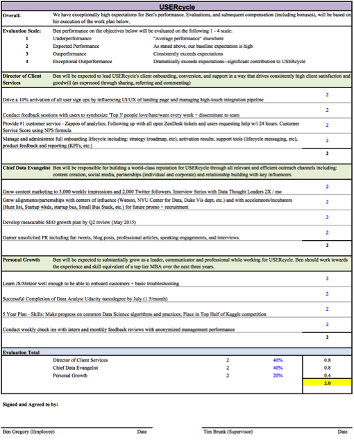
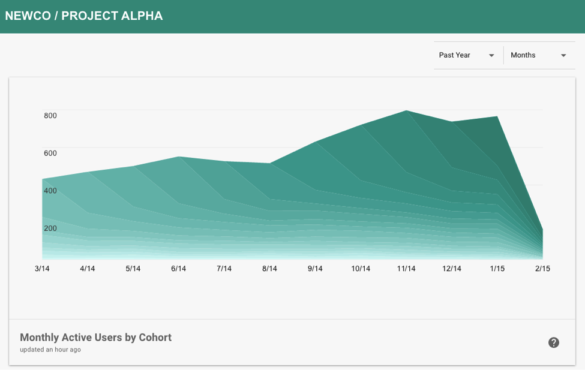

[Process?! We talking ‘bout process?!](https://youtu.be/tknXRyUEJtU?t=8s) Yes, Allen. I want to talk about process. Everyone loves to talk about process…especially in startups. And I get it. In theory, process is a way to keep an organization running smoothly. To keep all the balls in the air and make room for more. But there’s a sinister side to process…

As you launch and grow a startup, a tension emerges between two critical paths: “order” and “experimentation.” By nature, we humans constantly strive for and crave order. But a startup, by nature, craves experimentation. Its lifeblood is searching for creative solutions to poorly understood problems. To do this well, a company needs to shift directions and strategy aggressively as it uncovers new information about the problems it’s solving. The early days of a startup are filled with this discovery process. And the business strategy, team, approach and product must evolve accordingly.

**But this experimentation wreaks havoc on process.**

In the earliest days of Astronomer, it was just me and a young, brilliant VFA Fellow&nbsp;named Ben. (Actually, we weren’t even called Astronomer at that point…we were the hilariously named “USERcycle,” which most people naturally assumed had something to do with drugs and unicycles.) I wanted to create an environment for Ben to contribute meaningfully to the company but also to grow professionally and personally. So I carefully crafted an in-depth performance evaluation layered with different buckets of responsibilities and scoring.

I borrowed this from my days working for a hedge fund, and it was awesome. Well, awesomely complicated. I also developed a systematized process for regularly checking in and, ultimately, used this evaluation to impact Ben’s compensation. The desire was great. The output was not.

In the ensuing two months, Ben’s role changed so many times that the evaluation sheet was pure chaos. He would start marketing to startups, for example, and a week later I’d have pivoted our business into a completely new customer segment. Or, he would begin learning some data science to support a new product concept, and I’d kill the product.

After our second performance “check-in,” I think Ben was about ready to _kill_ me.&nbsp;

I learned an important lesson about process here. When processes are put in place, people depend on them. When they change, people get frustrated. And when they change every week, that frustration turns to anger and discouragement. (Ben, by the way, has become a rockstar for us, and to date, has yet to successfully kill me.)

Now don’t get me wrong, some process is desperately needed, even early. As we began launching a real product, we had real customers. So having a responsive customer support process, for example, was critical to protecting our reputation and brand. But I think these few critical processes were/are the exception vs. the rule.

Aside from the risk of renegade employees, there’s another major problem with over-processing things early:

**Process, by nature, restricts innovation.**

Process leads to structure, and structure leads to boundaries. Boundaries quickly begin to route thinking into well-defined or “safe” channels. In other words, people stop asking questions and begin to accept certain assumptions—like “we are building what our customers actually want”—as reality. And believe me, in the chaos of startup life, cementing anything feels amazing. But it’s death. A false sense of accomplishment that will lure you into blindness and complacency. It takes years to master the core assumptions of operating in large, complex markets, and by the time you do, they’ve all changed and you’re out of date again.

Allow me to illustrate with a story of personal failure. As we were building out USERcycle a year ago, Greg, our CTO, and I worked hard to set up an Agile development process for two-week product sprints. We were trying to consistently release new features for our handful of user retention charts. Using [Jira](https://www.atlassian.com/software/jira), we established a nice rhythm and were hustling hard to stay on track. The only problem was that we lost focus on the only thing that actually mattered at our stage: product market fit.

We knew from personal experience that analyzing customer behavior for a site or app was still way harder and more frustrating than it should’ve been, given all the new analytics tools on the market. We even validated this view through a handful of early customer interviews. We knew there was a big opportunity hiding somewhere in the general dissatisfaction with analytics, but we jumped on our first idea (better customer retention visualizations) and immediately starting building product.

We dramatically reduced the number of hard questions we were asking and reduced market research exclusively to interactions with our current customers. This created a limited view of our customers’ problems and only reinforced our existing thinking. We created an echo chamber. A nice, tranquil echo chamber. We had a clear product roadmap, regular feature releases and a killer two-year cash flow model in Excel.

But what we couldn’t see from within our little cone of focus is that we were simply building another Blockbuster clone in a world looking for Netflix! Companies did want better analytics, but the existing visualization tools weren’t the problem. Getting the right data was! The charts and dashboards were awesome if you had the proper data to fully leverage them. And this is where the average company had an outage. So that’s what we do now: help companies capture, collect and share their data so they can fully leverage analytical or BI tools or run their own data science internally.

Interestingly, it took a conference in Vegas to finally break us out of our trance. (I always encourage attending the occasional conference—even super early—simply for the value of getting out of your routine and comfort zone and interacting with fresh ideas.) We needed to escape the echo chamber for a bit and look at the problem from new angles. Shortly after sitting through a few expert panels on the future of dev-ops, we began to see the opportunity that became Astronomer’s core product today. Our current success is the result of a complete assumptions overhaul. Same problem, totally different solution.

**Our focus on process had allowed us to pretend we were a mature company trying to scale.**

I can’t stress enough how dangerous it is to try to shortcut the early immaturity of a company. The benefit of “working out of a garage” as a startup isn’t foosball in jeans. It’s the freedom to detonate every aspect of your company over and over until you get it right. There is a huge amount of customer, market and product understanding that can only be gained through painful learning. In many ways, the growth of a successful company mirrors the growth of a child. In the early years, you’re watching and exploring. You’re trying to take that first step or eat that fluffy drooling thing with a collar. Sure, you’re going to get barked at or, in my case, fall down millions of stairs.

But that’s how you learn. Everyone loves to point to exceptions—Slack or Google—who seemingly became giant companies overnight. I’m not saying there are zero exceptions, but they are _exceptions_. And even many of those have [years of trial and error before striking gold](https://unreasonable.is/make-your-startup-an-overnight-success/). (Steve Jobs quote: “If you really look closely, most overnight successes took a long time.”)

**So what does that mean for early stage startups?**

To be honest, I haven’t fully figured this out yet. I’m on my fourth startup now (2 are still alive, and growing, and USERcycle became Astronomer). What I do know at this point is that there’s great power in the cage-match between process and experimentation. This early tension creates fantastic internal debate about what really matters. Ben was a huge asset to me in the USERcycle days, because he challenged just about every decision I made (and I fired him weekly for it!). When Ry and Greg joined, these debates only intensified. Today, we’re still wrestling through very basic questions: best “point of entry” into our customers, the priority of certain features (based on solving short- or long-term problems), etc.&nbsp;

I imagine these early team dynamics and tensions are critical for finding the right balance with process. If you find yourself rarely challenged on key assumptions and rarely changing course, you may be slowly drifting into complacence. It might be time to shake things up a little. Switch some roles around, or bring in an outsider to ask hard questions.

Sometimes I think #hustle is nothing more than a relentless pursuit of truth, a willingness to risk everything (including your entire business model) to lay a strong foundation for your company. Don’t be afraid to jackhammer the concrete and start over… and over and over. After all, once you’ve laid a flat and solid foundation, you can start launching rockets! (space pun!!!) But seriously… [rockets](https://youtu.be/gmJgW-yMAIg).

&nbsp;Tim is Astronomer's Co-Founder and Head of Data. You can connect with him on Linkedin [here](https://www.linkedin.com/in/timbrunk).

