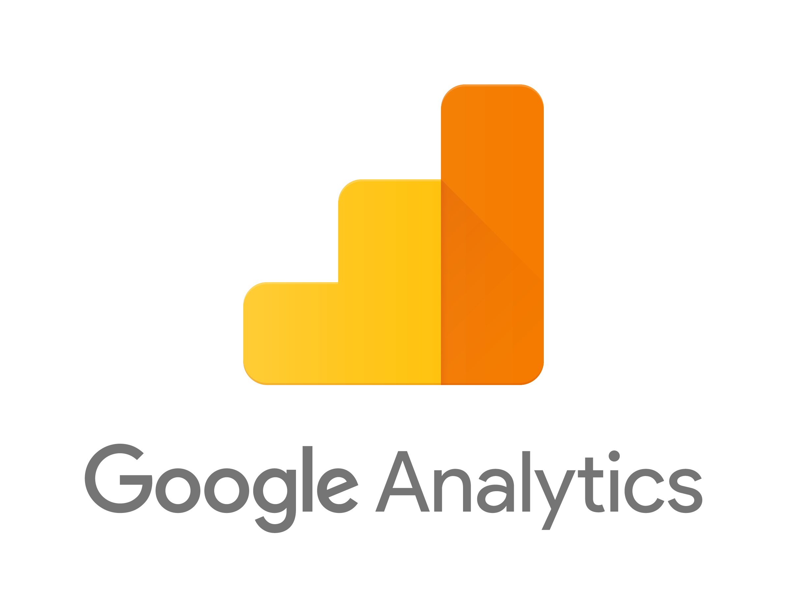
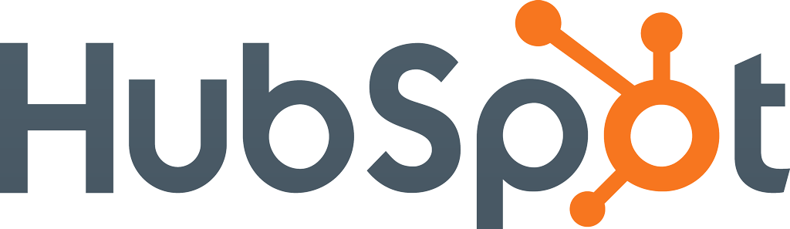

&nbsp;

There’s a good chance, if you’re reading this, that a hodgepodge of data sets are currently accumulating in your organization—collecting social media, blogging, email marketing, SEO, CRM, web analytics and more. Maybe you’re already gathering&nbsp;customer&nbsp;data from favorite tools. Maybe every step of a user's journey across your website or app, every "click," is tracked. (If you&nbsp;don't feel like you have enough data flowing,&nbsp;[check out this post](https://www.astronomer.io/blog/five-steps-to-take-before-kicking-off-a-customer-data-integration-initiative)&nbsp;and kick off something new.)&nbsp;

But each data set gives only a&nbsp;snapshot of the whole picture, which, anyone with an [Instagram](https://www.instagram.com/) account knows, doesn't tell you evverything. Fortunately, once data is routed through one platform (you know, like Astronomer),&nbsp;new integrations can be&nbsp;turned on and off _instantaneously_, with the flip of a switch. Why not make the most of that opportunity and add something new? Or switch to a new, better tool, while keeping your data inact? Or just read on and see what kinds of data you can connect, if you wanted to?&nbsp;

Of course, here at Astronomer, we don’t play favorites. Our customers, on the other hand, absolutely do. They have to, if they’re going to use the tools best-suited to their business needs. So here is a list of their ten favorite clickstream integrations, starting with the most popular.

### 

### 1. Amazon Redshift

Not surprisingly, the most popular clickstream destination that Astronomer supports is [Amazon Redshift](https://aws.amazon.com/redshift/). Redshift is a cost-effective, scalable SQL database, optimized for online analytic processing (OLAP) and business intelligence applications—a great central location for your data. It is immensely valuable to have your clickstream data stored in a database that is easy to plug a BI tool into or query with any number of SQL clients. Especially at an early stage, when your company may have a comparatively small amount of data, Redshift is also very affordable.

### 2. Google Analytics

[Google Analytics](https://www.google.com/analytics/) is a freemium website traffic analytics and reporting tool. The tool is geared toward small and medium-sized retail websites, and the price is hard to beat (free, unless you choose to go premium)! While some users may find it difficult to gain insights from this “less-than-user-friendly” tool, there are more than a few fantastic tutorials available to help you get the most out of it. Check out [this list](https://blog.kissmetrics.com/50-resources-for-getting-the-most-out-of-google-analytics/) compiled by our friends at Kissmetrics!

### 3. Mixpanel

[Mixpanel](https://mixpanel.com/) is one of the most popular clickstream analytics tools available today. With this tool, you have the ability to answer questions that are probably vital to the survival of your company, like:

- “Where during the sign-up process do my customers churn?”
- “Which aspects of my UI are confusing to my customers?”
- “Which ads are sending me my most valuable accounts?”
- “What solutions page are my customers reading when they decide to buy?”

### 

### 4. Kissmetrics

[Kissmetrics](https://www.kissmetrics.com/) is another customer funnel analytics tool. Like Mixpanel, Kissmetrics will help you see into the mind of your users with cohort and marketing funnel analysis through an intuitive interface, real-time data and easy A/B testing. Kissmetrics differentiates itself from the competition with ad-hoc funnel reporting and a lower technical skill requirement.

### 5. Google Adwords

[Google Adwords](https://adwords.google.com/home/#?modal_active=none) is an advertising service for businesses that want to display ads on Google. With Adwords, the user can set a budget for each campaign and only pay when the ad is clicked on! Pricing for keywords is based on a dynamic bidding system, so the more sought after the keyword is, the more the advertiser will pay per click.

Fun fact: The most expensive keyword is currently “Insurance,” with a cost per click of $54.91!

Weird fact: The 20th most expensive keyword(s) are “cord blood,” with a cost per click of $27.80.

_\*Thanks,_ [_Wordstream_](https://www.wordstream.com/blog/ws/2011/07/18/most-expensive-keywords-google-adwords)_._

### 6. WebHooks

This integration refers to&nbsp;a concept offered by multiple companies, not one specific company. To elaborate,&nbsp;“The concept of a WebHook is simple. A WebHook is an HTTP callback: an HTTP POST that occurs when something happens; a simple event-notification via HTTP POST.” Okay. If [that quote](https://en.wikipedia.org/wiki/Webhook) was a little _less_ than simple, this interesting and slightly unrealistic&nbsp;[analogy](https://blogrium.wordpress.com/2009/12/12/twitter-as-a-stockbroker-with-webhooks/) might clear some things up.

### 7. Intercom

[Intercom](https://www.intercom.com/) is a customer communication tool to streamline and simplify customer engagement. From real-time chat boxes to product announcements to multi-channel support ticket management. If it involves communicating with a customer, Intercom can help.

### 8. Calq

[Calq.io](https://calq.io/) is a blood-pumping, white knuckled, edge-of-your-seat thrill ride that you won’t want to miss … if you’re really, really into web and mobile analytics. If you’re just moderately interested in web and mobile analytics, Calq is still pretty cool! Calq lets you understand how users flow through your applications.

### 9. HubSpot

This inbound marketing and sales platform helps companies attract visitors, convert leads, and close customers. [Hubspot](https://www.hubspot.com/) users have full control to build websites without being schooled in code. Running analytics, assessing SEO, comparing to competitors, blogging and tracking leads are all a cinch, too. It’s basically a one-stop marketing and sales shop. &nbsp;

### 10. Amplitude

Last but definitely not least, [this product analytics tool](https://amplitude.com/) for web and mobile gives you the superpower of knowing exactly what your users want, in a way that’s accessible to the entire company. I mean, just check out [the definition of the word amplitude](https://www.dictionary.com/browse/amplitude). It seems fair to expect that a company by that name would provide significantly more holistic metrics than the status quo.

These ten are just the beginning. There are countless other integrations out there. But&nbsp;you're in luck:&nbsp;there are no limits to the&nbsp;integrations to which you can add clickstream! In fact, a fully integrated approach is the best way to truly get to know your customer, because each tool has a unique emphasis. Ideally, you'll use a number of tools with clickstream and centralize it all in one place, like Redshift (there's a reason it's popular).&nbsp;

As a starting point, test out that approach with a few tools from this list. Almost all of them&nbsp;offer a free tier and/or free month-long trial. Coincidentally, so does Astronomer. So you can actually test them all out *with* clickstream! [Sign up for free at app.astronomer.io](http://app.astronomer.io/login).

And if you have another favorite tool, tell us what it is and why you love it in the comments. On our neverending quest for total data connectivity, we may want to add it to our product roadmap.

