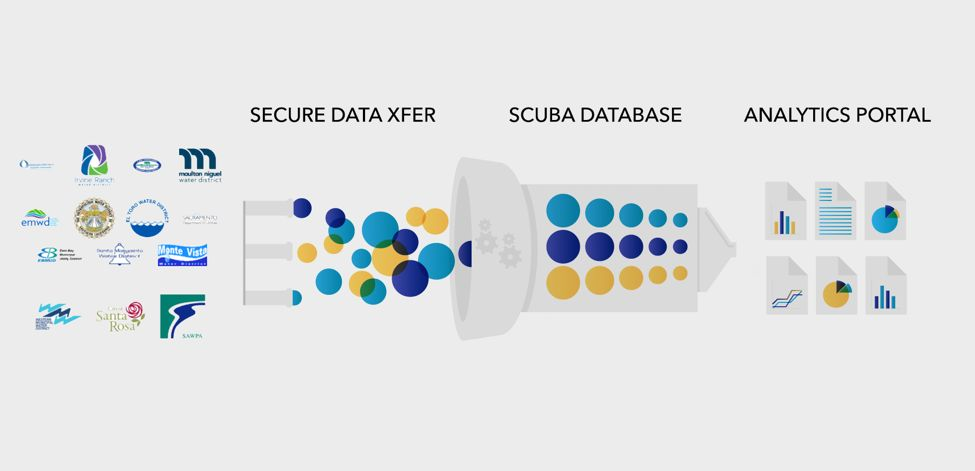
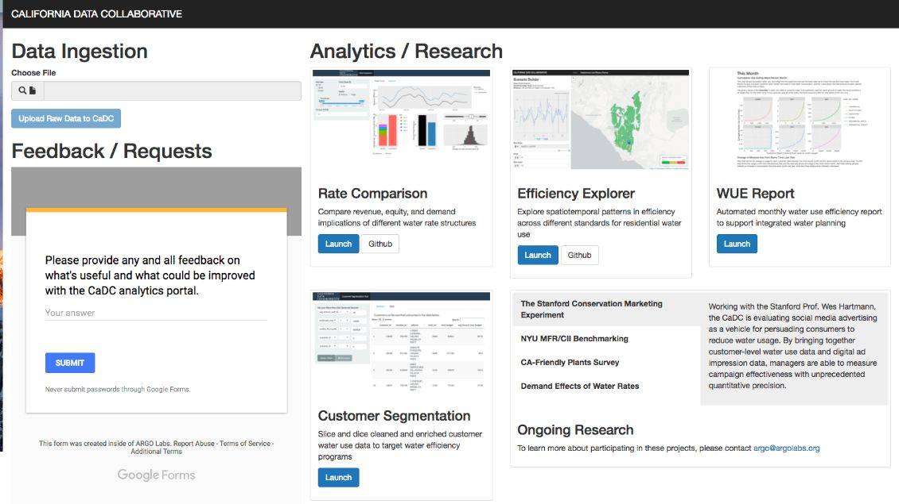
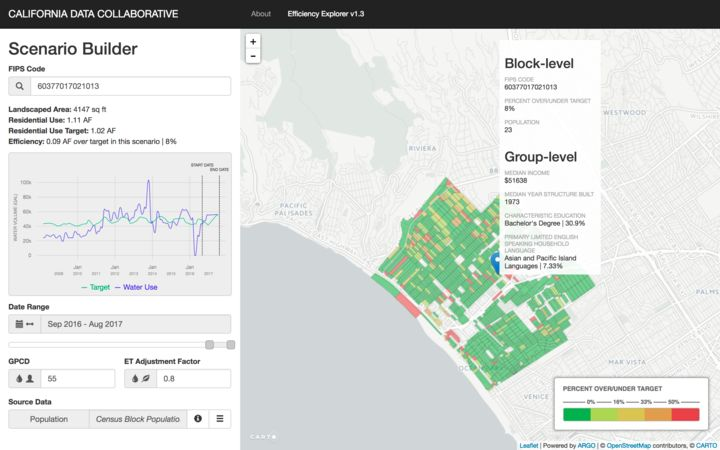
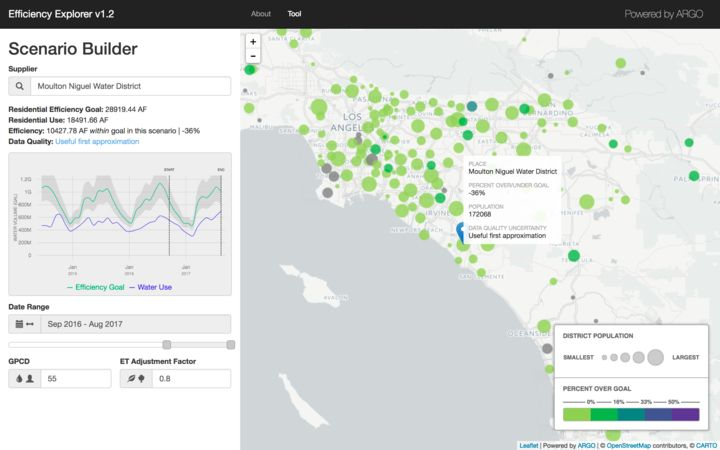
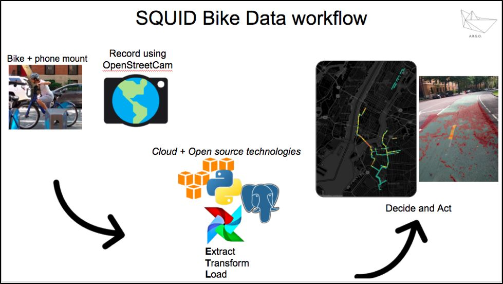
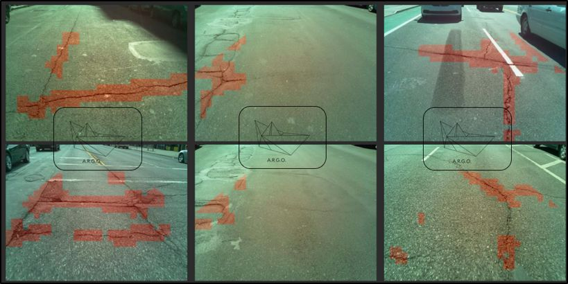
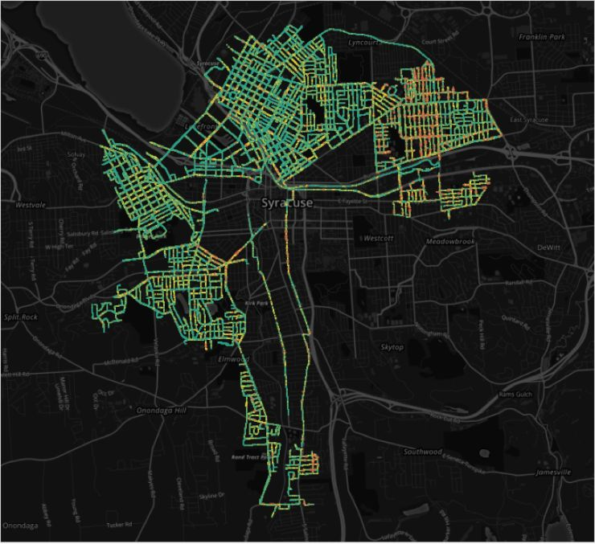

In 2015, five NYU graduates founded the **A**dvanced **R**esearch in **G**overnment **O**perations nonprofit—“the world’s first data utility.” [ARGO Labs](http://www.argolabs.org/) hopes to bring a change to an “Excel for everything” mindset in local government and shift the paradigm, using data, from reactive to proactive operations.

ARGO is different than typical top-down innovations that look great on a corporation’s resume but give little ownership to the city itself. Their vision as a non-profit is to collaborate not just on a project level, but also on a technical level, operating more like delivery agents than consultants. That’s something that enterprise organizations dealing with proprietary technology simply can’t do. So when ARGO began exploring the technology required to build, operate and maintain data infrastructure in the public sector, it’s no surprise they landed on Apache Airflow.

### Technology that Works for the Business Model
For ARGO, Airflow checks multiple boxes. One: it’s open source, so ownership can be handed off to the client while ensuring transparency and reusability. Open source components aren’t just open, though; they’re also groundbreaking, reliable, transparent diverse and agile ([dig into our CTO’s blog post](http://www.astronomer.io/blog/our-open-source-philosophy/) to find out why). Which means they’re best in class, another important criterion. Check and check. 

For the operation to be truly successful, however, ARGO can’t just build great data infrastructure and let it run. Nor can they afford to maintain it indefinitely while they continue to power new initiatives. But if they create data pipes that are defined in code—neat lines of Python, not drag-and-drop ETL spaghetti—any engineer can maintain, port, extend and collaborate with it anytime. Code-based pipes are a core principle of Apache Airflow. Control for the client: check. 

Furthermore, Apache Airflow, through its web-based user interface allows clients to actually *see* the data pipes in action, which is crucial to building trust and co-creating data infrastructure with municipal managers. Unlike slick websites or apps that do little to change how the underlying data is managed with an organization, Airflow’s reliance on a structured and open-ended approach to data workflow management raises the bar for how stakeholders manage their digital processes.

Also worth mentioning: public sector projects cost tax dollars. So while cities will sometimes shell out millions for an initiative, ARGO is determined to remain affordable. Apache Airflow makes that possible. 

### Technology that Works, Period
Equally important, however, are Apache Airflow’s technical chops. ARGO co-founder Varun Adibhatla puts it like this: “At the end of day, we're plumbers. We only work when data flows.” So we sat down with Varun to find out what that looks like for ARGO. 

To kick off their first initiative, [powering a coalition of water managers in California](http://californiadatacollaborative.org), Team ARGO  headed west in the throes of a drought of historic proportions. They quickly realized that a trove of water data existed but, when it came to connecting the dots on how to respond to the drought through proactive conservation methods, went largely unused. Artisanal data projects were happening ad-hoc, but little was integrated into a common operating system. Worse, the inherent fragmentation of  how water is managed in California was magnified in its data. Such asymmetry has disproportionate effects on millions of Californians.

So ARGO organized a group of local water utilities willing to pioneer a bold new approach to use data in a shared manner. The work included ingesting, standardizing and refining the fragmented water use data, which came in all forms. This disparate data need to be refined into a stable and well-maintained structure. ARGO, using Apache Airflow, created a data parsing workflow to clean and refine water use data across 14 Californian water utilities and load it into a secure database to power analytics. But we’ll let Varun tell us about it in his own words:
#### Let’s back up a minute and talk about the inspiration for ARGO. What sparked your desire to put data to use in the public sector? 
The ARGO crew believes that public services on a whole are headed for what we call, a Digital Tsunami. Digital Tsunami is a combination of several waves of change brought about the prolonged culture of “Excel for everything,” a lack of standardized data infrastructure across public services and a fundamental shift in how we as citizens engage with government services. We believe that local public agencies cannot, on their own, manage the transitions needed to successfully change to a digitally native organization. They need an independent and unbiased data utility to experiment and deliver in this new world. ARGO exists to help municipalities all over surf this Digital Tsunami through a delivery of open and imaginative data and analytics.

I spent the better part of a decade orchestrating data in Wall Street during the Financial crisis and became skilled in the efficient movement of financial data. What I realized towards the end of my career in Wall Street was that back in the early 90s, big banks got together and agreed to speak in a common transactional language. This was called the Financial Information Exchange or FIX protocol. FIX protocol is the glue that allows major financial institutions share data quickly. These data standards, I later found out, are not unique to Wall Street but exist in almost every sphere of trade and commerce (Ex: air traffic control, cell phone number portability, etc.). More intriguingly, many of these protocols are managed by unbiased, neutral and non-profit organizations. (I write about this in detail in "[ Bringing Wall Street and the US Army to bear on public service delivery.](http://medium.com/a-r-g-o/bringing-wall-street-technology-to-bear-on-public-service-delivery-26f8d794c1d5)")

My shift to the public sector was motivated by a personal desire to repurpose my data engineering skills towards positive impact but also a realization that vast swathes of public services lack standardized protocols to communicate in the digital realm.
#### Why did you start with water reliability in California? 
A California state of mind and the willingness of a few bold public water utilities to try something new was what helped us get off the ground. We owe our existence to these public leaders. Patrick Atwater, part of the core ARGO crew and project manager of the CaDC, is a fifth generation Californian and was already deeply invested in the effects of drought and water management before arriving at NYU CUSP.  [He also co-authored a children’s book about how the drought impacts everyday life in California](http://www.amazon.com/dp/0989534847/ref=cm_sw_r_cp_apa_lsKWzb7K1Z4PK).
#### When you went to California, did you know you’d use Apache Airflow? Or when/how did you land on that technology? 
Absolutely not! We were just getting started with Amazon Web Services, standing up databases and data parsing infrastructure on the cloud. We were very fortunate to get early support from the inspiring data organization [Enigma](http://www.enigma.com/), whose Chief Strategy Officer and NYC’s first Chief Analytics Officer saw what we wanted to do and supported our mission by offering Engima’s data and infrastructure Jedis. This was critical to [initially scoping the challenge ahead of us](http://www.enigma.com/resources/case-studies/california-data-collaborative-fights-most-severe-drought-in-history-with-enigma).

While evaluating Enigma’s ParseKit product for our needs, we stumbled upon Apache Airflow via Maxime Beauchemin’s  Medium post “[The Rise of the Data Engineer](http://medium.freecodecamp.org/the-rise-of-the-data-engineer-91be18f1e603).” It was then I realized the potential of Airflow.

While in Wall Street, I spent many years using Autosys, an enterprise “workload automation”  product developed by Computer Associates, aka CA Technologies, that was used by many big banks at the time. What was different about Airflow and clear from Maxime’s excellent description was that it was developed by data engineers *for* data engineering (i.e. the frictionless movement of data). Maxime led data engineering at Airbnb and if it worked for a multi-billion$ company, why couldn’t it work for us!?

The fact that it was open source was the cherry on top. I also want to take this opportunity to thank Maxime and the entire deployment team responsible for Airflow 1.8.0 that came just in time for us.
#### What was the biggest challenge you faced when getting the water coalition up and running? 

In addition to creating the necessary technology and delivering results quickly, we needed to manufacture and preserve trust across our local utility partners. This can be especially challenging when most of the value that’s being generated goes unnoticed, so the burden was on us to find creative ways to message the heavy data piping.

Moreover, many of our utility partners were consciously going against political convenience in supporting our effort. Preserving goodwill and trust across this complex landscape was challenging to our 4.5-person strong outfit (0.5 because we relied heavily on heroic volunteer researchers to help us deliver). In meeting these challenges, we ended up creating a special community of purposeful water data warriors who are truly committed to seeing that water systems are better managed.

We presented our trials and tribulations at the 2016 Bloomberg Data for Good Exchange conference titled “[Transforming how Water is managed in the West](http://arxiv.org/abs/1609.08715).”
#### Tell us about the current data infrastructure; what happens via Airflow? 
We call it the [Kraken](http://en.wikipedia.org/wiki/Kraken) because ETL has been this mythical beast of a problem in the public sector as portrayed by Dave Guarino, Senior Software Engineer for Code for America. His [ETL for America post](http://daguar.github.io/2014/03/17/etl-for-america/) really shed the light on the intractability of implementing cross-platform ETL in the public sector. 

Apache Airflow allowed us to ingest, parse and refine water use data from any water utility in any (tabular) format using any language we wanted. In addition to using PythonOperators to handle most of our data parsing, we use BashOperators and SSHExectuteOperators (to move data between machines), PostgresOperators, SlackOperators and CheckOperators.

We are also conscious of operating in an "eTl" environment where we are light on “e” and “l” as they do not involve time-sensitive ingestion or loading—and instead emphasize the “T” as our value lies in parsing data from different shapes into a single “shape” to help power analytics.

A capital E and L would imply ingesting real-time streaming data and loading it in highly available, possibly NoSQL databases. We are not there yet, and understanding this current need has helped us build consciously and deliver our core suite of analytics. These include the State efficiency explorer and Neighborhood efficiency explorer that reflect the diversity of local conditions while evaluating statewide conservation policies and programs.

Our data infrastructure also powers a rate modeling tool to illustrate how the shifts in water rates impact customers' bills and utilities’ revenue. This helps water utility managers navigate an environment of uncertain water futures and implement conservation and planning programs that can adapt to the on-the-ground reality.
#### What benefits have you seen so far? 
A recent and significant benefit was realized by one of our leading utility partners, Moulton Niguel Water District, MNWD who were able to save up to $20 million in recycled water investments. The forecasting tools and ability to access accurate data in a timely manner was key to realizing this.

This Airflow-powered data infrastructure provides key planning benefits, which are mission-critical so California can adapt to changing water conditions.

If you want to dig into some details, check out the latest screenshots from our CaDC Water Analytics Portal:

#### Anything else? 

Last summer, we implemented Apache Airflow with another open source data collection app called [Open Street Cam](http://www.openstreetcam.org/map/) to manage our Street Quality Identification-Bike (SQUID-Bike) project (a key analytics ability towards establishing the Streets Data Collaborative) and co-create, with public works and transit agencies, a shared streets data infrastructure!

The SQUID project was conceived in Fall 2015 and involves collecting and integrating street surface imagery and ride quality data, applying computer vision and image processing techniques towards rapidly measuring the overall quality of a city’s streets and bike lane infrastructure.

A frequent digital survey of all city streets enables cities answer a simple yet powerful question:

**“Which streets in my city are deteriorating faster than others?”**

Answering this question, we believe, is key to prepare cities for a future that amongst other things, includes autonomous vehicles. To end, I'll give you a sneak peek of how we're addressing city streets. 

*The SQUID Bike Data workflow, which started with riding 75 miles of NYC bike lanes and then used computer vision to automatically measure bike lane quality:*

*Our computer vision algorithm at work detecting cracks on the street imagery we collected:*

*In April 2016, we worked with the city of Syracuse to measure over 75% of Syracuse’s street grid in just 10 days. (110,000 images) that we streamed into an AWS S3 bucket:*

Stay tuned to see how ARGO's city streets initiative proceeds—and find out what they do next—[by following them on Medium](http://medium.com/a-r-g-o).   
<!-- markdownlint-disable-file -->