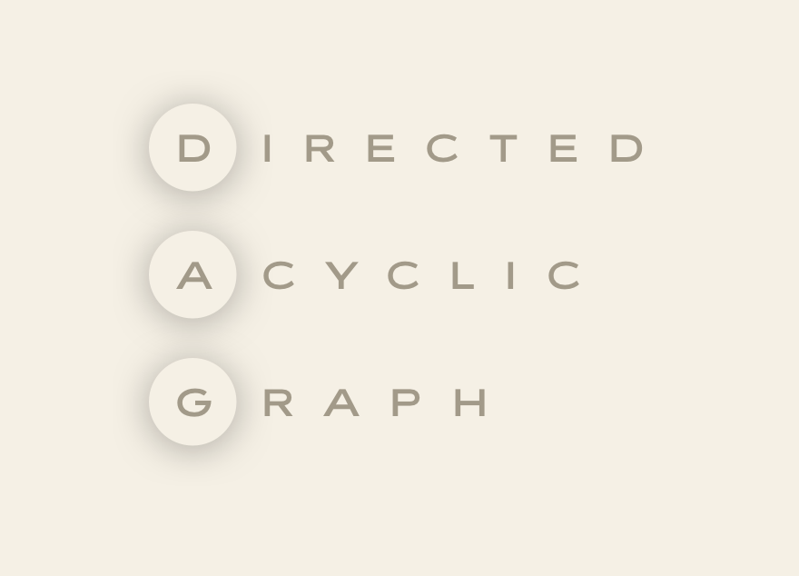
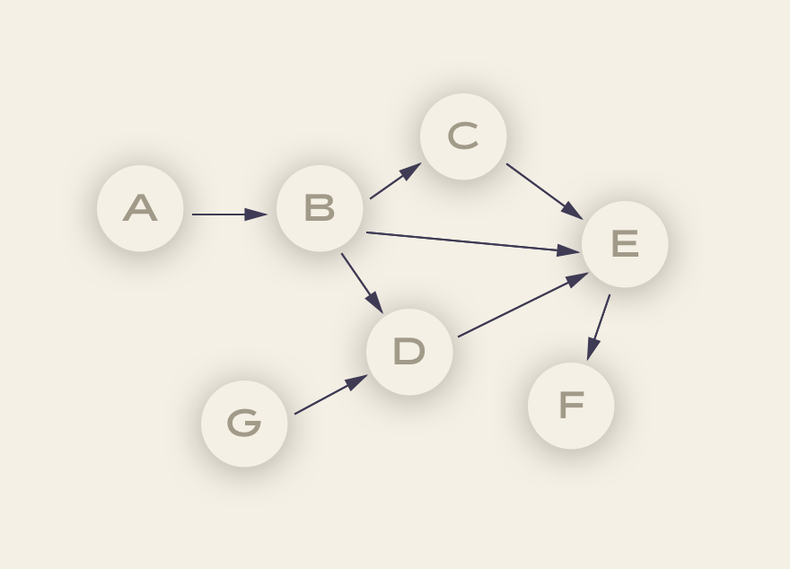
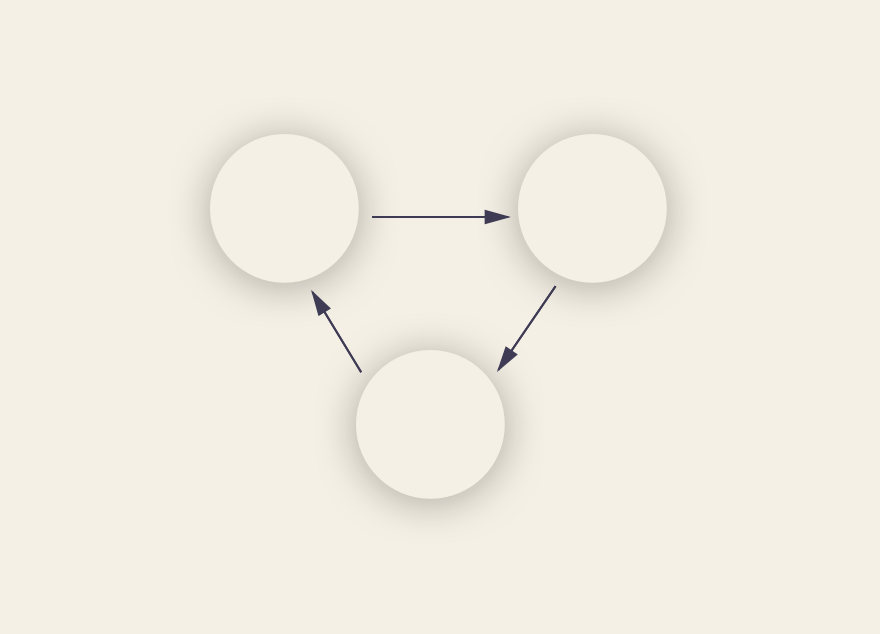

If you’ve kept up with the world of data engineering, you’re probably aware of one of two terms: Data Pipeline (if you’re an analyst/marketer/business-y focused person) or DAG (if you’re an engineer who favors term accuracy over branding). The strange part of this trend is that they both reflect basically the same mechanism.

Data pipeline as a term is pretty straightforward. It leverages a common occurrence (i.e. plumbing) to illustrate what would otherwise be an unviewable process. Data isn’t literally in a single tube starting on one side and coming out of the other but it is isolated from other data during this time (as if in a physical pipe) and a high velocity of data can create a great amount of stress on the servers it runs on (much like water pressure).

### So what exactly is a DAG and what does it tell us that the term “pipeline” cannot?

Let’s start with breaking down the acronym:

   

&nbsp;

There we go; unfortunately, we may have just made things more confusing. So let’s look at the individual words to build our meaning:

Let's start with Graph. A graph in data engineering means a finite set of nodes (dots) and vertices (lines) connecting them. &nbsp;When it comes to a DAG, the nodes each represent a data processing task.

- Node A could be the code for pulling data out of an API.
- Node B could be the code for anonymizing the data and dropping any IP address.
- Node D could be the code for checking that no duplicate record ids exist.
- Node E could be putting that data into a database.
- Node F could be running a SQL query on the new tables to update a dashboard.

Doesn’t really look like a pipe, does it? Tasks branch out and come back together with new inputs being brought in along the way. So why does the “data pipeline” moniker still roughly apply? That’s where Directed and Acyclic come in.

Notice in the above graph each of the vertices (lines) have a specific direction (denoted by the arrow) connecting the different nodes. Data can _only_ follow the direction of the vertices, meaning that, for our example, data can go from A to B but _never_ B to A. In the same way that water moves in one direction through a pipe, data must follow the direction dictated in the graph no matter how complex it comes. Nodes that come after a previous one are said to be “downstream” of that that one and nodes that come before are said to be “upstream.”

Notice that in addition to data moving in one direction, nodes never becomes self-referential. That is, they can never inform themselves as this could create an infinite loop. So data can go from A to B to C/D/E but once there, no subsequent process can ever lead back to A/B/C/D/E and so forth as data moves down the graph. Data coming from a new source (G) can lead into one of these nodes but similarly, no subsequent data can be passed into it either.

If F had a “downstream” process (meaning something that comes after it) in the form of D, then we would see a graph like the below form where D informs E, which informs F, which informs D and so on and so forth. This creates a scenario where the pipeline could run indefinitely without ever ending. Like water that can’t ever make it to the faucet, this loop is a waste of data flow.

And that’s pretty much it for DAGs! If you find yourself having a hard time remembering the finer details, just keep the following in mind:

1. **Directed -** If multiple tasks exist, each must have at least one defined upstream (previous) or downstream (subsequent) tasks, although they could easily have both.
2. **Acyclic -** No task can create data that goes on to reference itself. This could cause an infinite loop that would be, um, it’d be bad. Don’t do that.
3. **Graph -** All tasks are laid out in a clear structure with discrete processes occurring at set points and clear relationships made to other tasks.

Do you have other tech questions? Let us know in the comments!

