_The following is a continuation of a series where we use common data extraction, analysis, and machine learning techniques to make our business smarter (updated June 1, 2017). You can_ [_read Part I here_](/blog/what-i-learned-from-analyzing-1700-blog-posts)_._

The first post in this series kicked off the new blog and got a really incredible response (frankly, we were a little surprised.) Since then, we’ve decided to ramp up content and make sure everyone on the team can contribute. What we’ve learned from reading a lot of posts is that good content draws from personal experience to become insightful and relatable.

Our CTO wrote about [syncing MongoDB collections with Redshift](/blog/syncing-mongodb-collections-with-redshift), our Head of Sales wrote about [finding our target customer,](/blog/how-astronomer-found-its-target-customer) and our Head of Design wrote about [creating Astronomer’s brand aesthetic](/blog/a-logo-story). Ultimately, we believe this range of topics helps us provide a truly three-dimensional portrait of who we are, what we believe, and what we’re building.

But now it’s time for another nerdy data science post. Thank goodness. 😃 &nbsp;Here’s a preview of what’s at the end of the rainbow if you keep reading:

Part II begins

In our last “What I Learned…” post, I ended on a slightly boastful note. I think I said something along the lines of…

> The really fun stuff begins when you start digging into sentence structures, keyword frequencies, sentiment, and readability.

This was close to the exact definition of hubris — an Icarian level pronouncement that would clearly bring failure and humiliation given the fact that I’ve never actually done any NLP (Natural Language Processing.) But it was out there, so I had to at least try. As our CEO, Ry Walker, likes to say, I was “iterating in the wild.” In Astronomer speak, that basically means jumping off a cliff and trying to build wings on your way down. (_Kudos to Ray Bradbury for the metaphor. He really understood startups._) If I could find any pattern at all that helped us understand why some posts get shared more than others, I’d consider it a success.

#### So I got to work —

I began with the basics. I found a useful guide titled ‘[Getting Started with Natural Language Processing with Python](https://desilinguist.org/pdf/crossroads.pdf)’ to walk me through [NLTK](https://www.nltk.org/)&nbsp;(Natural Language Toolkit — a popular python package) and a nice accompanying cheat sheet titled, [Text Analysis with NLTK Cheatsheet](https://blogs.princeton.edu/etc/files/2014/03/Text-Analysis-with-NLTK-Cheatsheet.pdf). Not too creative but hey, it works.

I read about [Bag-of-words](https://en.wikipedia.org/wiki/Bag-of-words_model), [TF-IDF](https://michaelerasm.us/tf-idf-in-10-minutes), NLTK vs. [OpenNLP](https://opennlp.apache.org/), the [Stanford](https://nlp.stanford.edu/software/lex-parser.shtml) vs.[Berkeley](https://nlp.cs.berkeley.edu/software.shtml) Parser…the list continues. It soon became clear that I wasn’t going to be able to create any algorithm I’d be confident in using in a timeframe that mattered.

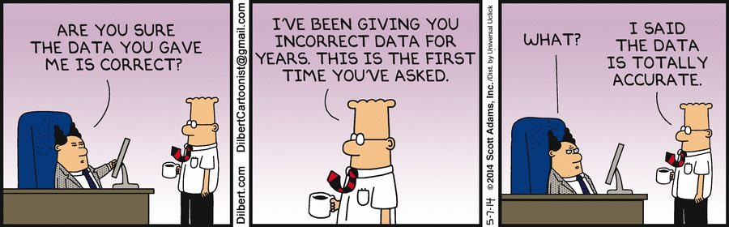

 &nbsp; 

Then the project got shelved because we’re a startup and text analysis isn’t helping the bottom line. Before I knew it I had another blog post to write and that’s when I saw something that hit me like lightning…overused metaphor aside.

#### The “Aha” Moment

Browsing LinkedIn one night (_you don’t?_), I found a post by [Jonathan Pickard](https://www.linkedin.com/in/jpickd), founder of the business intelligence firm, [Analyzer 1](https://analyzer1.com/). In it, he took President Obama’s SOTU address from 2015 and, using Watson (part of IBM Bluemix), analyzed it for personality traits. I loved [this post](https://www.linkedin.com/pulse/using-ibm-watson-analyze-obamas-sotu-address-jonathan-pickard?trk=prof-post) and the concept of leveraging an established NLP system like Watson (the same project group at IBM that [won Jeopardy a few years back](https://www.youtube.com/watch?v=WFR3lOm_xhE)) to power this project. So I signed up for a Bluemix\* account and started loading in data.

_\*Technically, I signed up for 10 Bluemix accounts. IBM caps Bluemix’s API at 1000 calls/day on the free tier (and I didn’t have a budget) so I needed a few keys to process all my data._

The Stack

After our last post, a few people reached out to learn more about our process/tool stack. I’ll write a follow-up post about that at some point, but here’s a quick overview if you’re interested (_if not, feel free to skip this section._)

#### Setting up the NLP Engine

- Watson lives within the full service platform of Bluemix that you can do a lot with (overwhelmingly so), but I was primarily interested in AlchemyAPI, a company acquired by IBM last March and rolled into their Watson product line. I felt a lot more comfortable outsourcing the NLP work to them, mostly because their expertise in [deep learning](https://en.wikipedia.org/wiki/Deep_learning) meant a much better output than the _rough_ (at best) algorithm I could create in my spare time.
- As a jumpstart to understanding how AlchemyAPI works, I cloned their&nbsp;[SDK from Github](https://github.com/AlchemyAPI) and started messing around with their examples. (I used Python but they have PHP, Node, and Ruby as well.)
- For this project I decided to use the ‘Keyword Extraction’ and ‘Sentiment Analysis’ endpoints. Loads of other cool stuff in there (_e.g. image tagging, entity extraction, text categorization_) that I still need to explore.

#### Getting the Values I Needed

- Given URLs I collected in Part I of this project (remember, all the scraped blog posts?), I gave AlchemyAPI a list of all the URLs I wanted it to interpret and return the response for each into a single list.
- For the readability index, I used the open-source [Textstat](https://pypi.python.org/pypi/textstat/) Python package and wrote a quick script to iterate through the files containing the post text.
- Now that I had returned a list of all the values I needed, I built an [Aries workflow](https://github.com/aries-data) to automatically upload this to S3, flatten it into a single file, and COPY to Redshift. We’re not using this project to actively inform any of our dashboards or alerts (at least not yet) so Redshift was the only destination I cared about at the time. I could’ve easily sent it to a few other destinations. Say, if we built an app to send a weekly email with a summary of all new keywords that have shown up in our competitors’ posts…

#### Doing the analysis

- With all the data in Redshift, I worked on it in-memory through R’s “RPostgreSQL” package. Just instantiate the driver, set standard credentials (e.g. host, port, dbname, user, pw), and start passing in standard SQL queries that you can store as separate dataframes.
- To make the charts a little more interactive, I used the fantastic [Plot.ly](https://plot.ly/) R package, available on [CRAN](https://cran.r-project.org/web/packages/plotly/index.html) and [Github](https://github.com/ropensci/plotly). If you don’t know about Plot.ly already, I can’t recommend them highly enough. Their free-to-use libraries (Not just for R!) instantly speed up any work you’re doing. Quick example — by just wrapping a ggplot graph I made in ggplotly(), Plot.ly lets me zoom, pan, and preview values by hovering.

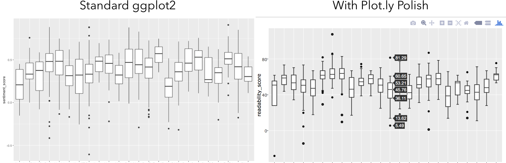

Keywords, Keywords, Keywords

The first endpoint from AlchemyAPI we used was Keyword Extraction. Depending on the length of the post, it’ll give you up to 50 top keywords with individual sentiment and relevancy scores. Overall? Pretty positive phrasing. Well, done people. Positive keywords are used almost 5:1 against negative keywords.

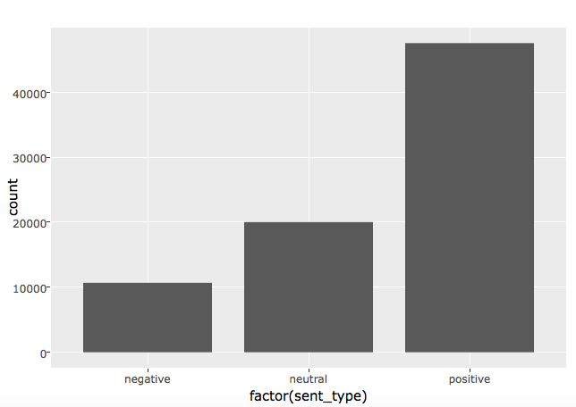

Nice to have a basic understanding of the distribution but we can (and should) always get a little more granular. Using some basic GROUP BY commands to consolidate the most commonly used keywords by company and then a quick `plyr.arrange` in R to rank order them by frequency, we get the following:

&nbsp; 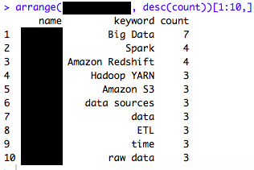

The above is the top 10 keywords used by one company. Generally, there aren’t any HUGE surprises here but it is interesting to see what they’re mentioning and how often. The real value of this will come into play as we track this list over time and begin to understand how it changes. What new technologies are suddenly getting mentioned? What product features are suddenly being highlighted as very important?

#### Sentiment and Readability

Beyond keyword inspection, we needed a more holistic view of the posts themselves. How positive/negative were the posts overall? How easy were they to read? How did this change across companies? Glad you asked.

#### Sentimental Fools

It may surprise you but there are actually some posts (\<100) with an overall negative tone. The majority, however, fall on the positive side with a mostly normal distribution centered around 0.4–0.5.&nbsp;

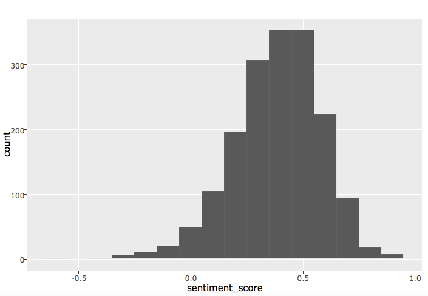

Breaking it down by company doesn’t really tell us anything further. Some skew to the more positive side than others but there is generally still a normal distribution around 0.4–0.5 and few negative posts.

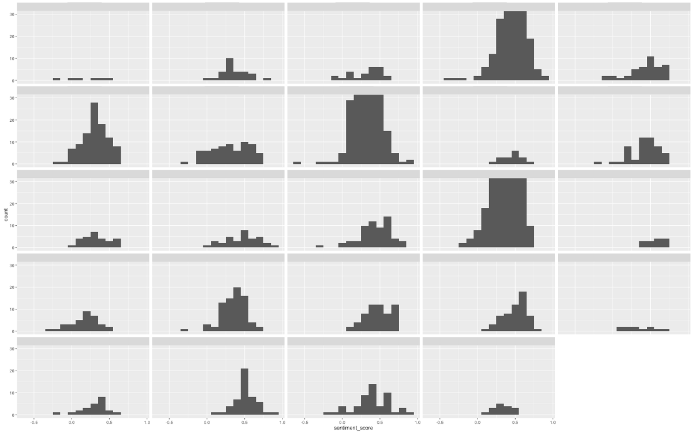&nbsp;

In the boxplots below, we can confirm that for most companies, the negative posts that exist are statistical outliers. For others…well, maybe focus on being a bit more positive.

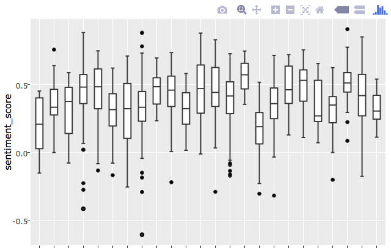&nbsp;

#### How about Readability?

Now, we didn’t exclusively use Bluemix to perform this analysis. We also wanted to examine the readability of each post and, for that, all I needed was a Python package that implemented the ’[Flesch Reading-Ease](https://en.wikipedia.org/wiki/Flesch%E2%80%93Kincaid_readability_tests)’ index. You can read more about it at the link I’ve provided. Essentially, as the average words per sentence and syllables per word increases, the lower the score becomes. The highest possible score is 120 (using a two-word sentence each with one syllable) with no theoretical lowest score (as some sentences can go on and on and on and on and you get the idea.) Any score lower than 50 is considered to be at or above college-level. Here’s the quick wiki-reference that we used:

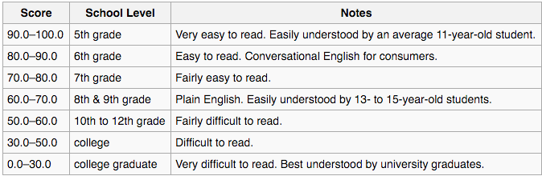&nbsp;

So across all posts, how difficult are these posts to read?

 &nbsp; 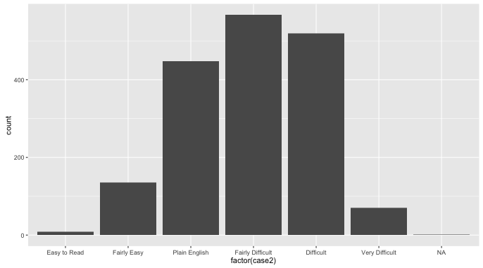 &nbsp; 

There is a fairly normal distribution in readability difficulty with a majority of posts falling in the “Fairly Difficult” category and overall slight skew to the left. Notice that there are no “Very Easy to Read” posts, suggesting that we’re all at least smarter than a 5th grader. Now, let’s break it down by company.

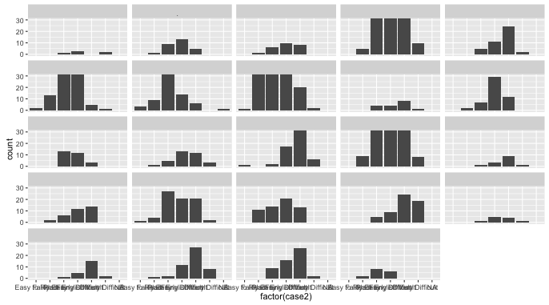

 This starts to get really interesting because we’re beginning to understand the complexity distribution across every competitor. Although readability has an overall normal distribution around “Fairly Difficult,” you can see some skew towards easier-to-read posts and some skew towards more difficult. In the boxplots below, we see how reliably each company posts in certain difficulty ranges. 

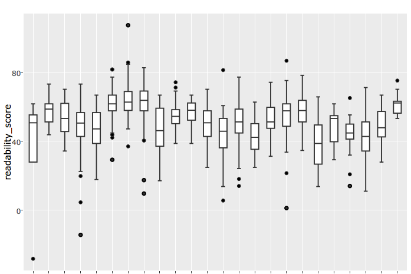

The Social Vortex

Tying this all back into total shares (the end goal of all this analysis), we needed to dive into how factors like readability and sentiment of a post contribute to the total shares it received. And because I was using Plot.ly’s API to create charts, I was able to take the visual component of analysis up a notch to help figure this out.

#### A Quick Word on Principles of Perception

Data visualization isn’t just a “nice-to-have”; it’s a measurably faster medium to convey system complexity\*. I promise I’m not making this up. In the early 20th Century, the Gestalt School of Psychology established seven “[Principles of Perception](https://en.wikipedia.org/wiki/Gestalt_psychology#Gestalt_laws_of_grouping)” (aka the Laws of Grouping) that encompass the cognitive interpretation of visual stimuli. They found that using these seven patterns could actually increase the speed at which subjects made connections and conclusions.

_\*If you’re interested in learning more and having your team work faster through well thought out data viz, I recommend reading_ [_The Functional Art_](https://www.amazon.com/The-Functional-Art-introduction-visualization/dp/0321834739) _by Alberto Cairo as a starting point._

What I’m trying to say is that good viz can help make insights much more pronounced. Case in point- what if I gave you a chart mapping the distribution of total shares by sentiment?

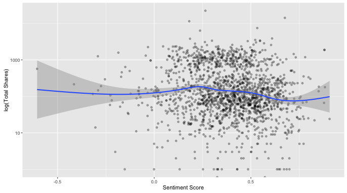

And shares by readability?

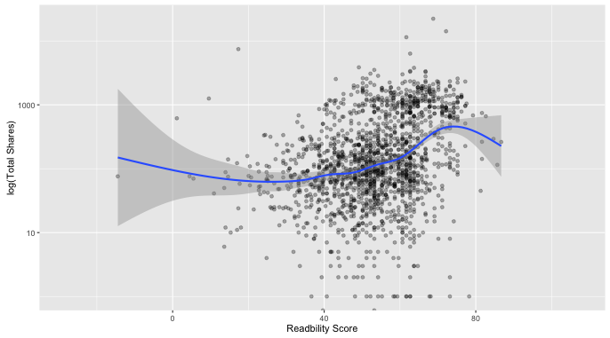

And what about readability by sentiment?

 &nbsp; 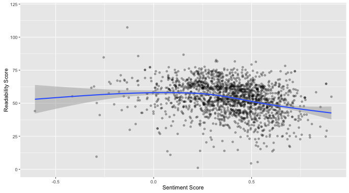 &nbsp; 

All somewhat interesting but these charts don’t tell us much by themselves. But what if I could combine all of these into one three-dimensional view?

 &nbsp; 

Boom.

#### Optimal Social Zone

Notice how when we view this in three dimensions that there seems to be a vortex-esque shape forming between a sentiment score of 0.2–0.6 and a readability score of 35–75. We call this the **_Optimal Social Zone_**. Posts with too many negative keywords (low sentiment) or overly complex language (low readability) aren’t getting the top posts. Nearly all of the top performing posts seem to fall in this range, suggesting that while you might not get a lot of shares simply because it has those qualities, you’re unlikely to score well if it falls outside of that range. A larger sample size and more rigorous analysis will be needed to confirm this but it’s a really interesting early finding.

What’s also interesting is that you can see a clear pattern of higher shares as readability increases (i.e. becomes easier.) Sharing begins rising around 35 — approximately college level — and peaks around 75, which corresponds to about a 7th grade reading level.

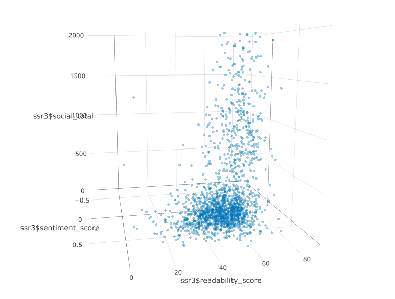

Because there are many more less-frequently shared posts, it’s a bit difficult to see how this patterns holds for the entire distribution. The top posts are easy to see but what about the lower ones. Are these high ranking posts outliers? Let’s log transform total social shares to spread the distribution out more.

So What Did We Learn (Part II)

- When you don’t have the time to build your own algorithm, stand on the shoulders of giants. Let a platform like Bluemix do the heavy lifting.
- [Aries workflows](https://github.com/aries-data) have way more use cases than just transferring data between DBs and SaaS products. It’s really fun to see how fast they can speed up our internal projects.
- Keywords are going to be critical to monitor moving forward. They’re already proving interesting but how they change over time by competitor will be where the real value lies.
- Keep it in the Optimal Social Zone (sentiment 0.2–0.6 and readability 35–75, preferably on the higher/easier end) and you’re golden. Get away from long, technical jargon and run-on sentences as much as you can. 7/8th grade reading level scores highest. The highest posts had a sentiment range of 0.2–0.6; positive but not overly positive for its own sake.
- Data viz isn’t voodoo. There are [seven guiding cognitive principles](https://en.wikipedia.org/wiki/Gestalt_psychology#Gestalt_laws_of_grouping) that govern our ability to visually process complexity. Follow these principles.
- Plot.ly is an outrageously generous company. Their API is incredibly impressive and mind-numbingly easy to use with R. Highly recommend adding them to your stack for any scientific computing projects you might be doing.

And...what's next?

That’s a really good question. The truth is, opportunities to effectively use data are endless. Around here, we like to quote Carl Sagan (a "lower-case a" astronomer): "Somewhere, something is waiting to be known." Insights are out there—it just takes some data wrangling to find them.&nbsp;Astronomer's platform takes the collection, processing and unification of your enterprise data off your hands, so you can get straight to analytics, data science and—more importantly—insights.

Want to talk about how your organization can leverage Astronomer to do better, more robust analytics? [Contact us](https://www.astronomer.io/contact). Insights might be closer than you think.&nbsp;

