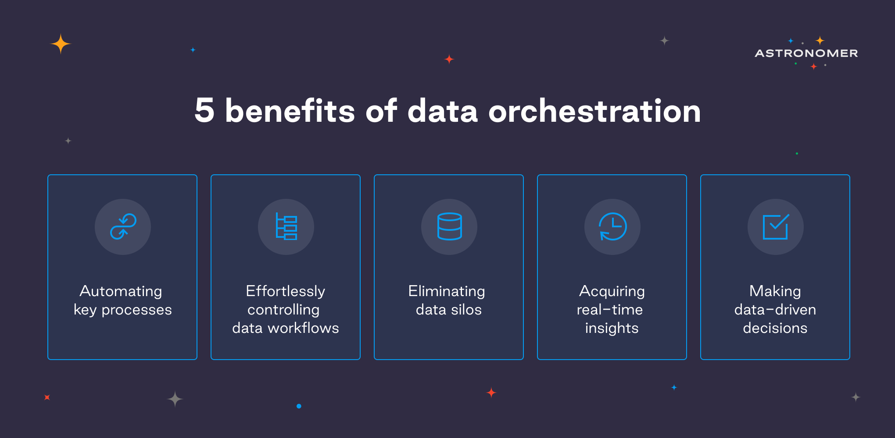

What do we mean by data orchestration and why does it matter? In this post, we define data orchestration, cover its benefits, what’s driving the push for ever more data orchestration and what annoying pain points data orchestration can address. We’d love to elaborate on self-driving music orchestras, too, but perhaps we’ll leave that for another day.

# What is Data orchestration?

In the most straightforward words, data orchestration is an **automated process that takes data from multiple storage locations and programmatically allows you to author, schedule, and monitor data pipelines.** Data orchestration platforms create a perfectly in-tune orchestra of data management, giving you an opportunity to control the data, monitor systems, and acquire real-time insights. Orchestrators don’t require custom scripts, which takes a load of work off the IT teams’ shoulders. 

What’s essential is that data orchestration tools allow companies to **run data pipelines at the right time, in the right order, and in the right way**. The extensive feature sets and flexibility have given data orchestration tremendous momentum over the last few years. Organizations from startups to Fortune 500 enterprises such as NIKE, Walmart, JP Morgan, Airbnb, or 9GAG have combat-tested data orchestration platforms in numerous environments, proving their flexibility. 

## Yeah, but what *exactly* is data orchestration?

Authoring data pipelines and processes is basically what data engineers do. Their work has become much more pleasant since the emergence of data orchestration tools that allow them to author, schedule, and monitor data pipelines programmatically. How is it done?

Data orchestration essentially consists of 3 parts.

The first step of data orchestration technologies is to comprehend and manage both current and incoming data. Let’s call it **systemization**. Organizations have piles of data in legacy systems, cloud-based tools, data warehouses, or data lakes. Organizing those manually takes ages. Data orchestration tools are able to swiftly access these piles, comprehend what sort of data exists and where it comes from. Long story short: the first step is tidying up the data mess. 

The second step of data orchestration is the **unification** of data, converting it into a standard format. Even basic dates are stored in a variety of formats through systems. It’s often difficult to add them up.

The final step is to make the data available for the tools that need it. It’s called **activation.** Orchestration tools deliver standardized data to the applications that organizations use on a daily basis. As a result, the data you need is already present when required, and the long data loading problem is eliminated.

# What is the goal of data orchestration?

> “*Data orchestration provides the answer to making your data more useful and available. But ultimately, it goes beyond simple data management. In the end, orchestration is about using data to drive actions, to create real business value*”.
>
> Steven Hillion, Head of Data at Astronomer

As we've reached the so-called age of analytics (how exciting is that?), nearly every prominent business today collects data and uses big data analysis. The word "big" in Big Data doesn't even begin to describe what's going on right now, let alone what's to come. Data analysis has quickly become a critical asset to enterprises, **charging-up process optimization, day-to-day operations, AI or machine learning solutions, and improving business decisions.** 

However, according to Gartner research on Business Outcomes for Big Data (2020), 87% of companies have low business intelligence and analytics maturity. Wait, what? A whopping 87%?! It gets worse: **more than half of all employees** find corporate analytical insights useless at their daily tasks, while most companies claim to keep track of their data. Where's the catch?

Turns out that it's not enough to simply acquire information from data - the real effort should be put into **delivering the right information to the right people, preferably at the right time, too.** And as the number of information sources continues to rise, the challenge is becoming more tricky every day. Companies deal with data silos and, simultaneously, have to keep up with their real-time data inflowing constantly. No easy endeavor without Apache Airflow.

The goal of data orchestration is simple. If you manage to collect the right data and get the right insights real-time, you will be able to **make data-driven decisions**, which will deliver real business value and results. The only way to do it successfully and efficiently is with data orchestration platforms.

# The 7 biggest pain points addressed by data orchestration

Does your organization suffer from any of these?

1. ## Wasting time and resources on manual coding

Developer productivity is the real issue here. Manual administration simply cannot effectively scale today's demands, with modern IT teams being responsible for maintaining hundreds to thousands of apps and servers.  There’s only so much manual coding a human being can produce - and the bigger the company grows, the more code there is to write. The more code, the more potential problems, bugs, freezes, etc. As the number of data pipelines increases, it becomes humanly impossible to solve all the problems in a blink of an eye and keep the inflow of real-time data alive. If only there was a tool that could orchestrate this process and take it off developers’ busy hands! Oh, wait. There is. That’s the exact reason data orchestration solutions are here!

Data orchestration is critical for providing highly available, dynamically scaled, performant applications and cloud systems, relieving IT teams of a truly heavy burden. Without having to develop bespoke scripts, big data orchestration solutions allow IT teams to design and automate end-to-end processes that include data, files, and dependencies from across the organization. 

2. ## Variety of data churned out daily

Businesses typically produce data in a variety of formats, and the data is... not always structured, to say the least. Each application database will almost certainly have its own format and the manner in which metadata is generated may differ between systems. Data management is definitely a struggle when it comes to integrating complicated and contradictory data sources. Simply put, **data engineers often have to combine apples with cars.** 

Before the “analytics era”, IT teams would write code to orchestrate data and control various sources and types of data. If you have one or even ten data processes to run daily - it’s doable, just as with a regular number of instruments within an orchestra. But the majority of companies don’t have just one, nor ten, nor even twenty data pipelines to run - so what happens once there are thousands of them? What if one of them can’t access the database? What if they - *knock on wood* - crash? 

Proper data orchestration is a life-saver, **creating protocols for channeling inconsistent types of data across specific pipelines** - and delivering consolidation.

3. ## Data scattered or siloed

The goal of data orchestration is to **make the data useful**, basically. Too many businesses nowadays leave their data scattered and in data silos. Migrating siloed data between locations is often too hard to tackle. It’s difficult for companies to have a complete grasp of what their data is telling them. As a result, organizations often leave their data fragmented, in silos, or only harvest the lowest-hanging insight fruit. 

It can be solved easily, though. Nearly every data orchestration platform allows IT teams to swiftly combine new data sources and current data silos. Accessing them is not a problem - it’s possible due to prebuilt connectors and low-code API adapters. There, data silos problem - solved!

4. ## Bottlenecks from manually preparing data for analysis

Behind the glitz of impressive analytical insights, there is **a mountain of time-consuming data preparation**. Practitioners have claimed that obtaining and processing data accounts for 80% of the effort required! Data orchestration may dramatically minimize the amount of time spent on those two stages - it can simply do the hard work of obtaining and preparing the data automatically. The result? No more bottlenecks, more time and resources to focus on important tasks!

5. ## Catching problems only after they make an impact

Data orchestration tackles one of the crucial business challenges: making data-driven decisions, by allowing organizations to access **comprehensive insights across all channels**. In order to make good decisions, companies need to know about a problem as soon as possible - and if it only shows up in business results, **that’s too late.**

If there’s a specific tracking strategy, a data orchestration tool can guarantee that the data collected is in accordance with it. If the gathered data does not conform to that plan, the orchestration tool may either block the data at the source or stop the process until it’s figured out how anything got past the tracking. As a result, companies make better, data-driven decisions **long before any problems influence their business results.**

6. ## Migrating to the cloud (or simply too many systems to keep track of)

Organizations are increasingly moving to hybrid and multi-cloud systems and bidding farewell to self-managed on-premise data warehouses. It’s one of the main reasons for the skyrocketing popularity of data orchestration platforms. This change provides for greater flexibility and agility, but it also necessitates the separation of computation and storage. It’s causing problems in terms of handling data management and orchestration across frameworks, clouds, and storage systems. Yet again, **what seems like a nightmare is a non-issue for Astronomer.** 

7. ## Trouble with interconnecting the ecosystem

Developers surely know the struggle of manually building connectors between systems in order to create a smashing ecosystem for data pipelines. Since businesses use numerous datasets and systems, it often requires great migrations. In order to achieve that, the storage systems need to be connected. It can be quite a pickle for an IT team (time and effort-consuming), but it’s effortless for a proper data orchestration platform. With a well-functioning and interconnected ecosystem, it’s easy to access data for analysis. 

# How data orchestration can help *you*?

The capacity to use data more effectively can generate a true competitive advantage in today’s digital economy. So how can your company tackle big data issues and fully exploit your data assets? And how can you use these data assets to spur your ability to innovate? Data orchestration provides the answer to making your data more useful, available, and, in the end, more valuable. The business implications of failing to properly leverage data insights can be substantial, and nobody wants to stay behind.

With data orchestration, you earn more time and resources to spend on valuable projects. The benefits imply shorter ramp-up times, easier installs, and speedy insights for data engineers, to name a few. Basically, your entire business improves with less effort from you. What’s not to like?

# Why do companies trust Astronomer with their data orchestration?

Now you know the benefits of data orchestration for your business. The most important step is to choose the perfect data orchestration platform. The majority of companies believe in the power of Apache Airflow due to a variety of reasons, such as an amazing community, constant innovations, and flexibility thanks to creating data pipelines in Python. 

And the **Astronomer framework takes Apache Airflow up a notch**. Astronomer automatically delivers the latest Airflow features and allows for instant deployment, so your team can focus on the data pipelines. The optimized infrastructure reacts to peaks in demand with instant auto-scaling and then scaling back to zero. The best part though, according to data engineers, is the **Astronomer registry** - a library of reusable integrations, DAGs, and components that boost productivity. 

With Astronomer, you get to stay close to your data with virtually no effort whatsoever. Your tasks run, and you get to benefit from all the time you just saved! 

> “*Without Astronomer, there would have been a lot more tweaking and adjusting to achieve the result we want. Our work as data scientists would have been a lot slower and more difficult. I don’t think there’s any company I wouldn’t recommend Astronomer to*".
>
> Mark Gergess, VP of Data & Analytics at Herman Miller [(click to see our case study)](https://www.astronomer.io/blog/herman-miller-case-study)

# Summary

Data-driven applications are taking over the world, impacting our everyday lives - from the way we commute to work or travel, to medical diagnostics and self-improvement. And since data is everywhere, the concept of comparing music to data is brilliant. Each data source is a different instrument, generating various melodies and rhythms that need to be orchestrated, and companies are adding more and more data sources to their mix. An experienced conductor can handle the biggest orchestras - but what if the number of instruments keeps growing exponentially? It’s becoming impossible to manage this onslaught of data sources. Data orchestration gives you oversight over an infinity of complex processes and 'melodies'.

Given the tremendous pace of technological advancement, the challenge for businesses now is no longer collecting the right data. The focus is rather on integrating new data analysis tools into their operations and strategies—as a result positioning themselves in a future where analytics has the potential to disrupt whole sectors. To fully benefit, companies must integrate analytics into their strategic vision and use the information to make better, quicker choices. And Astronomer data orchestration seems to be the best way to achieve this.

> Are you interested in taking your business to the next level and capitalizing on your data? [Click here ](https://www.astronomer.io/get-astronomer)and reach out to one of our experts, we’d love to chat!