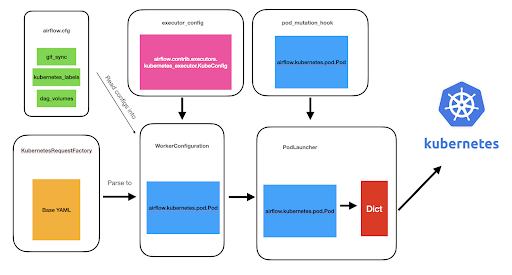
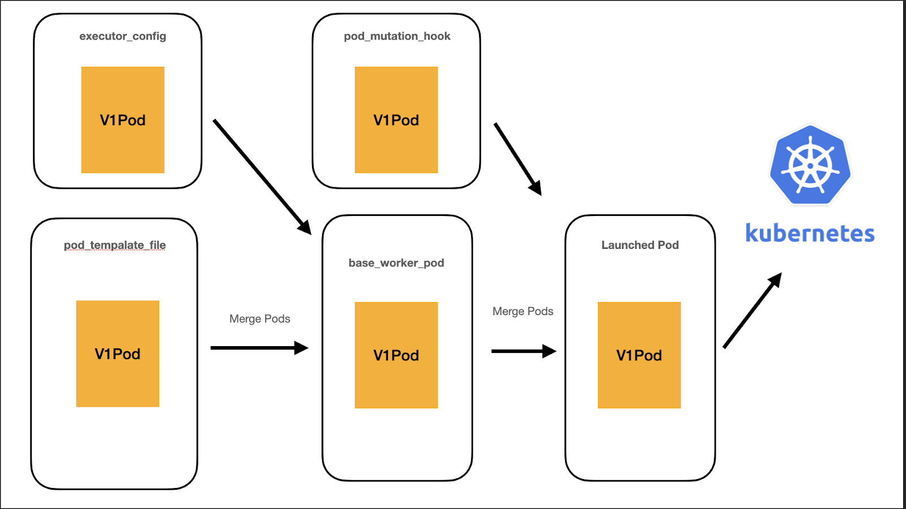

<iframe width="560" height="315" src="https://www.youtube.com/embed/5AggHgafFnw" title="YouTube video player" frameborder="0" allow="accelerometer; autoplay; clipboard-write; encrypted-media; gyroscope; picture-in-picture" allowfullscreen></iframe>

# Airflow 2.0 and Kubernetes Overview

* KubernetesExecutor
* KubernetesPodOperator
* KEDA Autoscalar

## KubernetesExecutor

* Each Airflow task is launched as a pod
* Workers scale to zero
* Expose Kubernetes API to the data engineer so they can have more control over the resources of each task


**Old Architecture** 



* Attempted to abstract Kubernetes API for “simplicity”
* Result: Lots of PRs to expose k8s, lots of code to maintain, lost of steps before a pod is launched
* Goal: Offer flexibility of the k8s API and reduce Airflow’s code footprint


**New Architecture** 



* Every step along the way, users have access to the Kubernetes models.V1Pod API
* Merging steps is much easier/faster/stable
* Removed 4k lines of code(!)


**pod_template_file**

* Infrastructure engineers can now define default pod layouts in yaml or json files
* can define default pod_template_file in the airflow.cfg

  ```
  apiVersion: v1
  kind: Pod
  metadata:
    name: dummy-name
  spec:
    containers:
      - env:
          - name: AIRFLOW__CORE__EXECUTOR
            value: LocalExecutor
          # Hard Coded Airflow Envs
          - name: AIRFLOW__CORE__FERNET_KEY
            valueFrom:
              secretKeyRef:
                name: RELEASE-NAME-fernet-key
                key: fernet-key
          - name: AIRFLOW__CORE__SQL_ALCHEMY_CONN
            ….
          # Extra env
        image: apache/airflow:2.0.0
        imagePullPolicy: IfNotPresent
        name: base
        ports: []
        volumeMounts:
          - mountPath: "/opt/airflow/logs"
            name: airflow-logs
          - name: config
            mountPath: "/opt/airflow/airflow.cfg"
            subPath: airflow.cfg
            readOnly: true
    hostNetwork: false
    restartPolicy: Never
    securityContext:
      runAsUser: 50000
      fsGroup: 0
    serviceAccountName: 'RELEASE-NAME-worker'
    volumes:
       ,,,
  ```


**executor_config**

* new “pod_override” object accepts a k8s.V1Pod instead of a dictionary.
* Can now use official [Kubernetes API reference](https://kubernetes.io/docs/reference/kubernetes-api/workload-resources/pod-v1/) for building spec
* Add side-cars, secrets, affinities, etc.

```
volume_task = PythonOperator(
    task_id="task_with_volume",
    python_callable=test_volume_mount,
    executor_config={
        "pod_override": k8s.V1Pod(
            spec=k8s.V1PodSpec(
                containers=[
                    k8s.V1Container(
                        name="base",
                        volume_mounts=[
                            k8s.V1VolumeMount(
                                mount_path="/foo/", 
                                name="test-volume"
                            )
                        ],
                    )
                ],
                volumes=[
                    k8s.V1Volume(
                        name="test-volume",
                        host_path=k8s.V1HostPathVolumeSource(path="/tmp/"),
                    )
                ],
            )
        ),
    },
)
```


You can even point to a custom `pod_template_file` and then add overrides on top of it!

```
task_with_template = PythonOperator(
    task_id="task_with_template",
    python_callable=print_stuff,
    executor_config={
        "pod_template_file": os.path.join(
            AIRFLOW_HOME, "pod_templates/basic_template.yaml"
        ),
        "pod_override": k8s.V1Pod(
            metadata=k8s.V1ObjectMeta(labels={"release": "stable"})
        ),
    },
)
```


## KubernetesPodOperator

KPO is Now in the cncf.kubernetes Provider