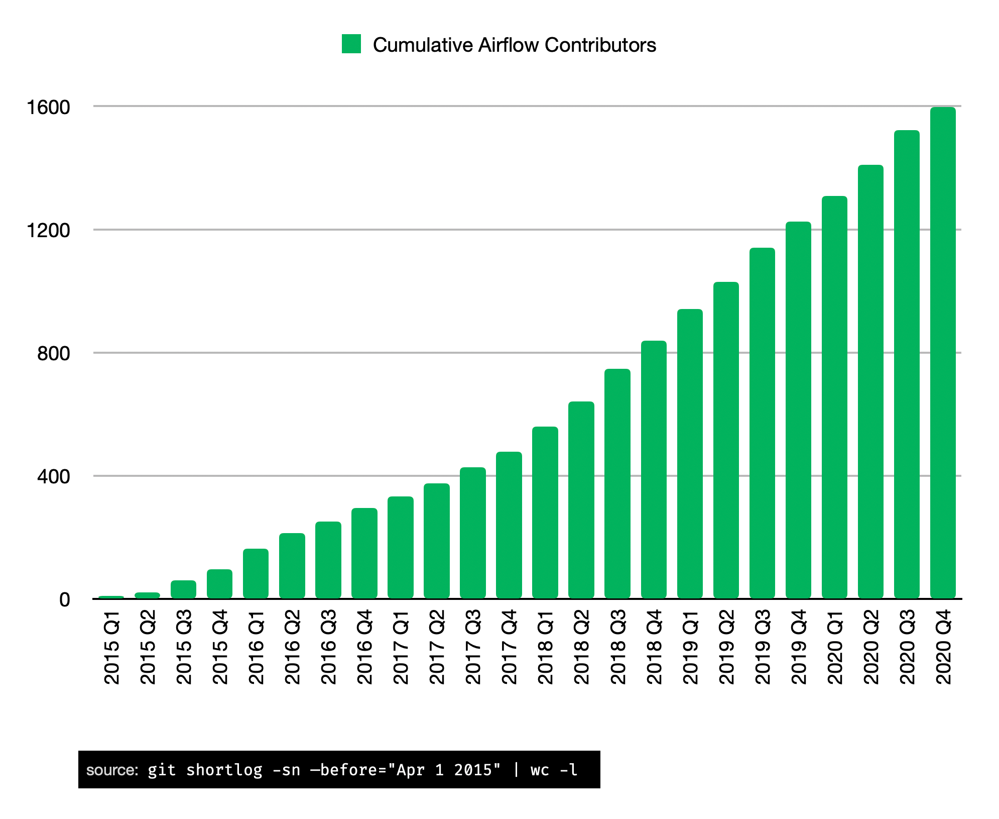
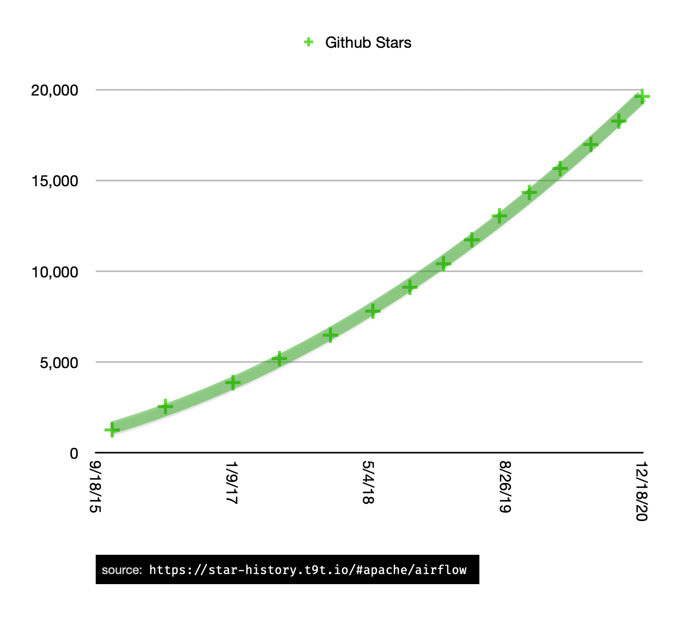

> Content updated December 2020

Apache Airflow continues to win vs. other workflow orchestration tools due to two main factors:

- An active and expanding community
- Very deep, proven functionality

### Community

As a result, thousands of companies — including Fortune 500s, tech giants, and early-stage startups — are adopting Airflow as their preferred tool to programmatically author, schedule, and monitor workflows.

The Airflow community is strong, healthy, and vibrant, with over 1,400 code contributors — and growing at a healthy pace.

The velocity of Github stars for Airflow [continues to accelerate](https://star-history.t9t.io/#apache/airflow).

And as the project accelerated towards our recent 2.0 release, it entered an extend second "golden age" that has now extended eight quarters, eclipsing the rate of commits from the early days when the first generation of project developers Maxime, Bolke, Jeremiah, Chris, Sid and Arthur were originally working on it.

The Airflow project was already gaining momentum in 2018 thanks to open-source activities in companies like Airbnb, Lyft, Twitter, Glassdoor, and [many, many others](https://github.com/apache/airflow#who-uses-apache-airflow).

In 2019, an elevated level of activity has been driven by companies like Astronomer, Google, Polidea, and GoDataDriven, who are dedicating significant resources to the project, including an expanded group of people working on the project full-time.

In 2020, project activity has been taken to a new level as the team pushed to 2.0.

### Functionality

Along the way, Airflow has accumulated an [impressive amount of functionality](https://airflow.apache.org/concepts.html) that solves many data engineering challenges both on-prem and on any cloud provider. Being built on the backs of numerous data engineers working to solve countless edge cases, it’s a complete solution.

While all Airflow functionality isn’t evenly polished, work is now in motion to ensure that that isn’t true for much longer. The community is working on a multitude of projects including:

- [Speeding up the scheduler](https://www.astronomer.io/blog/airflow-2-scheduler)
- [Speeding up the web server](https://cwiki.apache.org/confluence/display/AIRFLOW/AIP-24+DAG+Persistence+in+DB+using+JSON+for+Airflow+Webserver+and+%28optional%29+Scheduler)
- [Integrating with Knative](https://github.com/astronomer/airflow/pull/72)
- [An official production Docker image](https://cwiki.apache.org/confluence/display/AIRFLOW/AIP-26+Production-ready+Airflow+Docker+Image)
- [A full REST API](https://airflow.apache.org/docs/apache-airflow/stable/stable-rest-api-ref.html)
- [A refreshed UI](https://github.com/apache/airflow/pull/11195)
- Building a new UI

So while Airflow isn’t perfect, its deep functionality and strong community pose a big challenge to “fresh start” alternatives. And with an accelerating number of people and organizations pouring energy into and committing to Airflow, the future is bright.
