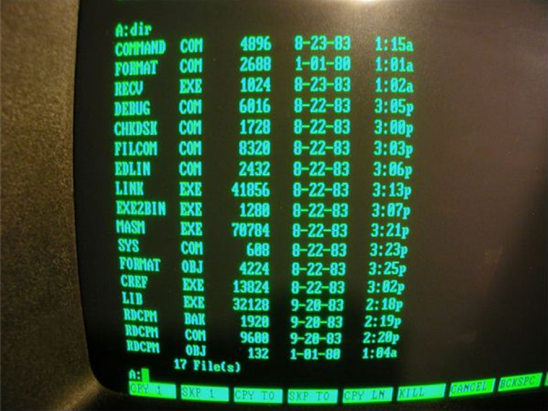

From the aqueducts to supercomputers to SpaceX, innovation creates a wave of new technology, suddenly available to the masses and exposing them to a foundation upon which to further iterate.&nbsp;The aqueducts made it possible to carry clean water long distances, which instigated the creation of storm water gutters, irrigation systems and, ultimately, indoor plumbing. Supercomputers made it possible to make complex computations in a fraction of the time, at a fraction of the cost. The result? Eventually, smartphones that are even more super&nbsp;_and_ fit inside our pockets. SpaceX’s goal to get to Mars will spark not only rapid advancements in travel here on earth, but reusable rockets and privatized space travel.

The same pattern holds true in many different industries—tech and non-tech—and data analytics are no different. We know that data analysis is important. But at first, the sheer volume of data can feel overwhelming. To illustrate how far data analytics has come (and why it’s a lot easier to do now), let’s first dive into web programming and how it progressed.

### The Evolution of Web Programming

The first computers consisted of DOS-based interfaces with brazen black backgrounds, a glaring white cursor and some gauche purple or neon green code.

Early websites were built from scratch in HTML or JavaScript and had static content, mostly text. Quickly, these limitations drove developers to make improvements. New languages like PHP, Python and ASP emerged to make coding web apps easier, more stable and more efficient when troubleshooting.

Eventually, the need to advance marketing websites became evident and [content management systems](https://en.wikipedia.org/wiki/Content_management_system) (CMS’s) like [WordPress](https://wordpress.com/) and [Joomla](https://www.joomla.org/)&nbsp;popped up and gained traction. With them, everyday struggles became more of a now-and-then “pain in the arse.” For example, most CMS websites rely on pre-built themes that allow anyone to edit the website easily, without writing code.&nbsp;

Even armed with these web frameworks and CMS tools, though, the setup and [server provisioning](https://en.wikipedia.org/wiki/Provisioning#Server_provisioning) for these systems required deep technical knowledge of servers, storage and networking. Then came [AWS](https://aws.amazon.com/). For the first time, a web developer could enter a credit card number and provision a server in under a minute. This lowered the technical barrier of entry involved in deploying code and web technologies.&nbsp;Now, anyone can spin up a marketing website from start to finish with solutions like [Squarespace](https://www.squarespace.com/) or [HubSpot](https://www.hubspot.com/).

The ease of programming laid the foundation for analytics, which has also undergone a total evolution.

### Analytics 1.0

The first wave of analytics has been around for quite a while, too. Google Analytics (GA) was launched in 2005. Suddenly, website owners could track visitors, devices, time on page and more. Before GA, users had to put code throughout their entire website, on each page, on each section, in order to obtain the information necessary to run high-level analytics. GA made it possible to put one snippet of code in the \<head\>\</head\> of a website to collect a whole slew of information. Programming basic analytics into any website or app was as easy as copy/paste.

Then came the next wave, driven by the advent of SaaS applications, which created online _users_ who interact with an application. During the “website-only” days, there wasn’t as much information to track; GA was enough. Soon, however, it became feasible to obtain demographic, usage and marketing information by collecting user data directly from an app. This type of data—the tracking of every click a user makes—is called clickstream and is essential to giving product owners and marketing directors insight into who is using their product, when and how they’re using it… or if they are using it at all.

Yet even clickstream data was difficult to track at the outset. Every page, link, button, etc. of a website had to be manually “[instrumented](https://en.wikipedia.org/wiki/Instrumentation_(computer_programming))” by putting a code snippet, unique to whatever individual tool was doing the tracking, within each code block. As the number of analytics tools began to explode (it's at ~3800 today), this process got even more tedious, especially for larger applications. Worse, when the app got updated, entire portions of code could break, making support and maintenance a nightmare. And with every new tool,&nbsp;the code became even more crowded. It was clear that the process needed to be simplified.

### Data Analytics Today

And so came the next exciting progression of clickstream: analytics.js. It allows an organization to track all kinds of “clicks”—ones included tools, like GA, HubSpot, MixPanel and thousands more—with a single analytics.js script and some additional tracking scripts, as desired, depending on the level of granularity needed. Specific tracked events, from the click of a page to the anonymous user id that identifies where someone came from _before_ they landed on the app, will immediately begin flowing in real-time.

This means that companies can now connect an individual customer's entire journey across a website and identify specific traits that impacted behavior, which can reveal exactly what marketing channel worked, how to improve the customer experience, what kind of retargeting will be meaningful and more.&nbsp;

Better yet, maintaining and optimizing analytics.js with the right platform (like Astronomer!)&nbsp;allows you to toggle tools on and off, test out a new analytics tool and replace old ones without losing any data. Say, for example, your company wants to start A/B testing with Optimizely or try out MailChimp for email campaigns. Making the switch is easy as the click of a button and doesn’t require engineering time, which can be hard to come by.&nbsp;

So getting and maintaining clickstream data for analytics is simple enough, but what about the actual analysis? Well, storing and analyzing data has followed in the same footsteps as everything else in this post... no longer do you need to keep everything in a data warehouse and run SQL queries to get started, although you can. Why? Because products like [Metabase](https://www.metabase.com/)&nbsp;(a BI server) and [Chartio](https://chartio.com/)&nbsp;(a custom dashboard)&nbsp;offer the ability to analyze data _without_ knowing SQL. And products like [Mixpanel](https://mixpanel.com/) and [Kissmetrics](https://www.kissmetrics.com/)&nbsp;will automate reports using natural language and self-service dropdowns.&nbsp;Basically, there’s no reason not to do in-depth analytics, especially with access to a[&nbsp;step-by-step guide](https://www.astronomer.io/analytics-guide).&nbsp;

### Beyond Analytics

Before we get to that, however, it’s worth noting that a bleeding edge of technology exists and isn’t available to business users yet.&nbsp;

So some advanced analytics still live with experts. Components requiring artificial intelligence, for example, are highly technical and require troves of data to use. IBM’s Watson is one of the best examples, today, of providing artificial intelligence to the masses and even then, [expert data engineering](https://www.astronomer.io/blog/airflow-and-the-future-of-data-engineering) is required to fully leverage its benefits.&nbsp;

The good news is, we’ve watched the same cycle since the beginning of innovation: figure something out, make it better, then make it accessible to everyone. In today’s world, we get to reap the benefits of how this is has happened in data analytics. Not to mention watch—and for some of us, lead—technology as it moves to the next level and the data engineering required to do machine learning and artificial intelligence becomes an everyday commodity. &nbsp;

_Ready to get product analytics started? Download Astronomer’s [free guide to product analytics](https://www.astronomer.io/analytics-guide) to discover what’s possible and map tangible next steps for your organization.&nbsp;_

