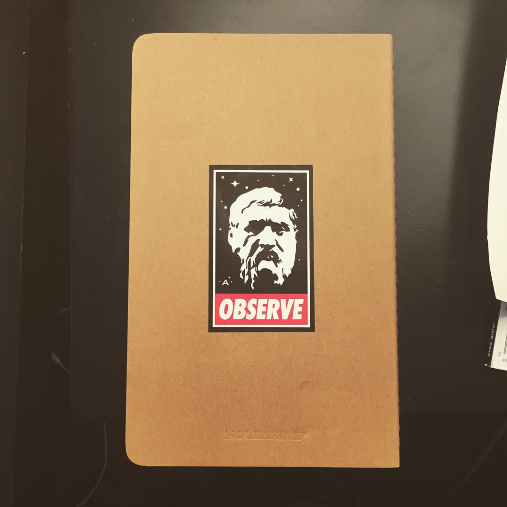

_TL;DR: At Astronomer, one of our core values is "fun." It could be one of the most important decisions we ever make._

From the outside, startups can seem like a lot of fun. The reality, though, is that an early-stage startup is mostly grueling work. Startups have monumental dreams and measly resources. Everything is ambiguous. Because you’re in a fight for survival, you rarely find time to exercise, eat right or get enough sleep, especially in a culture where working around the clock has become a [status symbol](https://www.businessinsider.com/working-all-the-time-is-a-status-symbol-2015-6). As a founder or early employee in a startup, your most common mental state is stressed out.

A 2015 [study](https://www.michaelafreemanmd.com/Research_files/AreEntrepreneursTouchedwithFire(pre-pubn)4-17-15.pdf) by Dr. Michael Freeman, a clinical professor at UCSF and an entrepreneur himself, shed light on the mental state of those working in startups compared to those who aren’t. Of the hundreds of entrepreneurs surveyed, 30% reported suffering from depression. That’s strikingly higher than the US population as a whole, where just 7% identify themselves as depressed.

The conundrum is that startups do require a level of commitment above and beyond that of most other companies. Startups have extraordinary potential, and reaching that potential requires an extraordinary effort. Anyone who’s worked in a startup will you tell that it is an emotional roller coaster. The highs are incredibly meaningful but the lows can be equally as devastating.

### How are we dealing with this at Astronomer?

Well, in true startup form, we’re trying something a little different. As we&nbsp;[build our brand](https://www.astronomer.io/blog/branding-is-relationship), we’ve decided to make “fun” one of our six core values as an organization (more on the rest in future posts). This is important to us, not because we need fun as much as we need wholeness. We believe that talking about fun can not only make our days at work a bit brighter, but also help us calibrate our culture towards honesty and vulnerability about our own strengths and weaknesses.

Individual wholeness is difficult to achieve in general, and it’s even harder in a startup, so we must make it a priority. Having open discussions about whether or not we are having fun at work is a path towards wholeness at work.

And we’re doing a pretty good job at it. At a recent all-team meeting, each of us went around the room and rated the organization on a scale of 1-10 on how we’re doing at incorporating fun as a core value. The average: 7.1. Not bad at all. Many of us said that working at Astronomer is the most fun place we’ve ever worked, though every one of us is making less money and working more hours than ever before.

### What do we mean by “fun”?

Of course, fun is a broad (not to mention, relative) term, so I'll share&nbsp;a few examples of what fun looks like for us. For one thing, I’m writing this from Denver, even though our office is in Cincinnati, Ohio. Getting out of our routine and into a new environment can bring inspiration and focus, so our&nbsp;team can work from anywhere, anytime, as long as we&nbsp;get work done.&nbsp;

That kind of freedom is definitely fun, but having fun _together_ is, arguably, more important when it comes to building team culture. Sometimes, having fun means amusing ourselves. Like creating stickers based on the [Andre the Giant has a Posse](https://en.wikipedia.org/wiki/Andre_the_Giant_Has_a_Posse) “OBEY” stickers that say “OBSERVE” and depict Plato instead, and hiding them all over Cincinnati.

Or coming up with custom team names in JIRA, a project management software we use. Or escaping the office during lunch for frisbee in the park.

The most fun aspects of our culture, however, are the ownership and camaraderie we have. Our Head of Delivery says, “The most fun thing for me about Astronomer is how much freedom everyone on the team has to drive the growth of the business. That sounds cliche but if you look at Astronomer today, really important elements of our organization and product offering were initially started through just one person wanting to see that project happen."

Similarly, our Head of Sales puts it this way: “We know the raw state of the business almost daily; we see dev/product problems and can jump in to fix them. We hear about new hot prospects and deals, and the team can rally around a solution. That kind of transparency is fun and joins us together as a team.” One of our data engineers loves the flexibility we have: “It's very fun to have the ability to adapt and grow with my team, and to have the freedom and encouragement to change things for the better as we go along.” For them, those aspects of team culture are fun, because they bring joy, unity and wholeness.

We believe that wholeness must start internally, but it inevitably impacts the way we interact with clients too. We’re in the habit of looking for ways to bring delight into any situation and make each person feel valued. Most recently, this looked like bringing Holtman's donuts, a Cincinnati staple, to a big meeting and sending flowers to a client&nbsp;on her birthday.

There’s no one-size-fits-all version of fun, but each day presents us with a new opportunity to find some way to bring joy to ourselves, our team and, ultimately, our customers.

### Striking a Balance

As our team grows and changes, the way we have fun will too. We’re still trying to figure out how to keep our average at 7.1 or higher while pushing ourselves to achieve more, but we’re starting with communication. Simply talking to one another about whether or not we are actually having fun at work is a huge first step for us. It brings issues to the forefront and forces us to face them head on. While simultaneously working on metrics to gauge our customer satisfaction, we’re creating internal metrics to assess the mental, emotional and physical health of our own team—a process that will most likely begin with a simple question: “Are you having fun working here?”

A family that stays together plays together, after all. Sounds simple, right? With endless to-do lists and constant pressure to perform, employees in a startup can barely find time to eat lunch, let alone find time to have fun. But we’re building a company culture at Astronomer that’s unique if not extraordinary. Making fun a core value forces us to face this challenge every day. We believe&nbsp;that it will create a culture of openness and, in turn, a culture of wholeness. And a culture of wholeness will no doubt increase productivity.

Will having more fun at work actually make us more productive? We are betting on it.

We're always looking for rising stars. Check out our latest openings [here](https://spacemanship.com).

**Bonus:** &nbsp;_Wallpapers are fun aren't they? Here are a few freebies..._

  
[Download Wallpaper](../assets/havefun2560x1600GreenA.png)

  
[Download Wallpaper](../assets/havefun2560x1600WhiteA.png)

  
[Download Wallpaper](../assets/havefun2560x1600PurpleA.png)

