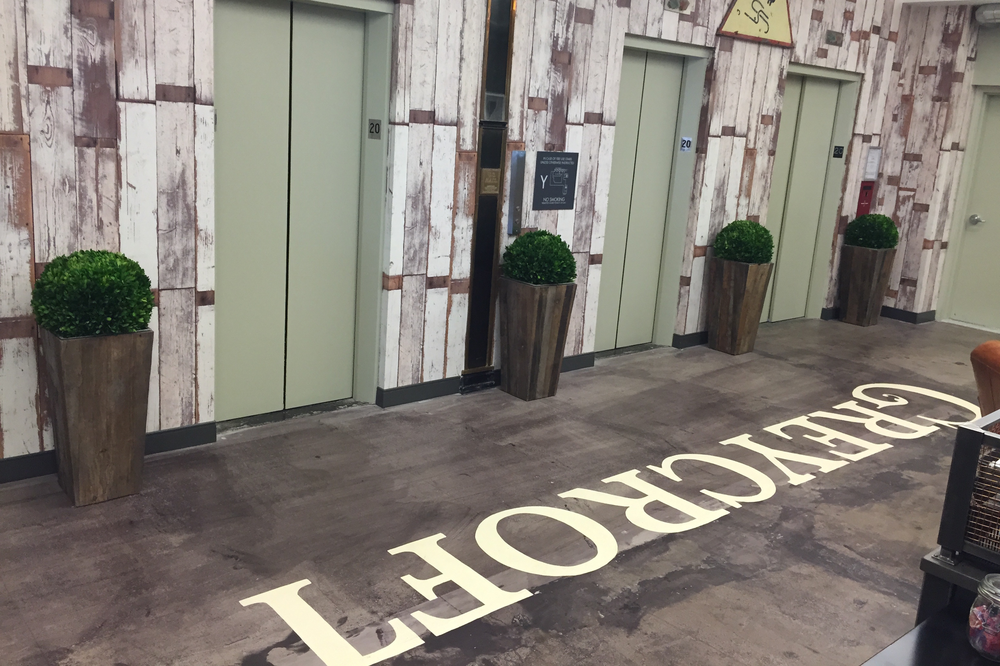

We're a tired team today :)

- **Tuesday:** Drove 10 hrs to NY
- **Wednesday:** A 15-minute meeting, drove back to Cincinnati
- **Today:** Back to work

What meeting could be so important? **An interview with [AngelPad](https://angelpad.org/b/accelerator-rankings-2015/), the #1 ranked startup accelerator in the world.** It was worth it.  
  
**Did we get in?**

We don't know yet...

The operators of AngelPad, Thomas and Carine, have decisions to make:

1. Our business is super technical...&nbsp;do they believe we've got the chops to execute?
2. Do they like our product enough to want to work on it with us? AngelPad is unique in this regard—the operators get their hands dirty with the teams, rather than relying on external mentors.
3. How do we stack up with their other applicants?

**So why so worth it?**

Best. Interview. Ever.

We've talked with 20-30 potential investors at this point. The interview was a piece of art.

We got there 15 minutes early... Thomas said "did you read the email? I said get here 5 minutes before your interview, not 20 minutes early... read my emails... read my emails." Whoops :)

Thomas guided us into the interview room. It was a little warm, perfect for an interrogation :) The interview started with our four-slide, three-minute opening statement.

Then it was 27 minutes of Q&A (we went over on time). They drilled us, but always with a smile. Product, cap table, compensation, team dynamics, competition, market, location, product roadmap. We stumbled a bit on some of the questions. A few times Thomas had to say something like "just answer the question, I don't need the backstory" —&nbsp; we're astounded with how much ground we covered during the interview.

They asked us for a few things... Thomas said "I'm going to share your product with five or so companies. If they don't want it, you're out. Send me what I should share with them."

We love a great challenge... **challenge accepted**. We're working on the best follow up email of our life today. Wish us luck!

The moral of the story?

**Take meetings with the smartest people you can, and embrace the opportunity to get your ass handed to you. We're a stronger startup from the experience.**

P.S. Thanks [Gimlet Media](https://gimletmedia.com/) for making the drive enjoyable with [awesome](https://gimletmedia.com/show/mystery-show/)&nbsp;[podcasts](https://gimletmedia.com/show/startup/).  
  
Another P.S. OK —&nbsp;I fibbed a little for dramatic effect. We also met with some awesome people from Greycroft while we were in town :) Their office is super cool!

